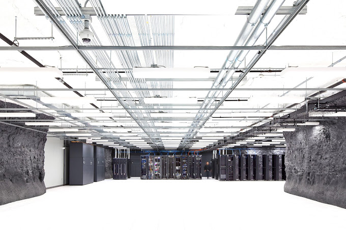

# GPU Benchmark

This repository contains benchmark data and documentation for evaluating the inference speeds of various large language models (LLMs) on different GPUs.

## About Massed Compute

Massed Compute leverages cutting-edge technology to offer scalable and efficient distributed computing solutions. We provide flexible computing power for AI research, visual effects production, data science, and more. Our goal is to empower organizations with the tools they need to maximize their computational capabilities.

For more information, visit [Massed Compute](https://massedcompute.com/?utm_source=github.com).

## Benchmarking Overview

This repository covers benchmarking LLM inference speeds on different GPUs, including:

### Llama

- [Llama 3 70B](./llama-3/llama-3-70B.md)
- [Llama 3.1 70B](./llama-3/llama-3.1-70B.md)
- [Llama 3.1 8B](./llama-3.1-8b/llama-3.1-8b.md)
- [Llama 3.3 70B](./llama-3.3-70b/llama-3.3-70b.md)

### NVIDIA Nemotron

- [Llama 3.1 Nemotron Nano 8B](./nemotron-nano-8b/nemotron-nano-8b.md)
- [Nemotron 3 Nano 30B (A3B)](./nemotron-3-nano-30b/nemotron-3-nano-30b.md)
- [Llama 3.1 Nemotron 70B Instruct](./nemotron-70b-instruct/nemotron-70b-instruct.md)

### DeepSeek

- [DeepSeek R1 Distill Llama 8B](./deepseek-r1-distill-llama-8b/deepseek-r1-distill-llama-8b.md)
- [DeepSeek R1 Distill Qwen 32B](./deepseek-r1-distill-qwen-32b/deepseek-r1-distill-qwen-32b.md)
- [DeepSeek R1 Distill Llama 70B](./deepseek-r1-distill-llama-70b/deepseek-r1-distill-llama-70b.md)
- [DeepSeek V4 Flash](./deepseek-v4-flash/deepseek-v4-flash.md)

### Qwen

- [Qwen2.5 7B Instruct](./qwen2-5-7b-instruct/qwen2-5-7b-instruct.md)
- [Qwen3 32B](./qwen3-32b/qwen3-32b.md)
- [Qwen3 30B-A3B (MoE)](./qwen3-30b-a3b/qwen3-30b-a3b.md)

### GLM

- [GLM-4.7-Flash](./glm-4.7-flash/glm-4.7-flash.md)

### Image / Multimodal

- [SenseNova-U1 Infographic V3](./sensenova-u1-8b-mot-infographic-v3/sensenova-u1-8b-mot-infographic-v3.md)

Each benchmark includes:

- **Model Description**: Overview of the model being tested.
- **Hardware Specifications**: Details about the GPUs used.
- **Benchmark Results**: Inference speed and performance metrics.

## Methodology

The original 2024 Llama 3 suite used [Hugging Face TGI](https://github.com/huggingface/text-generation-inference). The 2026 additions use modern serving engines — [vLLM](https://github.com/vllm-project/vllm) and [SGLang](https://github.com/sgl-project/sglang) — run on live Massed Compute instances.

Pinned profile for the 2026 runs: random prompts, input=128 / output=128 tokens, request-rate=inf, concurrency 1 / 8 / 32 (headline numbers use concurrency 32). GPUs include RTX PRO 6000 Blackwell, H100, H200 NVL, and L40S. Bench VMs were terminated after each capture.
