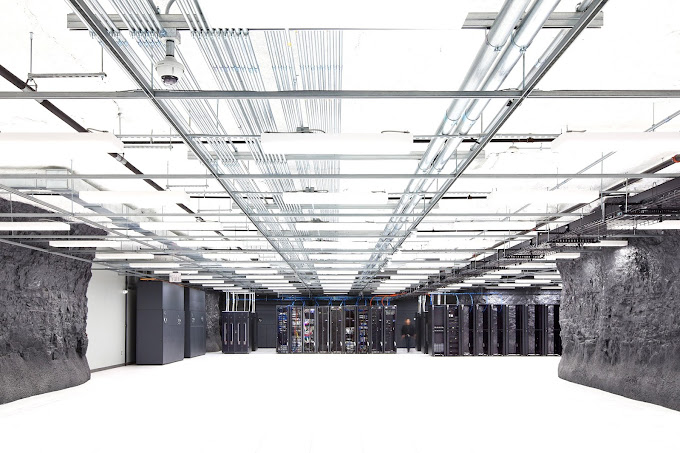

# GPU Benchmark

Benchmark data and writeups for LLM inference on Massed Compute GPUs.



## About Massed Compute

Massed Compute offers scalable GPU cloud for AI research, VFX, data science, and more.

[](https://massedcompute.com/?utm_source=github.com&utm_campaign=gpu-benchmark)

**[LAUNCH GPU OR CPU INSTANCE](https://massedcompute.com/?utm_source=github.com&utm_campaign=gpu-benchmark)**

> **Pricing note:** Listed `$/hr` rates on these pages are point-in-time from each capture date. Confirm live pricing in the marketplace before you launch — rates can change. Pay only for the hours you use; no long-term contracts.

## Llama (classic TGI screenshots)

- [Llama 3 70B](./llama-3-70b/llama-3-70b.md)
- [Llama 3.1 70B](./llama-3.1-70b/llama-3.1-70b.md)

## New (2026) — vLLM + SGLang

- [Qwen2.5 7B Instruct on 1× L40S](./qwen2-5-7b-instruct/qwen2-5-7b-instruct.md)
- [Llama 3.1 8B](./llama-3.1-8b/llama-3.1-8b.md)
- [Llama 3.3 70B (Blackwell vs H100)](./llama-3.3-70b/llama-3.3-70b.md)
- [Nemotron Nano 8B (Blackwell vs H100)](./nemotron-nano-8b/nemotron-nano-8b.md)
- [GLM-4.7-Flash (Blackwell vs H100)](./glm-4.7-flash/glm-4.7-flash.md)
- [Nemotron 3 Nano 30B (Blackwell vs H100)](./nemotron-3-nano-30b/nemotron-3-nano-30b.md)
- [Nemotron 70B Instruct (H200 vs H100)](./nemotron-70b-instruct/nemotron-70b-instruct.md)

## Newest locals (2026-07-20)

- [DeepSeek V4 Flash 0731](./deepseek-v4-flash-0731/deepseek-v4-flash-0731.md)
- [Qwen3.6 35B-A3B](./qwen3.6-35b-a3b/qwen3.6-35b-a3b.md)
- [Ornith 1.0 9B](./ornith-1.0-9b/ornith-1.0-9b.md)
- [Ornith 1.0 35B (MoE)](./ornith-1.0-35b/ornith-1.0-35b.md)
- [MiniCPM-RobotManip](./minicpm-robotmanip/minicpm-robotmanip.md)
- [MiniCPM-RobotTrack](./minicpm-robottrack/minicpm-robottrack.md)
- [Krea 2 Turbo](./krea-2-turbo/krea-2-turbo.md)
- [Bernini-R 14B](./bernini-r-14b/bernini-r-14b.md)
- [SenseNova-U1 Infographic V3](./sensenova-u1-8b-mot-infographic-v3/sensenova-u1-8b-mot-infographic-v3.md)
- [DeepSeek V4 Flash (2× Blackwell vs 2× H200)](./deepseek-v4-flash/deepseek-v4-flash.md)

## DeepSeek + Newest Local (2026) — vLLM + SGLang

- [DeepSeek R1 Distill Llama 8B (Blackwell vs H100)](./deepseek-r1-distill-llama-8b/deepseek-r1-distill-llama-8b.md)
- [DeepSeek R1 Distill Qwen 32B (Blackwell vs H100)](./deepseek-r1-distill-qwen-32b/deepseek-r1-distill-qwen-32b.md)
- [Qwen3 32B (Blackwell vs H100)](./qwen3-32b/qwen3-32b.md)
- [Qwen3 30B-A3B MoE (Blackwell vs H100)](./qwen3-30b-a3b/qwen3-30b-a3b.md)
- [DeepSeek R1 Distill Llama 70B (2x Blackwell vs 2x H200)](./deepseek-r1-distill-llama-70b/deepseek-r1-distill-llama-70b.md)


## Wave 2026-07-21

- [Astrea R8 Chat 9B](./astrea-r8-chat-9b/astrea-r8-chat-9b.md)
- [Hy3 IQ1_M GGUF](./hy3-iq1-m/hy3-iq1-m.md)
- [Ideogram v4 Instant](./ideogram-v4-instant/ideogram-v4-instant.md)
- [Motif-3-Beta (partial / blocked generate)](./motif-3-beta/motif-3-beta.md)

## How we run new benches

**Agent path:** paste an HF id and use the `gpu-benchmark-model` skill (`.cursor/skills/gpu-benchmark-model/`).

```bash
./bin/mc-bench scaffold --hf-id <org/name>
./bin/mc-bench plan --model <org/name> [--compare]
# launch via Massed MCP (image 184) → set MC_BENCH_IPS=sku:ip
./bin/mc-bench run --model <org/name>
./bin/mc-bench finalize --model-slug <slug>
```

Orchestrator uses optimized vLLM (FP8 KV, prefix cache, batched tokens) + SGLang, classic terminal showcase PNGs, writeup footer, then terminate.

See [docs/methodology.md](./docs/methodology.md) and [docs/new-model-playbook.md](./docs/new-model-playbook.md).
