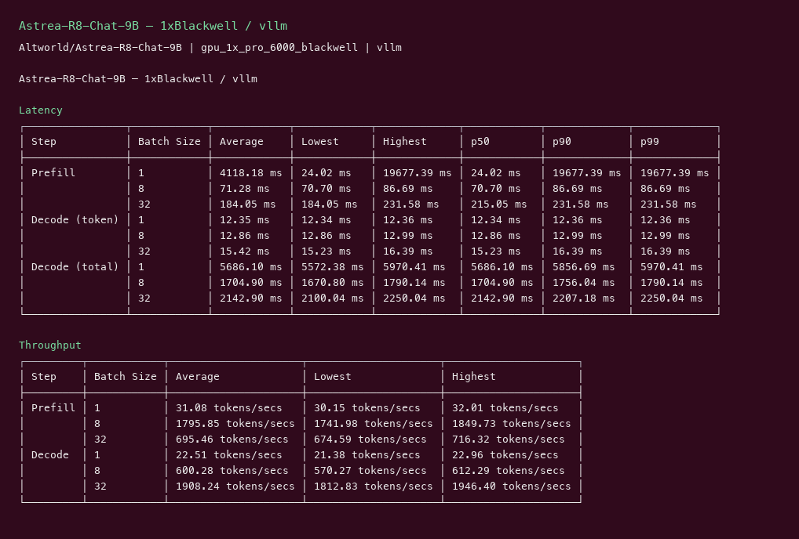
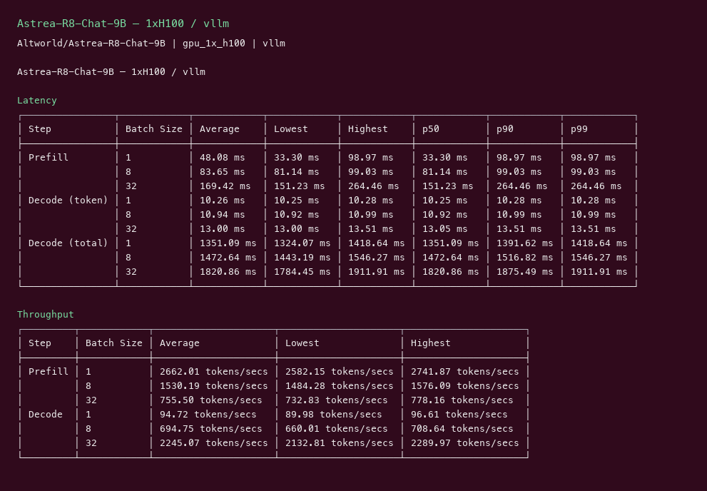

# Astrea R8 Chat 9B GPU Benchmark

### Last Edit Date:
MC - 2026.07.21

## Purpose
Live Massed Compute inference benches for **Altworld/Astrea-R8-Chat-9B** (Qwen3.5-9B creative-writing chat, Apache-2.0).

## Technique
Pinned profile: random prompts, input=128, output=128, request-rate=inf, concurrency 1 / 8 / 32. Headlines use **c32**.
Engine: **vLLM** (`nightly`) with `--trust-remote-code --max-model-len 4096`.

## Results

| Engine | SKU | $/hr | Output tok/s (c32) | TTFT med (ms) | tok/s per $ |
|---|---|---:|---:|---:|---:|
| vllm | `gpu_1x_pro_6000_blackwell` | 2.19 | 1908.2 | 215.0 | 871.3 |
| vllm | `gpu_1x_h100` | 2.73 | 2245.1 | 151.2 | 822.4 |

### Screenshots

**gpu_1x_pro_6000_blackwell** — $2.19/hr

vllm:

**gpu_1x_h100** — $2.73/hr

vllm:

## Conclusion

Peak c32 output throughput: **2245 tok/s** on `gpu_1x_h100` with **vllm**.
Best $/tok: **871.3 tok/s per $** on `gpu_1x_pro_6000_blackwell` / **vllm**.

## Notes
- Open-weight Altworld Astrea (Apache-2.0); architecture `Qwen3_5ForConditionalGeneration`.
- Numbers from live Massed runs 2026-07-21; bench VMs terminated after capture.

---

  

  <strong><a href="https://massedcompute.com/?utm_source=github.com&utm_campaign=gpu-benchmark">LAUNCH GPU OR CPU INSTANCE</a></strong>

> **Pricing note:** Listed `$/hr` rates are point-in-time from the capture date. Confirm live pricing in the marketplace before you launch — rates can change. Pay only for the hours you use; no long-term contracts.
