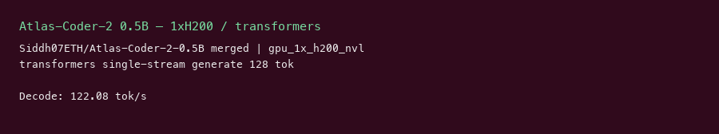

# Atlas-Coder-2 0.5B GPU Benchmark

### Last Edit Date:
MC - 2026.07.22

## Purpose
Live Massed Compute benches for **Siddh07ETH/Atlas-Coder-2-0.5B** (PEFT adapter merged onto Qwen2.5-Coder-0.5B-Instruct).

## Technique
Merge LoRA → transformers `generate` single-stream (128 new tokens, 5 repeats). vLLM rejected adapter-only weights.

## Results

| Engine | SKU | $/hr | Decode tok/s | tok/s per $ |
|---|---|---:|---:|---:|
| transformers | `gpu_1x_pro_6000_blackwell` | 2.19 | 149.0 | 68.0 |
| transformers | `gpu_1x_h200_nvl` | 3.62 | 122.1 | 33.7 |

### Screenshots

Terminal-style captures from live Massed runs 2026-07-22 (transformers single-stream, not T2I).

**gpu_1x_pro_6000_blackwell** — RTX PRO 6000 Blackwell 96GB — $2.19/hr

transformers (PEFT merged) · single-stream **149.0** tok/s:

**gpu_1x_h200_nvl** — H200 NVL 141GB — $3.62/hr

transformers (PEFT merged) · single-stream **122.1** tok/s:

## Conclusion

Peak decode: **149 tok/s** on `gpu_1x_pro_6000_blackwell`.
Best $/tok: **68.0 tok/s per $** on `gpu_1x_pro_6000_blackwell`.

## Notes
- HF repo is PEFT adapter; merged onto `Qwen/Qwen2.5-Coder-0.5B-Instruct` before bench.
- `gpu_1x_h100` unavailable; used `gpu_1x_h200_nvl` as second SKU.
- Numbers from live Massed runs 2026-07-22; disposable bench VMs terminated after capture.

---

**[LAUNCH GPU OR CPU INSTANCE](https://massedcompute.com/?utm_source=github.com&utm_campaign=gpu-benchmark)**

> **Pricing note:** Listed `$/hr` rates are point-in-time from the capture date. Confirm live pricing in the marketplace before you launch — rates can change. Pay only for the hours you use.
