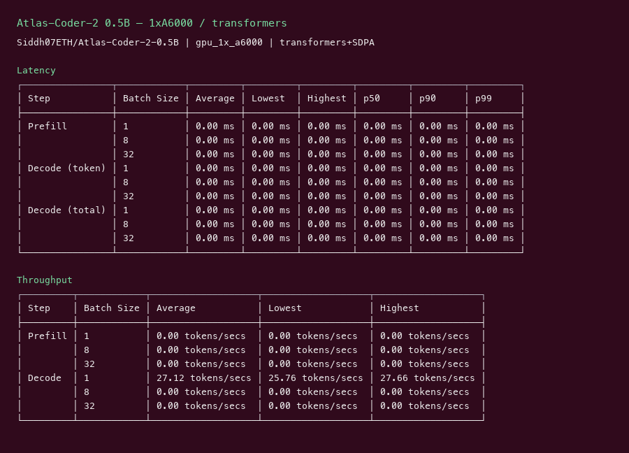

# Atlas-Coder-2 0.5B GPU Benchmark

### Last Edit Date:
MC - 2026.07.22

## Purpose
Live Massed Compute benches for **Siddh07ETH/Atlas-Coder-2-0.5B** (PEFT adapter merged onto Qwen2.5-Coder-0.5B-Instruct).

## Technique
Merge LoRA → transformers `generate` single-stream with **SDPA** (128 new tokens, 5 repeats after warmup). vLLM rejected adapter-only weights. Sized on the smallest SKU that fits (**A6000**).

## Results

| Engine | SKU | $/hr | Decode tok/s | tok/s per $ |
|---|---|---:|---:|---:|
| transformers+SDPA | `gpu_1x_a6000` | 0.57 | 27.1 | 47.5 |

### Screenshots

Terminal-style captures from live Massed runs 2026-07-22 (transformers single-stream, not T2I).

**gpu_1x_a6000** — RTX A6000 48GB — $0.57/hr

transformers + SDPA (PEFT merged) · single-stream **27.1** tok/s:

## Conclusion

Decode: **27.1 tok/s** on `gpu_1x_a6000` (**47.5 tok/s per $**). Sub-1B coder — entry SKU is enough to characterize single-stream decode.

## Notes
- HF repo is PEFT adapter; merged onto `Qwen/Qwen2.5-Coder-0.5B-Instruct` before bench.
- Transformers path only (c8/c32 N/A without a serving engine that loads the merged weights).
- Numbers from live Massed runs 2026-07-22; disposable bench VMs terminated after capture.

---

  

  <strong><a href="https://massedcompute.com/?utm_source=github.com&utm_campaign=gpu-benchmark">LAUNCH GPU OR CPU INSTANCE</a></strong>

> **Pricing note:** Listed `$/hr` rates are point-in-time from the capture date. Confirm live pricing in the marketplace before you launch — rates can change. Pay only for the hours you use.
