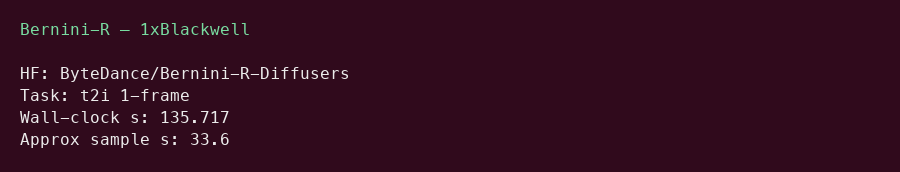
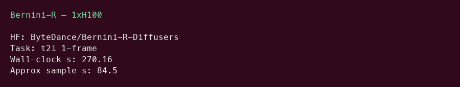

# Bernini-R 14B GPU Benchmark

### Last Edit Date:
MC - 2026.07.20

## Purpose
Live Massed Compute benches for **ByteDance/Bernini-R-Diffusers** (Wan2.2-based renderer, image/video).

## Technique
Official `infer_single_gpu.py` t2i case (1 frame, 480×848, UniPC ~40 steps). Wall-clock includes cold start; sampling phase ~34–85s in logs.

## Results

| SKU | $/hr | Task | Wall-clock (s) | Approx sample (s) |
|---|---:|---|---:|---:|
| `gpu_1x_pro_6000_blackwell` | 2.19 | t2i_1frame | 135.717 | ~33.6 |
| `gpu_1x_h100` | 2.73 | t2i_1frame | 270.16 | ~84.5 |

### Screenshots

**gpu_1x_pro_6000_blackwell** — $2.19/hr

**gpu_1x_h100** — $2.73/hr

## Conclusion

Blackwell completed the official t2i case faster end-to-end in this capture (lower wall-clock and sampling).

## Notes
- Renderer-only Bernini-R (vs full Bernini planner+renderer).
- Ran with SDPA fallback when flash-attn was unavailable.
- Numbers from live Massed runs 2026-07-20.

---

  

  <strong><a href="https://massedcompute.com/?utm_source=github.com&utm_campaign=gpu-benchmark">LAUNCH GPU OR CPU INSTANCE</a></strong>

> **Pricing note:** Listed `$/hr` rates are point-in-time from the capture date. Confirm live pricing in the marketplace before you launch — rates can change. Pay only for the hours you use
