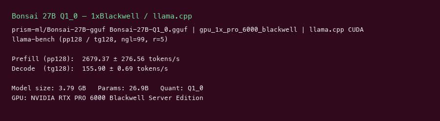
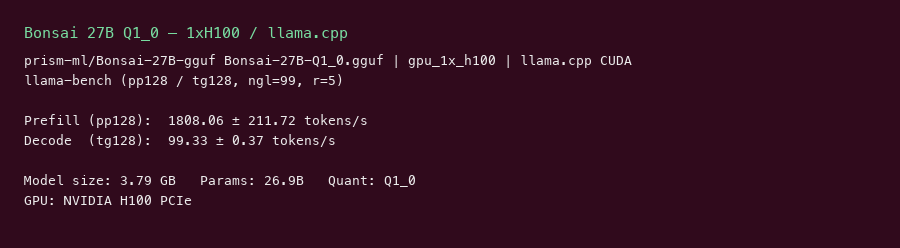

# Bonsai 27B Q1_0 GPU Benchmark

### Last Edit Date:
MC - 2026.07.21

## Purpose
Live Massed Compute llama.cpp benches for **prism-ml/Bonsai-27B-gguf** `Bonsai-27B-Q1_0.gguf` (Qwen3.5 27B, ~3.8 GB 1-bit GGUF).

## Technique
`llama-bench` (CUDA docker, `-ngl 99`), profile **pp128 / tg128**, 5 repeats. Headline decode = **tg128**.
Script: `scripts/wave4/remote_bonsai.sh`.

## Results

| Engine | SKU | $/hr | Prefill tok/s (pp128) | Decode tok/s (tg128) | tok/s per $ (decode) |
|---|---|---:|---:|---:|---:|
| llama.cpp | `gpu_1x_pro_6000_blackwell` | 2.19 | 2679.4 | 155.9 | 71.2 |
| llama.cpp | `gpu_1x_h100` | 2.73 | 1808.1 | 99.3 | 36.4 |

### Screenshots

Terminal-style captures from live `llama-bench` (pp128 / tg128, ngl=99, 5 repeats) on Massed Compute, 2026-07-21. Not product photos — maroon TGI-table showcases of prefill + decode tok/s.

**gpu_1x_pro_6000_blackwell** — RTX PRO 6000 Blackwell 96GB — $2.19/hr

llama.cpp CUDA · `Bonsai-27B-Q1_0.gguf` (~3.8 GB) · headline decode **155.9 tok/s**:

**gpu_1x_h100** — H100 80GB PCIe — $2.73/hr

llama.cpp CUDA · same GGUF · headline decode **99.3 tok/s**:

## Conclusion

Peak decode: **155.9 tok/s** on `gpu_1x_pro_6000_blackwell` (~**71.2 tok/s per $**).
Blackwell leads H100 on both prefill (~48% faster) and decode (~57% faster) for this Q1_0 GGUF.

## Notes
- Open HF GGUF from prism-ml; architecture reported as `qwen35 27B Q1_0`.
- Numbers from live Massed runs 2026-07-21; wave4 bench VMs terminated after capture.

---

  

  <strong><a href="https://massedcompute.com/?utm_source=github.com&utm_campaign=gpu-benchmark">LAUNCH GPU OR CPU INSTANCE</a></strong>

> **Pricing note:** Listed `$/hr` rates are point-in-time from the capture date. Confirm live pricing in the marketplace before you launch — rates can change. Pay only for the hours you use; no long-term contracts.
