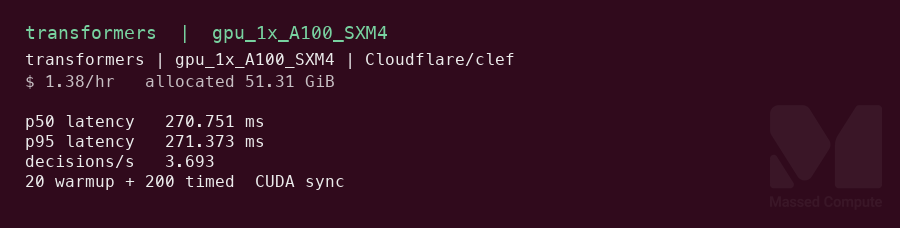
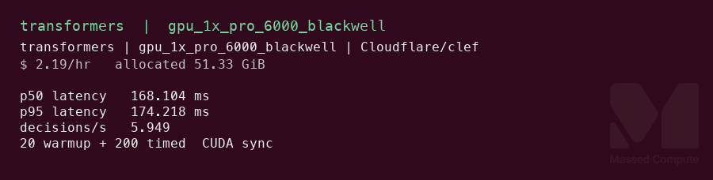

# Clef GPU Benchmark

### Last Edit Date:
MC - 2026.10.06

## Purpose
Live Massed Compute latency benches for [Cloudflare/clef](https://huggingface.co/Cloudflare/clef) at revision `2f3de3dd85f379784083b0814d997ab627200f0c` (BF16). Clef is a multimodal decision model. One forward returns probabilities for typed questions. It does not generate text. Headlines are **p50 `systemone` latency (ms)** and **decisions/s**, not token throughput.

## Technique
Hugging Face snapshot of `Cloudflare/clef`, `systemone()` from the repo (`joint_schema_model.py`). Single-stream, 20 CUDA-sync warmups + 200 timed calls. One call is one decision and contains three questions (choice, score, noul). Two workloads, same questions: a text state, then that state plus one generated 512×512 image. Runner: `scripts/clef/remote.sh`.

Video inputs and batch sizes above 1 were not run.

Engine pin, both cards: `torch 2.14.1+cu130`, `transformers 5.10.2`. Optional `flash-linear-attention` was not installed, so both used the torch fallback.

## Results

Text state is the headline workload.

| Engine | SKU | $/hr | p50 latency (ms) | p95 latency (ms) | Decisions/s | Decisions per $ | Allocated VRAM (GiB) |
|---|---|---:|---:|---:|---:|---:|---:|
| transformers | `gpu_1x_A100_SXM4` | 1.38 | 270.8 | 271.4 | 3.693 | 2.68 | 51.31 |
| transformers | `gpu_1x_pro_6000_blackwell` | 2.19 | 168.1 | 174.2 | 5.949 | 2.72 | 51.33 |

Same questions with one image:

| Engine | SKU | $/hr | p50 latency (ms) | p95 latency (ms) | Decisions/s | Decisions per $ | Allocated VRAM (GiB) |
|---|---|---:|---:|---:|---:|---:|---:|
| transformers | `gpu_1x_A100_SXM4` | 1.38 | 406.4 | 407.1 | 2.461 | 1.79 | 51.39 |
| transformers | `gpu_1x_pro_6000_blackwell` | 2.19 | 242.3 | 243.4 | 4.128 | 1.88 | 51.42 |

Allocated VRAM = `torch.cuda.max_memory_allocated` MiB / 1024 after that workload's timed loop. Decisions per $ = decisions/s ÷ list $/hr.

Live `nvidia-smi` during the timed text loop: A100 **53109 MiB** used of 81920, Blackwell **53263 MiB** used of 97887.

### Screenshots

Text-workload cards. Numbers on the image are the raw JSON, not the rounded table.

**gpu_1x_A100_SXM4** — A100 SXM 80GB — $1.38/hr

transformers · `systemone` · p50 **270.8 ms** · **3.693** decisions/s:

**gpu_1x_pro_6000_blackwell** — RTX PRO 6000 Blackwell 96GB — $2.19/hr

transformers · same checkpoint · p50 **168.1 ms** · **5.949** decisions/s:

## Conclusion

Smallest launched fit is **`gpu_1x_A100_SXM4`**. The A6000 load failed: safetensors on disk are **51.19 GiB**, and a successful load on both larger cards held **51.195 GiB**. The A6000 reports **47.40 GiB** usable, and PyTorch died at **47.08 GiB** allocated. The L40S was not launched. It is the same 48GB class.

On the text workload, Blackwell is the latency card: **168.1 ms** p50 / **5.949** decisions/s, **1.6×** the A100 rate. Text value is **2.68** vs **2.72** decisions per dollar, too close to name a winner. On the image workload Blackwell is also faster (**4.128** vs **2.461** decisions/s, **1.6×**) and higher value (**1.88** vs **1.79** decisions per dollar).

L40S listed at **$0.97/hr** (rate rose from $0.88 to $0.97 on 2026-09-08). It was not used for this model.

## Notes
- Weights: sharded BF16 safetensors plus `joint_head.safetensors`. Disk total **51.19 GiB**. Revision `2f3de3dd85f379784083b0814d997ab627200f0c`.
- A6000 was launched and the BF16 load ran out of memory. Raw note: `results/raw/clef/gpu_1x_a6000/oom.txt`. No success marker on that SKU.
- Cheaper card that might fit and was not launched: `gpu_1x_a100` ($1.35), out of stock at capture. `gpu_1x_DGX_A100` is the same $1.38 as the SXM and was not launched. `gpu_1x_a6000_low_ram` ($0.55) is still 48GB VRAM. Out of stock and too small: `gpu_1x_A30` ($0.35), `gpu_1x_a5000` ($0.44).
- H100 ($2.73, 80GB) was not launched. Blackwell at $2.19 already has 96GB.
- Smoke answers on the sample ticket: department=technical, urgency near "today", outage likely. The image workload returned the same labels. Not an accuracy eval.
- Raw: `results/raw/clef/<sku>/bf16-systemone/` (`clef-bench.json`, live `nvidia-smi.txt`, `DONE` on the two successful SKUs).
- Bench VMs terminated after capture.

---

  

  <strong><a href="https://massedcompute.com/?utm_source=github.com&utm_campaign=gpu-benchmark">LAUNCH GPU OR CPU INSTANCE</a></strong>

> **Pricing note:** Listed `$/hr` rates are point-in-time from the capture date. Confirm live pricing in the marketplace before you launch — rates can change. Pay only for the hours you use.
