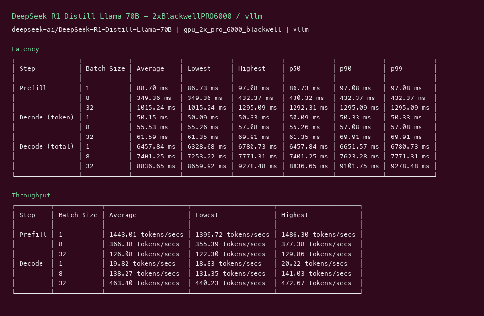
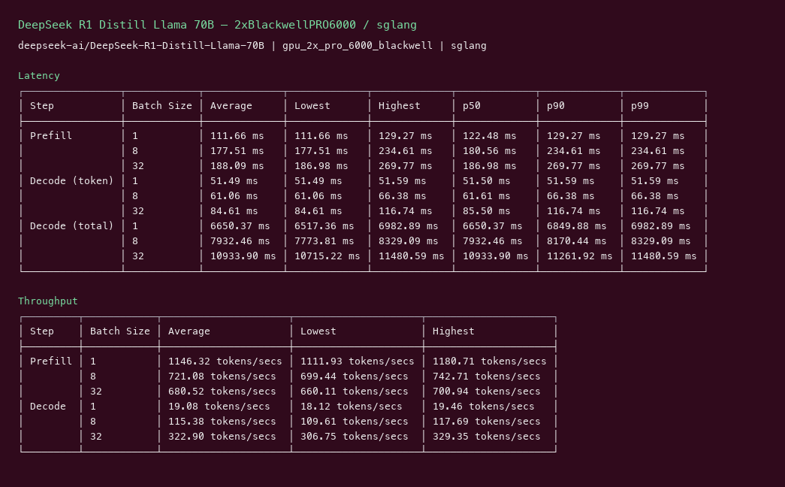
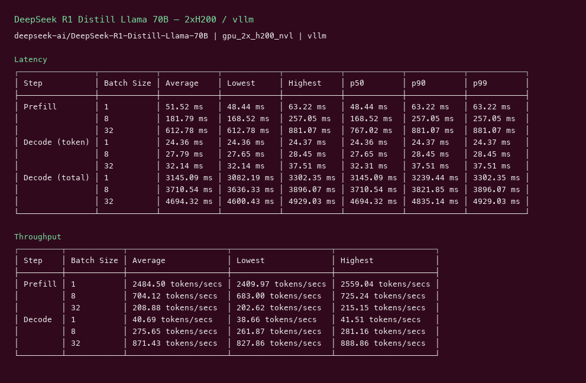
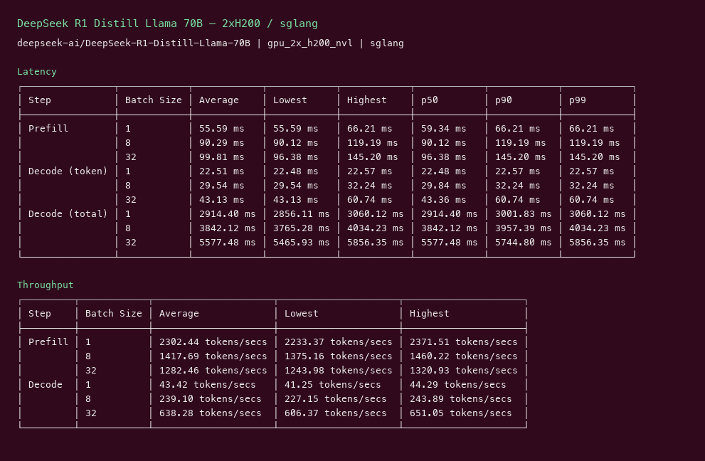

# DeepSeek R1 Distill Llama 70B GPU Benchmark

### Last Edit Date:
MC - 2026.07.16

## Purpose
Live Massed Compute inference benches for **deepseek-ai/DeepSeek-R1-Distill-Llama-70B**, comparing **vLLM** vs **SGLang**.

## Technique
Pinned profile: random prompts, input=128, output=128, request-rate=inf, concurrency 1 / 8 / 32. Headlines use **c32**.
Engines: vLLM (`cu129-nightly`) + SGLang `lmsysorg/sglang:latest`.

## Results

| Engine | SKU | $/hr | Output tok/s (c32) | TTFT med (ms) | tok/s per $ |
|---|---|---:|---:|---:|---:|
| vllm | `gpu_2x_pro_6000_blackwell` | 4.38 | 463.4 | 1292.3 | 105.8 |
| sglang | `gpu_2x_pro_6000_blackwell` | 4.38 | 322.9 | 187.0 | 73.7 |
| vllm | `gpu_2x_h200_nvl` | 7.24 | 871.4 | 767.0 | 120.4 |
| sglang | `gpu_2x_h200_nvl` | 7.24 | 638.3 | 96.4 | 88.2 |

### Screenshots

**gpu_2x_pro_6000_blackwell** — $4.38/hr

vllm:

sglang:

**gpu_2x_h200_nvl** — $7.24/hr

vllm:

sglang:

## Conclusion

Peak c32 output throughput: **871 tok/s** on `gpu_2x_h200_nvl` with **vllm**.
Best $/tok: **120.4 tok/s per $** on `gpu_2x_h200_nvl` / **vllm**.

## Notes

- Reasoning distill of Llama 3.3 70B; needs 2 GPUs (TP=2).
- 2x Blackwell vs 2x H200 NVL comparison.
- Numbers from live Massed runs 2026-07-16; bench VMs terminated after capture.

---

  

  <strong><a href="https://massedcompute.com/?utm_source=github.com&utm_campaign=gpu-benchmark">LAUNCH GPU OR CPU INSTANCE</a></strong>

> **Pricing note:** Listed `$/hr` rates are point-in-time from the capture date. Confirm live pricing in the marketplace before you launch — rates can change. Pay only for the hours you use; no long-term contracts.
