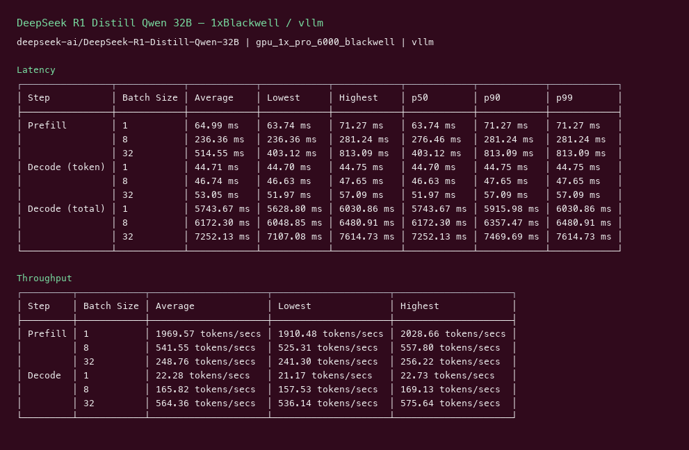
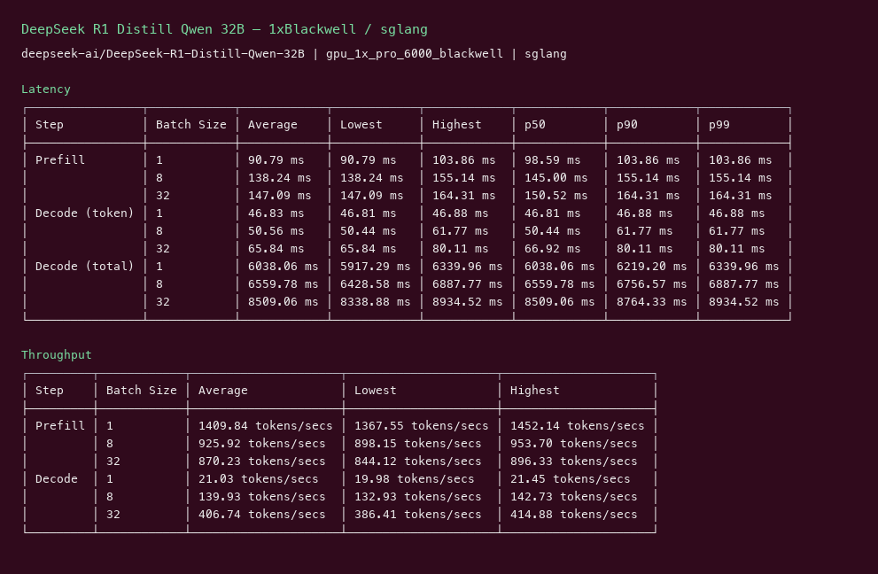
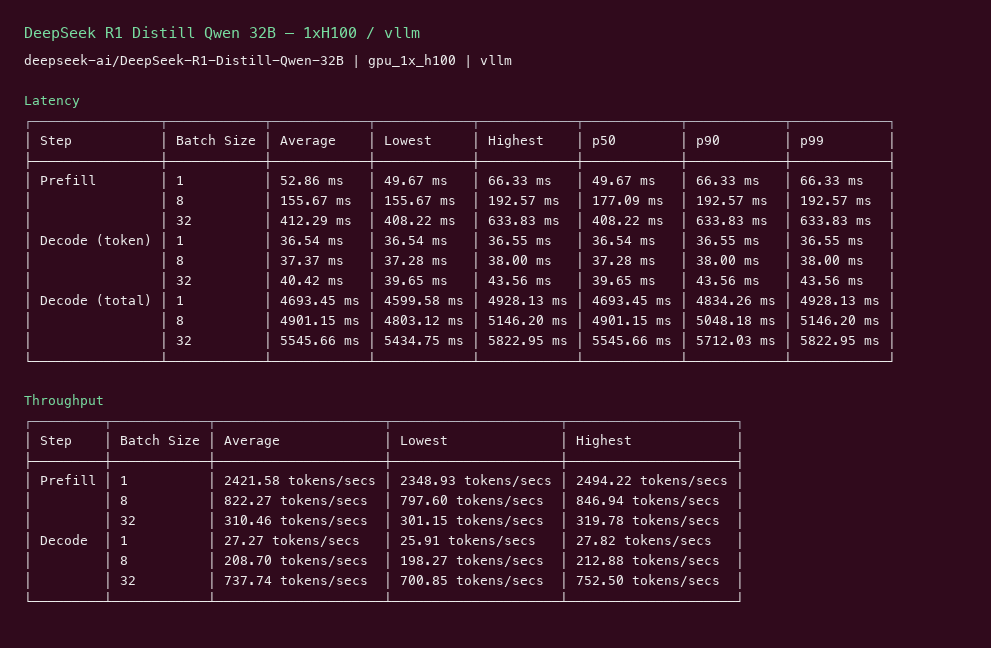
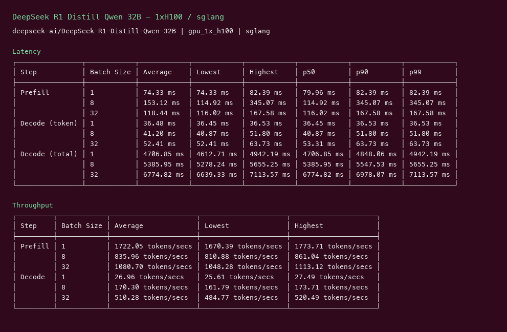

# DeepSeek R1 Distill Qwen 32B GPU Benchmark

### Last Edit Date:
MC - 2026.07.16

## Purpose
Live Massed Compute inference benches for **deepseek-ai/DeepSeek-R1-Distill-Qwen-32B**, comparing **vLLM** vs **SGLang**.

## Technique
Pinned profile: random prompts, input=128, output=128, request-rate=inf, concurrency 1 / 8 / 32. Headlines use **c32**.
Engines: vLLM (`cu129-nightly`) + SGLang `lmsysorg/sglang:latest`.

## Results

| Engine | SKU | $/hr | Output tok/s (c32) | TTFT med (ms) | tok/s per $ |
|---|---|---:|---:|---:|---:|
| vllm | `gpu_1x_pro_6000_blackwell` | 2.19 | 564.4 | 403.1 | 257.7 |
| sglang | `gpu_1x_pro_6000_blackwell` | 2.19 | 406.7 | 150.5 | 185.7 |
| vllm | `gpu_1x_h100` | 2.73 | 737.7 | 408.2 | 270.2 |
| sglang | `gpu_1x_h100` | 2.73 | 510.3 | 116.0 | 186.9 |

### Screenshots

**gpu_1x_pro_6000_blackwell** — $2.19/hr

vllm:

sglang:

**gpu_1x_h100** — $2.73/hr

vllm:

sglang:

## Conclusion

Peak c32 output throughput: **738 tok/s** on `gpu_1x_h100` with **vllm**.
Best $/tok: **270.2 tok/s per $** on `gpu_1x_h100` / **vllm**.

## Notes

- Reasoning distill on Qwen2.5 32B; fits one 80–96GB card at bf16.
- Numbers from live Massed runs 2026-07-16; bench VMs terminated after capture.

---

  

  <strong><a href="https://massedcompute.com/?utm_source=github.com&utm_campaign=gpu-benchmark">LAUNCH GPU OR CPU INSTANCE</a></strong>

> **Pricing note:** Listed `$/hr` rates are point-in-time from the capture date. Confirm live pricing in the marketplace before you launch — rates can change. Pay only for the hours you use.
