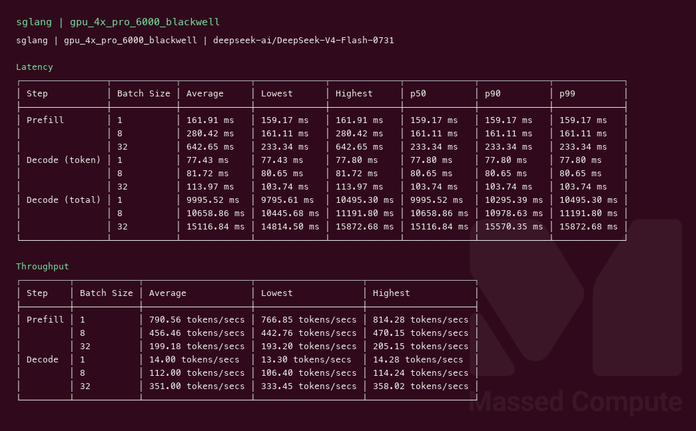

# DeepSeek V4 Flash 0731 GPU Benchmark

### Last Edit Date:
MC - 2026.08.04

## Purpose
Live Massed Compute inference benches for **deepseek-ai/DeepSeek-V4-Flash-0731** (official Flash release; 304B MoE, FP8+packed experts, DSpark).

## Technique
Pinned profile: random prompts, input=128, output=128, request-rate=inf, concurrency 1 / 8 / 32. Headlines use **c32**.
Engine: **SGLang** (`lmsysorg/sglang:latest`) `--tp 4 --moe-runner-backend flashinfer_mxfp4 --context-length 2048 --mem-fraction-static 0.80 --cuda-graph-backend-decode disabled --disable-custom-all-reduce`.
vLLM nightly blocked on SM120 (see Notes).

## Results

| Engine | SKU | $/hr | Output tok/s (c32) | TTFT med (ms) | tok/s per $ |
|---|---|---:|---:|---:|---:|
| sglang | `gpu_4x_pro_6000_blackwell` | 8.76 | 351.0 | 233.3 | 40.1 |

### Screenshots

**gpu_4x_pro_6000_blackwell** — $8.76/hr

sglang — 351.0 output tok/s @ c32:

## Conclusion

On this run, **gpu_4x_pro_6000_blackwell** with **sglang** led cost efficiency at ~40.1 output tok/s per $/hr (~351.0 tok/s at $8.76/hr).

## Notes
- Official **DeepSeek-V4-Flash-0731** (MIT; supersedes preview). ~304B MoE / FP8+packed experts (~167GB download); DSpark draft attached.
- Engine: **SGLang** (`lmsysorg/sglang:latest`) with `--moe-runner-backend flashinfer_mxfp4`, `--tp 4`, `--context-length 2048`, `--cuda-graph-backend-decode disabled` (CUDA-graph capture OOMed with decode graphs / DSPARK on 4×96GB).
- **vLLM nightly** could not load on RTX PRO 6000 Blackwell (**SM120**): DeepGEMM hits `Unknown SF transformation` / `Unsupported architecture`; official MegaMoE path requires **SM100** (B200/GB300). No B200 capacity at capture time.
- Ladder attempts: `1x H200` OOM (~138 GiB weights); `2x Blackwell` SGLang OOM after load; `4x Blackwell` succeeded.
- Compare prior preview page: `../deepseek-v4-flash/deepseek-v4-flash.md` (vLLM on 2×Blackwell **514** tok/s c32 / 2×H200 **560**).
- Live Massed runs 2026-08-04; bench VMs terminated after capture.

---

**[LAUNCH GPU OR CPU INSTANCE](https://massedcompute.com/?utm_source=github.com&utm_campaign=gpu-benchmark)**

> **Pricing note:** Listed `$/hr` rates are point-in-time from the capture date. Confirm live pricing in the marketplace before you launch — rates can change. Pay only for the hours you use.
