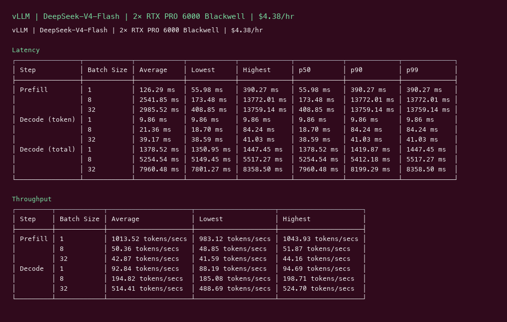
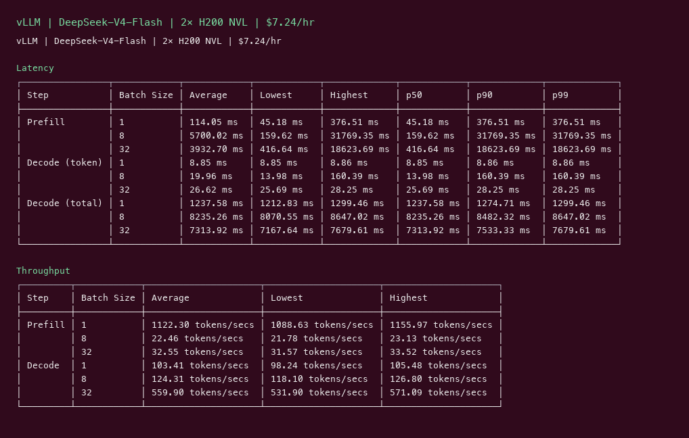

# DeepSeek V4 Flash GPU Benchmark

### Last Edit Date:
MC - 2026.07.20

## Purpose
Live Massed Compute inference benches for **deepseek-ai/DeepSeek-V4-Flash** (284B MoE / 13B active, FP4+FP8 mixed, 1M context capable).

## Technique
Pinned profile: random prompts, input=128, output=128, request-rate=inf, concurrency 1 / 8 / 32. Headlines use **c32**.
Engine: **vLLM** (`nightly`) with `--kv-cache-dtype fp8 --tensor-parallel-size 2 --max-model-len 4096`.
SGLang nightly could not complete this capture (memory / MoE kernel mismatch); vLLM-only.

## Results

| Engine | SKU | $/hr | Output tok/s (c32) | TTFT med (ms) | tok/s per $ |
|---|---|---:|---:|---:|---:|
| vllm | `gpu_2x_pro_6000_blackwell` | 4.38 | 514.4 | 408.8 | 117.4 |
| vllm | `gpu_2x_h200_nvl` | 7.24 | 559.9 | 416.6 | 77.3 |

### Screenshots

**gpu_2x_pro_6000_blackwell** — $4.38/hr

vllm:

**gpu_2x_h200_nvl** — $7.24/hr

vllm:

## Conclusion

Peak c32 output throughput: **560 tok/s** on `gpu_2x_h200_nvl` with **vllm**.
Best $/tok: **117.4 tok/s per $** on `gpu_2x_pro_6000_blackwell` / **vllm**.

## Notes
- Official DeepSeek-V4-Flash weights (MIT); FP4 experts + FP8 elsewhere.
- `gpu_2x_h100` (2×80GB) could not allocate KV after load (~74 GiB weights) — OOM for cache blocks.
- Numbers from live Massed runs 2026-07-20; bench VMs terminated after capture.
