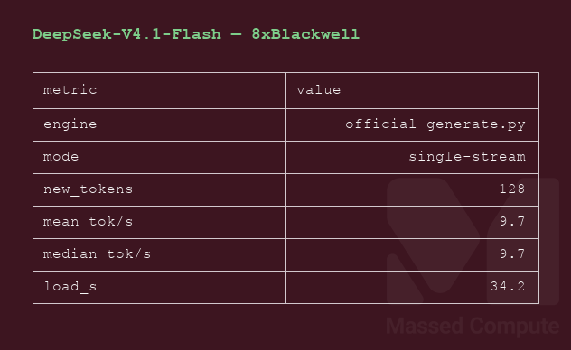
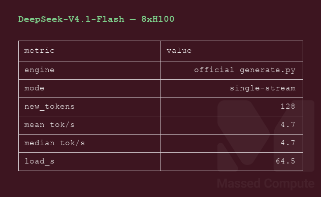

# DeepSeek V4.1 Flash GPU Benchmark

### Last Edit Date:
MC - 2026.09.10

## Purpose
Live Massed Compute benches for **deepseek-ai/DeepSeek-V4.1-Flash** (MIT; ungated). HF snapshot ~476 GiB. Architecture is `DeepseekV41ForCausalLM` (`model_type=deepseek_v41`).

## Technique
Official DeepSeek `inference/generate.py` single-stream decode (128 new tokens, 5 repeats after warmup), `torchrun --nproc-per-node 8`, TP8 checkpoint (`convert.py --model-parallel 8 --expert-dtype fp4`). Runtime image `lmsysorg/sglang@sha256:d6e7288627be8b02be88e4bba38e73f6d50e2826869f753c13a4c4385ab3eda9` (SGLang **0.5.19**, tilelang **0.1.12**). Headlines are **decode tok/s** from that harness — not vLLM/SGLang **Output token throughput** at c32. SGLang serve cannot load `deepseek_v41` (c8/c32 N/A).

## Results

| Engine | SKU | $/hr | Decode tok/s | tok/s per $ |
|---|---|---:|---:|---:|
| official generate.py | `gpu_8x_pro_6000_blackwell` | 17.52 | 9.7 | 0.55 |
| official generate.py | `gpu_8x_H100_SXM5` | 25.12 | 4.7 | 0.18 |

### Screenshots

Terminal-style captures from live Massed runs 2026-09-10 (official `generate.py` single-stream decode — not a serving-engine c32 run).

**gpu_8x_pro_6000_blackwell** — 8× RTX PRO 6000 Blackwell 96GB — $17.52/hr

official generate.py · single-stream **9.7** tok/s:

**gpu_8x_H100_SXM5** — 8× H100 SXM5 80GB — $25.12/hr

official generate.py · single-stream **4.7** tok/s:

## Conclusion

On this harness, **`gpu_8x_pro_6000_blackwell`** delivered **9.7** decode tok/s at **$17.52/hr** (~**0.55** tok/s per $/hr). **`gpu_8x_H100_SXM5`** was slower and more expensive (**4.7** tok/s at **$25.12/hr**, ~**0.18** tok/s per $/hr).

## Notes
- Weights do not fit 4×96 GB. Smallest SKU that held the TP8 shards and ran is **8× RTX PRO 6000 Blackwell**. `4× H200 NVL` ($14.48/hr, 564 GB) would be a tighter VRAM fit but had **no capacity** at capture. `8× H200` / `8× B200` also **cap 0**, untested.
- `gpu_8x_a100` was live cheaper ($10.80/hr) and untested — Ampere + official FP4/MegaMoE kernels. Not claimed as cheapest-fit.
- **SGLang 0.5.19** `AutoConfig` raises `ValueError: model type deepseek_v41`. Nested VL `text_config` / `vision_config` is not a rename-to-`deepseek_v4` fix. vLLM was not used.
- Official `requirements.txt` pins `tilelang==0.1.8`; that pin broke JIT (`_NestedLoopCheckVisitor`). **0.1.12** (the SGLang image pin) passed `python3 model.py`.
- Live VRAM during decode: **65293 MiB** / 1024 = **63.8 GiB** per GPU on Blackwell (96 GB card); **65913 MiB** / 1024 = **64.4 GiB** per GPU on H100 (80 GB card — tight, but it ran).
- DSpark speculative decoding was **not** enabled on the timed run.
- Numbers from live Massed runs 2026-09-10; disposable bench VMs terminated after capture. List $/hr from live inventory that day (not a promo rate).

## Raw
- `results/raw/deepseek-v4.1-flash/gpu_8x_pro_6000_blackwell/`
- `results/raw/deepseek-v4.1-flash/gpu_8x_H100_SXM5/`

---

  

  <strong><a href="https://massedcompute.com/?utm_source=github.com&utm_campaign=gpu-benchmark">LAUNCH GPU OR CPU INSTANCE</a></strong>

> **Pricing note:** Listed `$/hr` rates are point-in-time from the capture date. Confirm live pricing in the marketplace before you launch — rates can change. Pay only for the hours you use.
