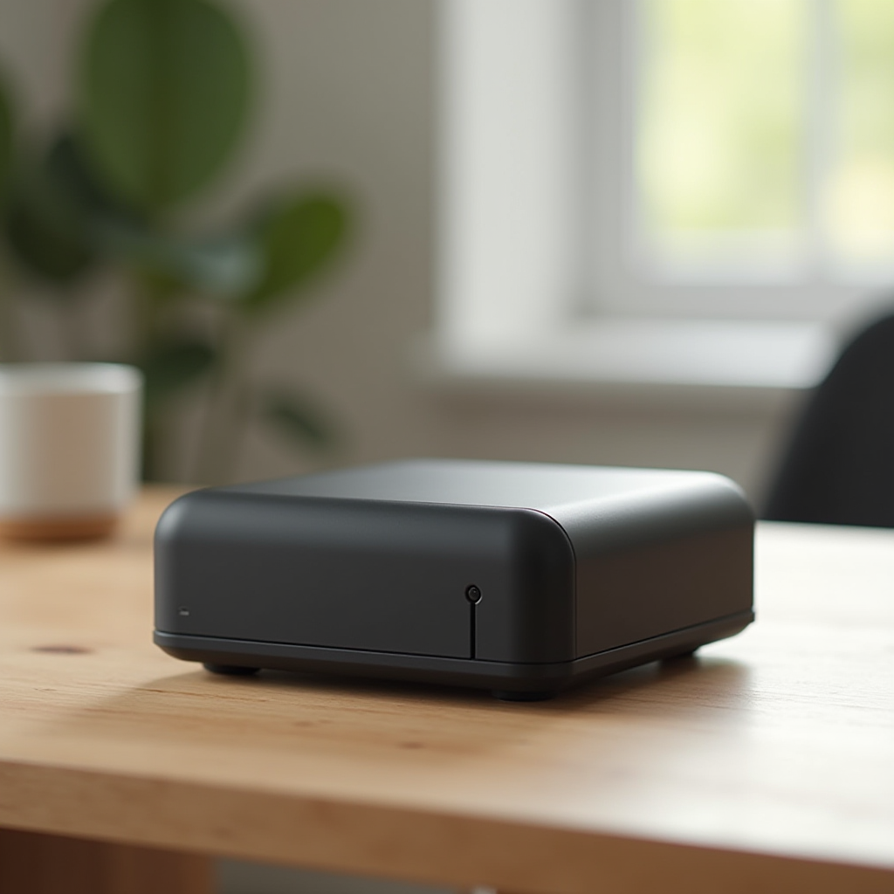

# FLUX.1-dev INT8 ConvRot GPU Benchmark

### Last Edit Date:
MC - 2026.07.22

## Purpose
Live Massed Compute text-to-image benches for **SearchingMan/FLUX.1-dev-ConvRot**.

## Technique
ComfyUI timed multi-seed gens (20 steps, 1024², euler). Headline = mean latency over timed seeds.

## Results

| SKU | $/hr | Res | Gen latency mean (s) | Images/s | Peak VRAM (GB) |
|---|---:|---|---:|---:|---:|
| `gpu_1x_pro_6000_blackwell` | 2.19 | 1024x1024 | 4.110 | 0.243 | 0.0 |
| `gpu_1x_h200_nvl` | 3.62 | 1024x1024 | 4.008 | 0.250 | 0.0 |

### Screenshots

Word-free T2I showcase stills (product photo). Prompt locked to no text/letters/watermark. Packing bench (INT8 ConvRot), not a new base model.

**gpu_1x_pro_6000_blackwell** — RTX PRO 6000 Blackwell 96GB — $2.19/hr · mean gen **4.110** s

**gpu_1x_h200_nvl** — H200 NVL 141GB — $3.62/hr · mean gen **4.008** s

## Conclusion

Fastest mean latency: **4.008 s** on `gpu_1x_h200_nvl`.

## Notes
- Native ComfyUI INT8 ConvRot packing of FLUX.1-dev — not a new architecture.
- `gpu_1x_h100` unavailable; second SKU `gpu_1x_h200_nvl`.
- Numbers from live Massed runs 2026-07-22; disposable bench VMs terminated after capture.

---

**[LAUNCH GPU OR CPU INSTANCE](https://massedcompute.com/?utm_source=github.com&utm_campaign=gpu-benchmark)**

> **Pricing note:** Listed `$/hr` rates are point-in-time from the capture date. Confirm live pricing in the marketplace before you launch — rates can change. Pay only for the hours you use; no long-term contracts.
