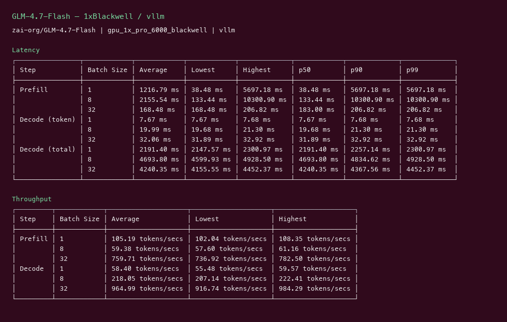
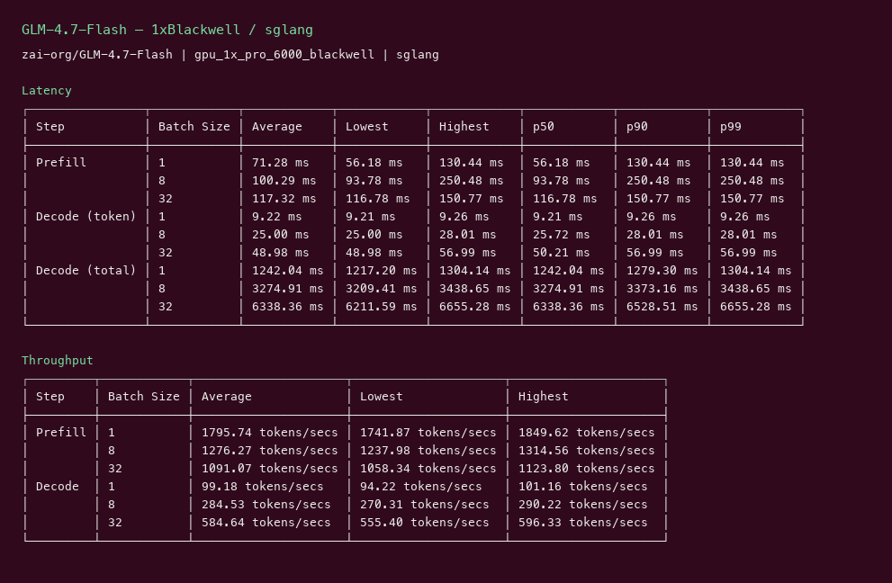
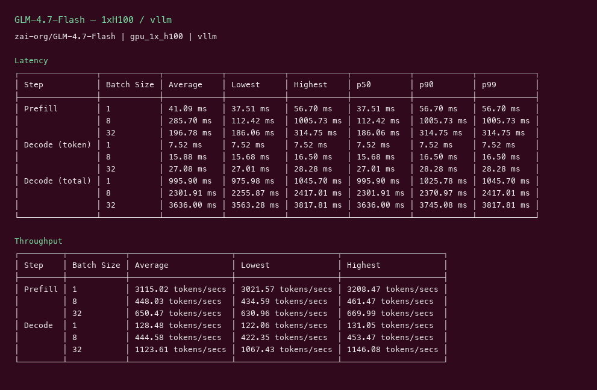
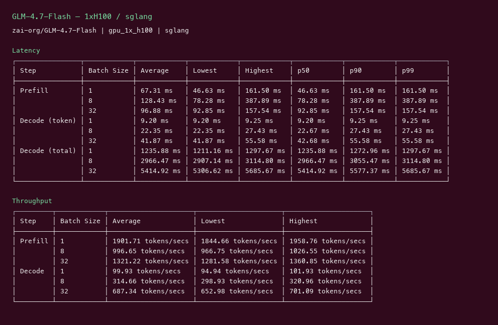

# GLM-4.7-Flash GPU Benchmark

### Last Edit Date:
MC - 2026.07.16

## Purpose
Live Massed Compute inference benches for **zai-org/GLM-4.7-Flash**, comparing **vLLM** vs **SGLang**.

## Technique
Pinned profile: random prompts, input=128, output=128, request-rate=inf, concurrency 1 / 8 / 32. Headlines use **c32**.
Engines: vLLM (`v0.8.5` and/or `cu129-nightly`) + SGLang `lmsysorg/sglang:latest`.

## Results

| Engine | SKU | $/hr | Output tok/s (c32) | TTFT mean/med (ms) | tok/s per $ |
|---|---|---:|---:|---:|---:|
| vllm | `gpu_1x_pro_6000_blackwell` | 2.19 | 965.0 | 183.0 | 440.6 |
| sglang | `gpu_1x_pro_6000_blackwell` | 2.19 | 584.6 | 116.8 | 267.0 |
| vllm | `gpu_1x_h100` | 2.73 | 1123.6 | 186.1 | 411.6 |
| sglang | `gpu_1x_h100` | 2.73 | 687.3 | 92.8 | 251.8 |

### Screenshots

**gpu_1x_pro_6000_blackwell** — $2.19/hr

vllm:

sglang:

**gpu_1x_h100** — $2.73/hr

vllm:

sglang:

## Conclusion

Peak c32 output throughput: **1124 tok/s** on `gpu_1x_h100` with **vllm**.
Best $/tok: **440.6 tok/s per $** on `gpu_1x_pro_6000_blackwell` / **vllm**.

## Notes

- Newest Z.ai GLM Flash MoE-lite (~30B-class). Required vLLM nightly for Glm4MoeLite.
- Both SKUs used `cu129-nightly` for arch support.
- Numbers from live Massed runs 2026-07-16; bench VMs terminated after capture.

---

**[LAUNCH GPU OR CPU INSTANCE](https://massedcompute.com/?utm_source=github.com&utm_campaign=gpu-benchmark)**

> **Pricing note:** Listed `$/hr` rates are point-in-time from the capture date. Confirm live pricing in the marketplace before you launch — rates can change. Pay only for the hours you use; no long-term contracts.
