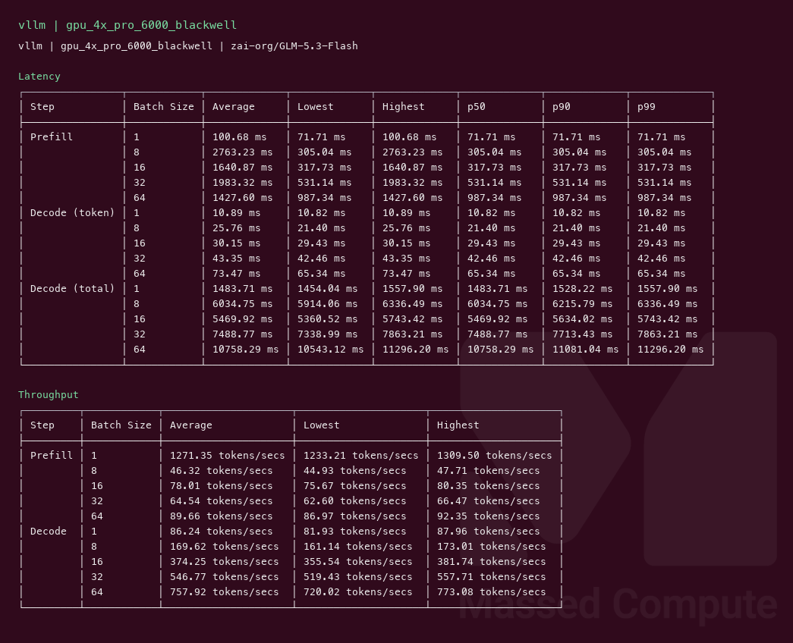
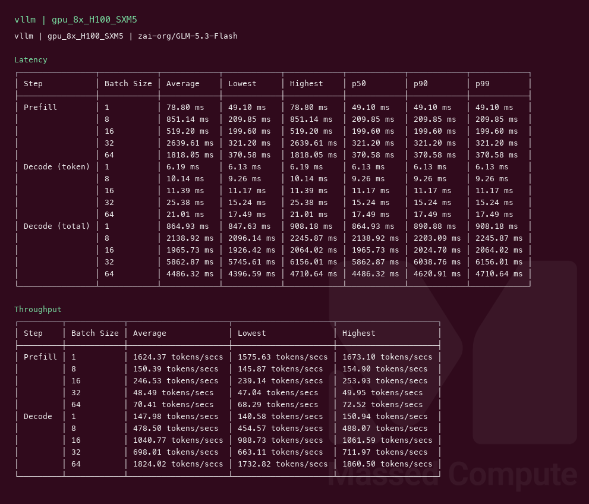

# GLM 5.3 Flash GPU Benchmark

### Last Edit Date:
MC - 2026.08.31

## Purpose
Live Massed Compute inference benches for **zai-org/GLM-5.3-Flash** (321B MoE / 18B active, native FP8, multimodal). Official weights, text-decode throughput profile (MM image limit 0).

## Technique
Pinned profile: random prompts, input=128, output=128, request-rate=inf, concurrency 1 / 8 / 16 / 32 / 64. Headlines use **c32**.

- **4× RTX PRO 6000 Blackwell** (`gpu_4x_pro_6000_blackwell`, $8.76/hr): patched SM120 NoPE image `cstechdev/vllm:glm53-flash-nope-sm120-cu130-20260826-r1`, `--tensor-parallel-size 4 --kv-cache-dtype fp8 --max-num-seqs 64 --max-model-len 8192 --gpu-memory-utilization 0.95`.
- **8× H100 SXM5** (`gpu_8x_H100_SXM5`, $25.12/hr): official `vllm/vllm-openai:glm53-flash`, `--tensor-parallel-size 8 --kv-cache-dtype bfloat16 --max-num-seqs 256 --max-model-len 8192`.

Stock `glm53-flash` cannot serve this checkpoint on SM120 (NoPE MLA, `qk_rope_head_dim=0` vs `fp8_ds_mla` pe_dim=64). Hopper 8× H100 is the official-image path. SGLang not captured this wave.

## Results

These two rows are **not** the same serving configuration. Image, KV dtype, and `max-num-seqs` all differ; the H100 row also has no FP8 KV on Hopper, so that split is forced.

| Engine | SKU | Image | KV | max-num-seqs | $/hr | Output tok/s (c32) | TTFT med (ms) | tok/s per $ | $/1M out tokens |
|---|---|---|---|---:|---:|---:|---:|---:|---:|
| vllm | `gpu_4x_pro_6000_blackwell` | SM120 NoPE overlay | fp8 | 64 | 8.76 | 546.8 | 531.1 | 62.4 | 4.450 |
| vllm | `gpu_8x_H100_SXM5` | official `glm53-flash` | bfloat16 | 256 | 25.12 | 698.0 | 321.2 | 27.8 | 9.997 |

H100 **c32 is the trough** in that host's own ladder (decode tok/s: c1 148 / c8 479 / **c16 1041** / c32 698 / **c64 1824**). c32 sits 33% below c16 at twice the concurrency; c16's range does not overlap c32. Blackwell is monotonic on the same rungs. Read the H100 comparison at **c16 or c64**, not at the c32 headline.

| SKU | c1 | c8 | c16 | c32 | c64 |
|---|---:|---:|---:|---:|---:|
| `gpu_4x_pro_6000_blackwell` | 86.2 | 169.6 | 374.3 | **546.8** | 757.9 |
| `gpu_8x_H100_SXM5` | 148.0 | 478.5 | **1040.8** | 698.0 | **1824.0** |

tok/s per $ at c64 is still Blackwell (86.5 vs 72.6).

### Screenshots

**gpu_4x_pro_6000_blackwell** — $8.76/hr

vllm — 546.8 output tok/s @ c32:

**gpu_8x_H100_SXM5** — $25.12/hr

vllm — 698.0 output tok/s @ c32 (trough; c16 is 1041, c64 is 1824):

## Conclusion

c32 output throughput: **698 tok/s** on `gpu_8x_H100_SXM5` / **vllm** — that is this host's worst point above c8. Same capture: **1041 tok/s** at c16 and **1824 tok/s** at c64.
Best tok/s per $: **62.4** on `gpu_4x_pro_6000_blackwell` / **vllm** (still the value winner at c64).

4× Blackwell is the least expensive live fit; 8× H100 buys lower TTFT (321 vs 531 ms at c32) and more headroom when you read c16/c64.

## Notes
- Official FP8 checkpoint (~306 GiB). 8× Blackwell / 8× H200 had no capacity at capture (large tier skipped).
- Stock `vllm/vllm-openai:glm53-flash` loads on 4× Blackwell then dies (`pe_dim must be 64 for fp8_ds_mla`). 4× numbers use the SM120 NoPE overlay image above.
- Hopper KV is **bfloat16** (this model has no FP8 KV on Hopper). Blackwell overlay uses **fp8**.
- Numbers from live Massed runs 2026-08-31; bench VMs terminated after capture.
- Raw: `results/raw/glm-5.3-flash/`.

---

  

  <strong><a href="https://massedcompute.com/?utm_source=github.com&utm_campaign=gpu-benchmark">LAUNCH GPU OR CPU INSTANCE</a></strong>

> **Pricing note:** Listed `$/hr` rates are point-in-time from the capture date. Confirm live pricing in the marketplace before you launch — rates can change. Pay only for the hours you use.
