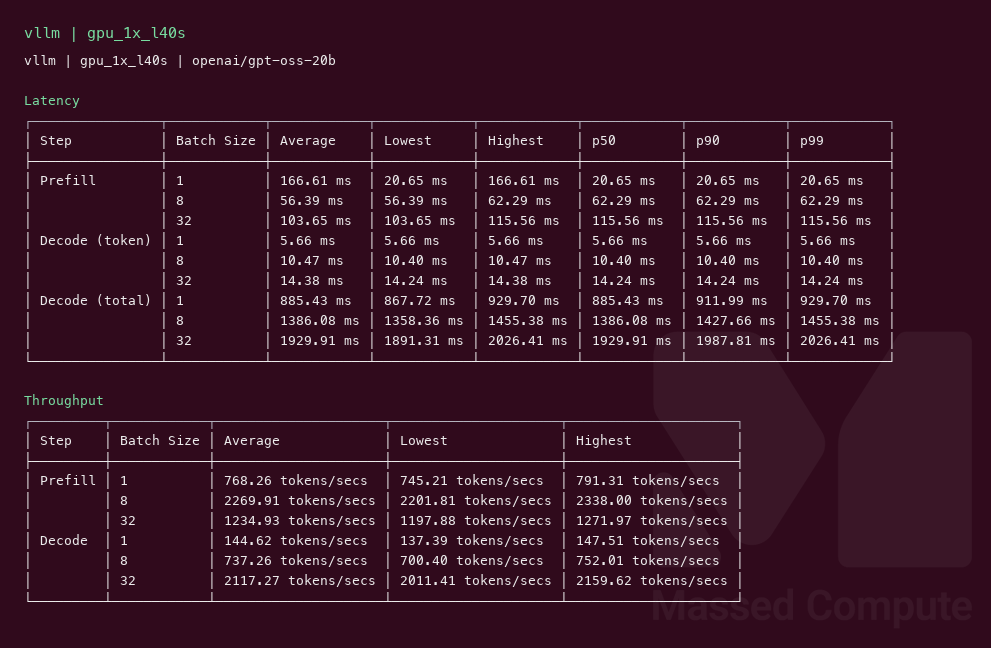
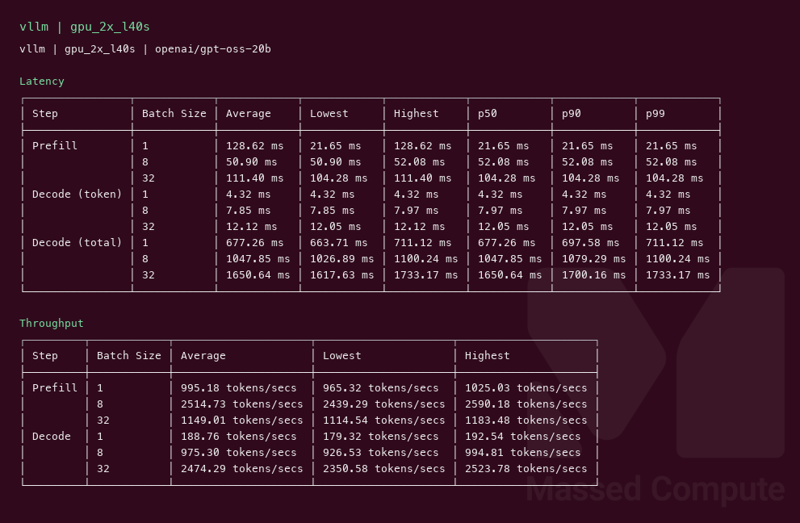
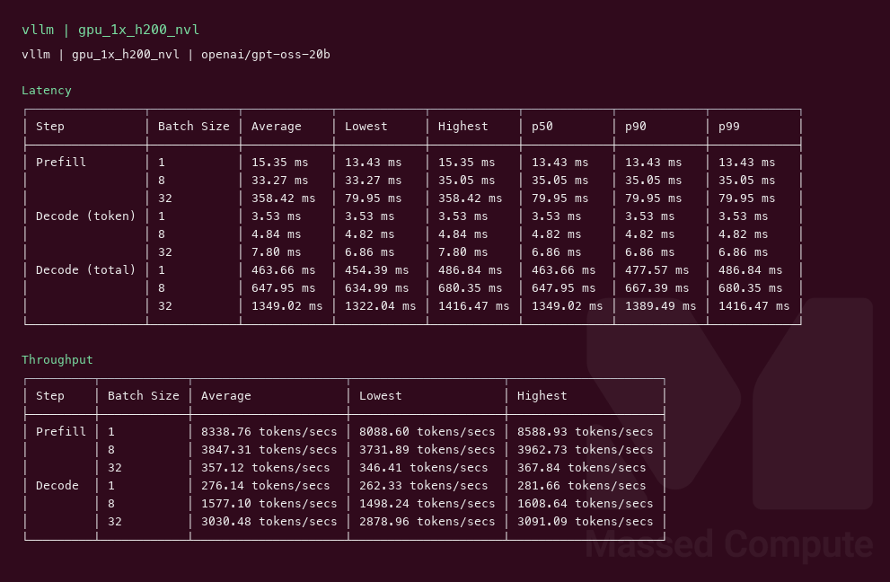

# gpt-oss-20b GPU Benchmark

### Last Edit Date:
MC - 2026.08.11

## Purpose
Live Massed Compute inference benches for **openai/gpt-oss-20b** (ungated HF, MXFP4 weights). Ladder on coupon-available stock: 1× L40S → 1× H200 NVL → 2× L40S (Blackwell/H100 out of stock this window).

## Technique
Pinned profile: random prompts, input=128, output=128, request-rate=inf, concurrency 1 / 8 / 32. Headlines use **c32**.
vLLM image: `vllm/vllm-openai:nightly` (v0.8.5 does not load `gpt_oss`). Serve flags: `--max-model-len 8192 --gpu-memory-utilization 0.92 --max-num-batched-tokens 16384 --enable-prefix-caching --kv-cache-dtype fp8`.

## Results

| Engine | SKU | $/hr | Output tok/s (c32) | TTFT med (ms) | tok/s per $ |
|---|---|---:|---:|---:|---:|
| vllm | `gpu_1x_l40s` | 0.88 | 2117.3 | 115.6 | 2406.0 |
| vllm | `gpu_2x_l40s` | 1.76 | 2474.3 | 104.3 | 1405.8 |
| vllm | `gpu_1x_h200_nvl` | 3.62 | 3030.5 | 80.0 | 837.1 |

### Screenshots

**gpu_1x_l40s** — $0.88/hr — smallest fit; best tok/s per $

vLLM terminal capture @ c32 — 2117.3 output tok/s, median TTFT 115.6 ms:

**gpu_2x_l40s** — $1.76/hr — medium step (TP=2)

vLLM terminal capture @ c32 — 2474.3 output tok/s, median TTFT 104.3 ms:

**gpu_1x_h200_nvl** — $3.62/hr — large / max VRAM this run

vLLM terminal capture @ c32 — 3030.5 output tok/s, median TTFT 80.0 ms:

## Conclusion

**1× L40S + vLLM** is the best-value setup for this model (~2406 output tok/s per $/hr). 2× L40S adds ~17% throughput for 2× the hourly rate. 1× H200 is the peak throughput tier (~3030 tok/s) if you want lower TTFT and headroom.

## Notes
- SGLang serve came up on L40S/2×L40S, but the host-side `sglang.bench_serving` client failed. `--dataset-name random` still downloads ShareGPT for sampling, and that hit a root-owned docker HF cache (`PermissionError`). H200 failed earlier on a `deep_gemm_wrapper` import. Retries deferred — vLLM ladder is complete. Prefer `sglang.benchmark.serving` on retry (old `bench_serving` is deprecated).
- Pinned profile (stated inline): random prompts, input=128 / output=128, request-rate=inf, concurrency 1 / 8 / 32; headlines use c32 sustained Output token throughput.
- Confirm live marketplace pricing before launch.

---

  

  <strong><a href="https://massedcompute.com/?utm_source=github.com&utm_campaign=gpu-benchmark">LAUNCH GPU OR CPU INSTANCE</a></strong>

> **Pricing note:** Listed `$/hr` rates are point-in-time from the capture date. Confirm live pricing in the marketplace before you launch — rates can change. Pay only for the hours you use.
