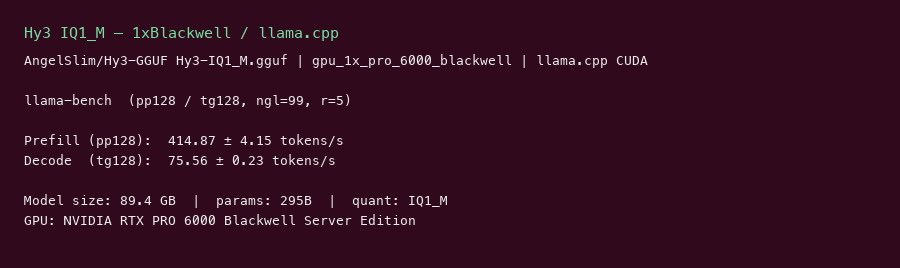

# Hy3 IQ1_M GGUF GPU Benchmark

### Last Edit Date:
MC - 2026.07.21

## Purpose
Live Massed Compute llama.cpp benches for **AngelSlim/Hy3-GGUF** `Hy3-IQ1_M.gguf` (Tencent Hy3 295B MoE / ~21B active, ~84–92 GB 1-bit, Apache-2.0) on a single 96 GB GPU.

## Technique
`llama-bench` (CUDA, `-ngl 99`), profile **pp128 / tg128**, 5 repeats. Headline decode = **tg128**.
Built with CUDA 12.8 against Blackwell `sm_120`.

## Results

| Engine | SKU | $/hr | Prefill tok/s (pp128) | Decode tok/s (tg128) | tok/s per $ (decode) |
|---|---|---:|---:|---:|---:|
| llama.cpp | `gpu_1x_pro_6000_blackwell` | 2.19 | 414.9 | 75.6 | 34.5 |

### Screenshots

**gpu_1x_pro_6000_blackwell** — $2.19/hr

llama.cpp:

## Conclusion

Single-GPU Hy3 IQ1_M decode: **75.6 tok/s** on `gpu_1x_pro_6000_blackwell` (~**34.5 tok/s per $**).

## Notes
- Official AngelSlim IQ1_M GGUF of `tencent/Hy3` (hy_v3); fits one RTX PRO 6000 Blackwell 96 GB.
- Extreme 1-bit compression trades quality for single-card deployability.
- Numbers from live Massed run 2026-07-21; bench VM terminated after capture.

---

  

  <strong><a href="https://massedcompute.com/?utm_source=github.com&utm_campaign=gpu-benchmark">LAUNCH GPU OR CPU INSTANCE</a></strong>

> **Pricing note:** Listed `$/hr` rates are point-in-time from the capture date. Confirm live pricing in the marketplace before you launch — rates can change. Pay only for the hours you use
