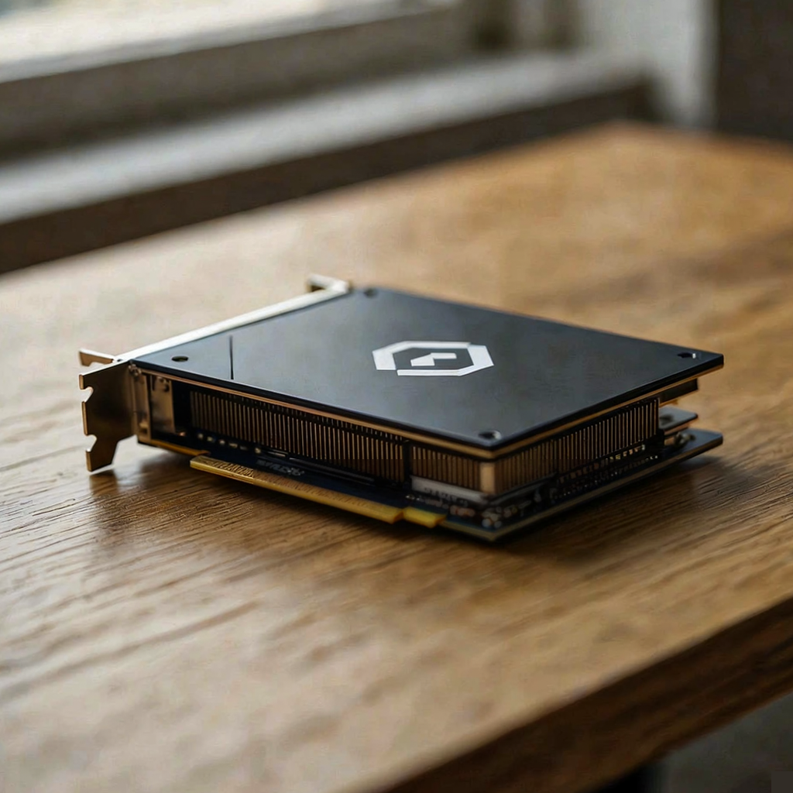

# Ideogram v4 Instant GPU Benchmark

### Last Edit Date:
MC - 2026.07.21

## Purpose
Live Massed Compute text-to-image benches for **Ideogram v4 Instant** (8-step, no-CFG) using ungated ComfyUI weights **Hippotes/Ideogram4-Fal-ComfyUI** (`Ideogram4-instant_int8-convrot-simple`) + Comfy-Org shared TE/VAE.

## Technique
ComfyUI: `UNETLoader` + `CLIPLoader(type=ideogram4)` + `Ideogram4Scheduler` + `SamplerCustom` (euler), **8 steps**, CFG 1.0, **1024×1024**. Headline: mean latency over uncached seeds (warm excluded).

## Results

| SKU | $/hr | Res | Gen latency mean (s) | Images/s | Peak VRAM (GB) |
|---|---:|---|---:|---:|---:|
| `gpu_1x_pro_6000_blackwell` | 2.19 | 1024x1024 | 1.880 | 0.532 | 17.7 |
| `gpu_1x_h100` | 2.73 | 1024x1024 | 2.528 | 0.396 | 17.6 |

### Screenshots

Word-free T2I showcase stills (product photo of a compact accelerator module on a desk). Same open Instant stack as the latency table: ComfyUI Ideogram4 Instant int8-convrot, 8 steps, euler, CFG 1.0, **1024×1024**. Prompt locked to no text/letters/watermark. Latency numbers above are from timed multi-seed bench runs — not this single still.

**gpu_1x_pro_6000_blackwell** — RTX PRO 6000 Blackwell 96GB — $2.19/hr · mean gen **1.880** s

**gpu_1x_h100** — H100 80GB PCIe — $2.73/hr · mean gen **2.528** s

## Conclusion

Blackwell leads Instant 8-step latency in this capture (~26% faster than H100 at 1024² / int8-convrot).

## Notes
- fal/ideogram-v4-instant is gated; Hippotes ComfyUI Instant int8 package used for reproducible open download.
- Numbers from live Massed runs 2026-07-21; bench VMs terminated after capture.

---

  

  <strong><a href="https://massedcompute.com/?utm_source=github.com&utm_campaign=gpu-benchmark">LAUNCH GPU OR CPU INSTANCE</a></strong>

> **Pricing note:** Listed `$/hr` rates are point-in-time from the capture date. Confirm live pricing in the marketplace before you launch — rates can change. Pay only for the hours you use.
