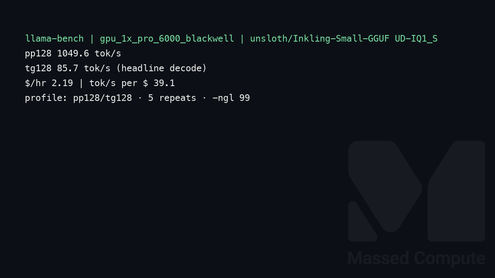
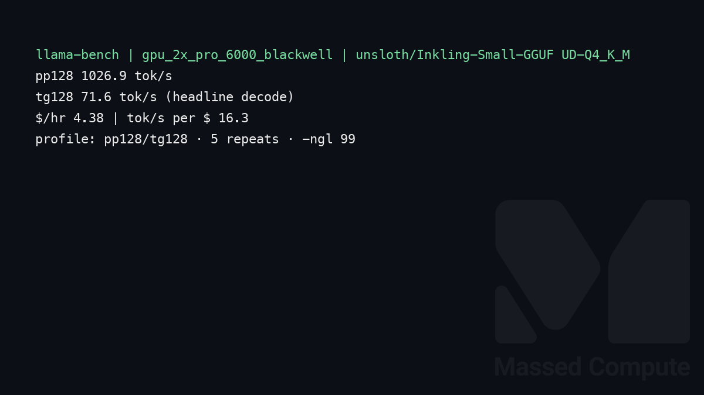
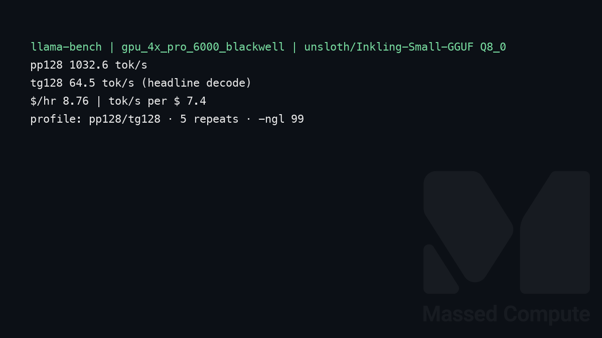

# Inkling-Small GGUF GPU Benchmark

### Last Edit Date:
MC - 2026.08.03

## Purpose
Live Massed Compute llama.cpp benches for **Thinking Machines Lab Inkling-Small** via **`unsloth/Inkling-Small-GGUF`** (276B total / 12B active multimodal MoE).  
NVFP4 (`thinkingmachines/Inkling-Small-NVFP4`) was attempted first on RTX PRO 6000 Blackwell (SM120) with vLLM nightly; serve failed (`Paged KV not supported on SM 12.0` / `SM120 forward only supports num_splits=1`). GGUF is the runnable Massed path today on Pro 6000.

## Technique
`llama-bench` (CUDA, `-ngl 99`), profile **pp128 / tg128**, 5 repeats. Headline decode = **tg128**.  
Built in `nvidia/cuda:12.8.0-devel` against Blackwell `sm_120` (llama.cpp PR `#25731` when available).

Ladder:
- **Smallest fit:** `UD-IQ1_S` (~69.6 GiB) on **1×** RTX PRO 6000 Blackwell 96 GB  
- **Medium:** `UD-Q4_K_M` (~151.4 GiB) on **2×** RTX PRO 6000 Blackwell  
- **Large:** `Q8_0` (~261.0 GiB) on **4×** RTX PRO 6000 Blackwell  

## Results

| Engine | Quant | SKU | $/hr | Prefill tok/s (pp128) | Decode tok/s (tg128) | tok/s per $ (decode) |
|---|---|---|---:|---:|---:|---:|
| llama.cpp | `UD-IQ1_S` | `gpu_1x_pro_6000_blackwell` | 2.19 | 1049.6 | **85.7** | **39.1** |
| llama.cpp | `UD-Q4_K_M` | `gpu_2x_pro_6000_blackwell` | 4.38 | 1026.9 | 71.6 | 16.3 |
| llama.cpp | `Q8_0` | `gpu_4x_pro_6000_blackwell` | 8.76 | 1032.6 | 64.5 | 7.4 |

### Screenshots

Terminal-style llama-bench captures (pp128 / tg128), Massed Compute 2026-08-03.

**gpu_1x_pro_6000_blackwell** — RTX PRO 6000 Blackwell 96GB — $2.19/hr — `UD-IQ1_S`

llama.cpp · tg128 **85.7** tok/s · pp128 **1049.6** tok/s:

**gpu_2x_pro_6000_blackwell** — 2× RTX PRO 6000 Blackwell 96GB — $4.38/hr — `UD-Q4_K_M`

llama.cpp · tg128 **71.6** tok/s · pp128 **1026.9** tok/s:

**gpu_4x_pro_6000_blackwell** — 4× RTX PRO 6000 Blackwell 96GB — $8.76/hr — `Q8_0`

llama.cpp · tg128 **64.5** tok/s · pp128 **1032.6** tok/s:

## Conclusion

Peak decode (tg128): **85.7 tok/s** on **1× Blackwell** with `UD-IQ1_S` (~**39.1 tok/s per $**).  
Higher-fidelity `UD-Q4_K_M` on **2×** is **71.6** tok/s; large `Q8_0` on **4×** is **64.5** tok/s (~7.4 tok/s per $).

## Notes
- The three rows are **not quality-comparable**: each SKU runs a different GGUF quant (IQ1_S → Q4_K_M → Q8_0). Decode falling as GPUs are added is buying fidelity, not a scaling regression.
- Prefill (pp128) stays flat (~1030–1050 tok/s) across 1×/2×/4× because layer-split runs one GPU at a time and prefill is bottlenecked elsewhere at ubatch 512.
- Card copy often says ~276B; committed `llama-bench` JSON reports `model_n_params` ≈ **263.7B** (GGUF counting). Exact HF ids: `unsloth/Inkling-Small-GGUF` quants above (derived from Thinking Machines Inkling-Small).
- NVFP4 (`thinkingmachines/Inkling-Small-NVFP4`) / BF16 vLLM on Pro 6000 SM120 blocked in this session’s nightly (`Paged KV not supported on SM 12.0`); H200/B200 inventory was empty for the official NVFP4 recipe.
- Repro: `scripts/remote_inkling_gguf.sh` (`QUANT=UD-IQ1_S|UD-Q4_K_M|Q8_0`).
- Bench VMs terminated after capture.

## Raw
- `results/raw/inkling-small-gguf/gpu_1x_pro_6000_blackwell/`
- `results/raw/inkling-small-gguf/gpu_2x_pro_6000_blackwell/`
- `results/raw/inkling-small-gguf/gpu_4x_pro_6000_blackwell/`

---

  

  <strong><a href="https://massedcompute.com/?utm_source=github.com&utm_campaign=gpu-benchmark">LAUNCH GPU OR CPU INSTANCE</a></strong>

> **Pricing note:** Listed `$/hr` rates are point-in-time from the capture date. Confirm live pricing in the marketplace before you launch — rates can change. Pay only for the hours you use.
