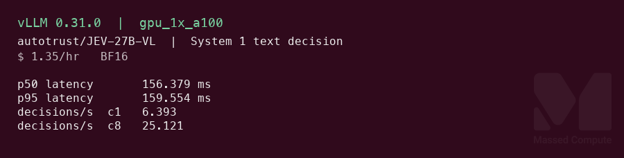
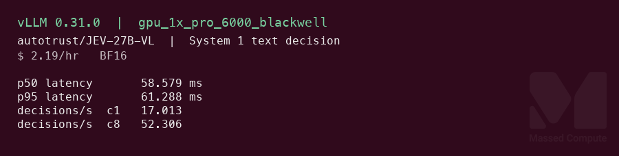

# JEV-27B-VL GPU Benchmark

### Last Edit Date:
MC - 2026.10.06

## Purpose
Live Massed Compute benches for [autotrust/JEV-27B-VL](https://huggingface.co/autotrust/JEV-27B-VL) at revision `f34b598d4ef4bcefd337bee8d8e7ddd3b7733ccc` (BF16). JEV-27B-VL is Qwen3.8-27B with vision plus a System 1 decision adapter. System 1 (`POST /v1/decide`) returns a calibrated probability for every option in one forward pass. System 2 is the unmodified base model through the usual OpenAI endpoints. Headlines are **System 1 p50 latency (ms)** and **decisions/s**. System 2 is reported as sustained output tokens/s.

## Technique
vLLM `0.31.0` (`torch 2.13.0+cu130`, `transformers 5.17.0`) running the author's `serve_decide.py` from the model repo, which is the standard vLLM OpenAI server plus the `/v1/decide` route. Flags follow the author's `serve.sh`: `--enable-lora --max-lora-rank 32`, the `jev-decision` adapter, `--logprobs-mode processed_logprobs`, `--max-model-len 32768`, `--max-num-seqs 8` (the author says more than 8 sequences per batch gives wrong System 1 probabilities), `--limit-mm-per-prompt '{"image": 8}'`, `--trust-request-chat-template`. Two changes from `serve.sh`: prefix caching is off, and `VLLM_USE_FLASHINFER_SAMPLER=0`. On these images the FlashInfer sampler tried to compile a CUDA module at the first System 2 request and the engine died. Runner: `scripts/jev-27b-vl/remote.sh`.

System 1 requests use `thinking: "off"` and `strategy: "single"`, so each call is one System 1 pass. Two workloads:

- **Text:** a 3-option `choice` (route a support ticket). About 53 prompt tokens.
- **Image:** a `noul` yes/no question about one generated 448×448 PNG sent as a base64 data URL. About 237 prompt tokens.

Every request has a unique state string. The clock is client wall time per HTTP request on the same VM, including JSON and image upload. Single stream: 20 warmup + 200 timed calls in sequence. decisions/s at c1 = 200 / wall time of those calls. Concurrent: 16 warmup, then 400 requests at client concurrency 8 (the server cap). decisions/s at c8 = 400 / wall time.

System 2: `vllm bench serve`, random dataset, 128 input / 128 output tokens, `--ignore-eos`. c1 is 10 prompts and c8 is 40 prompts. Concurrency above 8 was not run because the server caps at 8 sequences.

## Results

System 1, text decision (headline):

| Engine | SKU | $/hr | p50 latency (ms) | p95 latency (ms) | Decisions/s c1 | Decisions/s c8 | Decisions per $ c8 |
|---|---|---:|---:|---:|---:|---:|---:|
| vLLM 0.31.0 | `gpu_1x_a100` | 1.35 | 156.4 | 159.6 | 6.393 | 25.121 | 66989 |
| vLLM 0.31.0 | `gpu_1x_h100` | 2.73 | 164.4 | 180.7 | 6.090 | 26.259 | 34627 |
| vLLM 0.31.0 | `gpu_1x_pro_6000_blackwell` | 2.19 | 58.6 | 61.3 | 17.013 | 52.306 | 85982 |

System 1, image decision:

| Engine | SKU | $/hr | p50 latency (ms) | p95 latency (ms) | Decisions/s c1 | Decisions/s c8 | Decisions per $ c8 |
|---|---|---:|---:|---:|---:|---:|---:|
| vLLM 0.31.0 | `gpu_1x_a100` | 1.35 | 164.6 | 168.9 | 6.070 | 12.113 | 32301 |
| vLLM 0.31.0 | `gpu_1x_h100` | 2.73 | 179.5 | 217.4 | 5.273 | 18.457 | 24339 |
| vLLM 0.31.0 | `gpu_1x_pro_6000_blackwell` | 2.19 | 73.0 | 76.8 | 13.613 | 23.276 | 38262 |

Decisions per $ = decisions/s × 3600 ÷ list $/hr.

System 2, random 128 in / 128 out:

| Engine | SKU | $/hr | Output tok/s c1 | Output tok/s c8 | Median TTFT c8 (ms) | Median TPOT c8 (ms) | Output tok per $ c8 |
|---|---|---:|---:|---:|---:|---:|---:|
| vLLM 0.31.0 | `gpu_1x_a100` | 1.35 | 27.06 | 194.46 | 363.5 | 38.56 | 518567 |
| vLLM 0.31.0 | `gpu_1x_h100` | 2.73 | 31.43 | 207.51 | 244.7 | 33.21 | 273645 |
| vLLM 0.31.0 | `gpu_1x_pro_6000_blackwell` | 2.19 | 26.22 | 194.14 | 204.3 | 39.90 | 319130 |

Output tok/s is `output_throughput` from the `vllm bench serve` JSON. Tok per $ = output tok/s × 3600 ÷ list $/hr.

### Screenshots

System 1 text-decision cards. Numbers on the image are the raw JSON, not the rounded table.

**gpu_1x_a100** — A100 80GB PCIe — $1.35/hr

vLLM 0.31.0 · `/v1/decide` · p50 **156.4 ms** · **25.121** decisions/s at c8:

**gpu_1x_h100** — H100 80GB PCIe — $2.73/hr

vLLM 0.31.0 · same checkpoint · p50 **164.4 ms** · **26.259** decisions/s at c8:

**gpu_1x_pro_6000_blackwell** — RTX PRO 6000 Blackwell 96GB — $2.19/hr

vLLM 0.31.0 · same checkpoint · p50 **58.6 ms** · **52.306** decisions/s at c8:

## Conclusion

Least expensive launched fit is **`gpu_1x_a100`** at $1.35/hr. The BF16 safetensors are **52.17 GiB**, so a single 48GB card cannot hold the weights. The model card also asks for one GPU with 80 GB or more.

Blackwell is both the System 1 speed card and the System 1 value card. Text p50 is **58.6 ms**, against 156.4 ms on the A100 and 164.4 ms on the H100. At c8 it serves **52.306** text decisions/s, **2.1×** the A100 and **2.0×** the H100, and leads decisions per dollar at **85982** against the A100's 66989. Image decisions follow the same order: **23.276**/s at c8, **1.9×** the A100.

The H100 is not faster than the A100 for single-stream System 1 in this build (164.4 vs 156.4 ms text p50). Blackwell's System 2 median TTFT at c1 is also about half the other two cards (59.5 ms vs 112.6 / 110.9 ms). The Blackwell lead holds across both measurements, but this capture does not isolate the cause.

For System 2 text generation, the H100 has the highest output rate (**207.51** tok/s at c8, **33.21** ms TPOT). The A100 is the best value at **518567** output tokens per dollar. The three cards are within 7% of each other at c8.

## Notes
- Weights: 18 sharded BF16 safetensors plus the `adapter_vllm` System 1 LoRA. Safetensors total **56014508552** bytes (52.17 GiB). Revision `f34b598d4ef4bcefd337bee8d8e7ddd3b7733ccc`, passed to `snapshot_download` as `revision=` and written to `versions.txt`.
- `nvidia-smi` peaks are about 72 GiB on the 80GB cards and 86 GiB on Blackwell. That is vLLM's reserved KV-cache pool at the default `--gpu-memory-utilization 0.9`, not the model's minimum.
- Cheaper cards that might fit with tensor parallel 2 and were not launched: `gpu_2x_a6000` ($1.14), `gpu_2x_a6000_low_ram` ($1.10), `gpu_2x_a6000_spot` ($1.00), 96GB across two cards. The author's setup is one GPU, and the System 1 LoRA path was not checked under tensor parallel.
- `gpu_1x_DGX_A100` and `gpu_1x_A100_SXM4` ($1.38) were not launched. `gpu_1x_a100` is $0.03 less.
- Smoke answers: the text ticket returned `billing` (p ≈ 0.999). The image question returned `true`, which is correct for the generated frame. Not an accuracy eval.
- Prefix caching off means repeated long system states are not reused. The author's `serve.sh` enables it, and real control loops with a fixed prefix may see lower latency than these numbers.
- Raw: `results/raw/jev-27b-vl/<sku>/bf16-vllm/` (`decide-bench.json` with every timed latency, `vllm-c1.json`, `vllm-c8.json`, `serve.log`, live `nvidia-smi.txt`, `versions.txt`, `DONE`).
- Bench VMs terminated after capture.

---

  

  <strong><a href="https://massedcompute.com/?utm_source=github.com&utm_campaign=gpu-benchmark">LAUNCH GPU OR CPU INSTANCE</a></strong>

> **Pricing note:** Listed `$/hr` rates are point-in-time from the capture date. Confirm live pricing in the marketplace before you launch — rates can change. Pay only for the hours you use.
