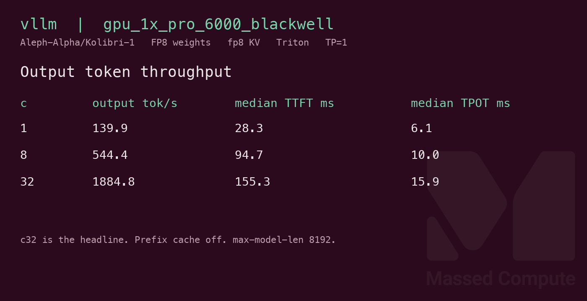
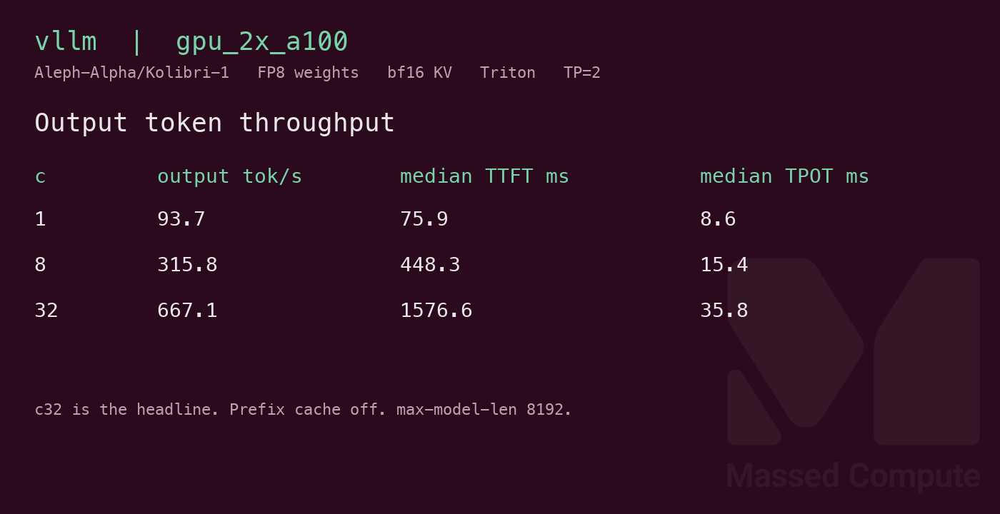
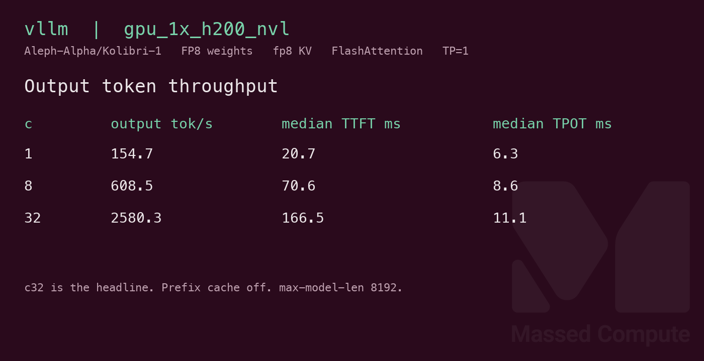

# Kolibri-1 GPU Benchmark

### Last Edit Date:
MC - 2026.10.07

## Purpose
Live Massed Compute vLLM benches for [Aleph-Alpha/Kolibri-1](https://huggingface.co/Aleph-Alpha/Kolibri-1) revision `35bc4d3be745502227a67247de77d70e691614ee`. FP8 e4m3fn weights, about 78B total parameters and about 3.5B active. Measured safetensors are **78,841,467,208** bytes (**73.4 GiB**).

## Technique
Pinned profile: `vllm bench serve`, backend openai, `/v1/completions`, random prompts, input=128, output=128, `ignore-eos`, request-rate=inf, concurrency 1 / 8 / 32. Prompts per row are concurrency times 5. Headlines use **c32** **Output token throughput**. The clock is client wall time against one long-lived server, including HTTP.

Engine is vLLM **0.29.0** from `aleph-alpha-inference` **1.0.0** (torch 2.13.0+cu130). Same weights and revision on every SKU. Prefix cache off. `--max-model-len 8192 --gpu-memory-utilization 0.92 --max-num-batched-tokens 16384`. vLLM 0.29 does not force temperature 0; sampling is whatever the server applies. Runner: `scripts/kolibri-1/remote.sh`.

Attention and KV dtype are not the same on every card. `scripts/kolibri-1/remote.sh` sets them per SKU so a rerun matches the row:

- **H200 NVL** (`gpu_1x_h200_nvl`): no `--attention-backend`. vLLM auto-selected FlashAttention, with fp8 KV.
- **RTX PRO 6000 Blackwell**: forced `--attention-backend TRITON_ATTN` and fp8 KV. Blackwell has no FlashAttention candidate, and the FlashInfer XQA kernel is missing.
- **2× A100**: forced `--attention-backend TRITON_ATTN`, **bfloat16 KV**, and tensor parallel 2 (`TP=2`). A100 (SM80) cannot store fp8 KV with Triton (needs SM89) or FlashAttention (fp8 KV needs FA3 on SM90 or FA4 on SM100), and FlashInfer’s attention JIT needs nvcc, which this image does not ship.

Treat cross-SKU tok/s as indicative, not an A/B of one kernel.

## Results

| Engine | SKU | KV | Attention | $/hr | Output tok/s (c32) | TTFT med (ms) | tok/s per $ | $/1M out tokens |
|---|---|---|---|---:|---:|---:|---:|---:|
| vllm 0.29.0 | `gpu_1x_pro_6000_blackwell` | fp8 | Triton (forced) | 2.19 | 1884.8 | 155.3 | 860.6 | 0.323 |
| vllm 0.29.0 | `gpu_2x_a100` | bf16 | Triton (forced) | 2.70 | 667.1 | 1576.6 | 247.1 | 1.124 |
| vllm 0.29.0 | `gpu_1x_h200_nvl` | fp8 | FlashAttention (auto) | 3.62 | 2580.3 | 166.5 | 712.8 | 0.390 |

`$/hr` is the live list rate on 2026-10-07. tok/s per $ is c32 output tok/s divided by `$/hr`. `$/1M` is `$/hr × 1,000,000 / (output tok/s × 3600)`.

### Screenshots

Serving-bench cards from the raw JSON (input=128, output=128, concurrency 1/8/32).

**gpu_1x_pro_6000_blackwell** — RTX PRO 6000 Blackwell 96GB — $2.19/hr

vLLM · Triton (forced) · fp8 KV · c32 **1884.8** output tok/s · TTFT med **155.3** ms:

**gpu_2x_a100** — 2× A100 80GB PCIe — $2.70/hr

vLLM · Triton (forced) · bf16 KV · tensor parallel 2 · c32 **667.1** output tok/s · TTFT med **1576.6** ms:

**gpu_1x_h200_nvl** — H200 NVL — $3.62/hr

vLLM · FlashAttention (auto) · fp8 KV · c32 **2580.3** output tok/s · TTFT med **166.5** ms:

## Conclusion

The least expensive launched card that held the pack is **`gpu_1x_pro_6000_blackwell`** at **$2.19/hr**. Its c32 output throughput is **1884.8** tok/s, **860.6** tok/s per $, **$0.323** per 1M output tokens. H200 is the c32 throughput high in this set: **2580.3** tok/s at **$3.62/hr** (**712.8** tok/s per $). Those two rows both use fp8 KV, but H200 ran vLLM's auto-selected FlashAttention and Blackwell was forced to Triton, so the gap is indicative.

2× A100 at **$2.70/hr** finished at **667.1** output tok/s and median TTFT **1576.6** ms. That row uses bfloat16 KV and tensor parallel 2 on PCIe, with custom allreduce disabled after the P2P check failed. It is not the same profile as the fp8 rows.

Concurrency 1 output tok/s: Blackwell **139.9**, H200 **154.7**, 2× A100 **93.7**. Each c32 row completed 160 prompts and failed 0.

## Notes
- `serve-attempt1.log` on H200 and Blackwell are failed first starts (H200 FlashInfer sampler / nvcc, Blackwell FlashInfer XQA), not a shorter-context retry. The published rows all ran at `--max-model-len 8192`.
- `nvidia-smi` memory.used while the server was up, divided by 1024: Blackwell **88.44 GiB** of **95.59 GiB**, H200 **129.14 GiB** of **140.40 GiB**, each A100 **74.55 GiB** of **80.00 GiB**.
- A single 80GB card cannot hold this working set. `gpu_1x_A100_SXM4` at **$1.38/hr** was not launched. 48GB cards, including L40S, were not launched. L40S list rate rose from $0.88 to $0.97 on 2026-09-08; L40S had no capacity on the capture day.
- `gpu_1x_h100_nvl` at **$3.11/hr** and `gpu_2x_pro_6000_blackwell` at **$4.38/hr** were in the inventory and were not launched. 2× H100 and 8× B200/B300 had no capacity.
- fp8 attention on the H200 and Blackwell servers warned that q_scale and prob_scale were the uncalibrated default 1.0.
- Numbers from live Massed runs 2026-10-07; bench VMs terminated after capture.

---

  

  <strong><a href="https://massedcompute.com/?utm_source=github.com&utm_campaign=gpu-benchmark">LAUNCH GPU OR CPU INSTANCE</a></strong>

> **Pricing note:** Listed `$/hr` rates are point-in-time from the capture date. Confirm live pricing in the marketplace before you launch — rates can change. Pay only for the hours you use.
