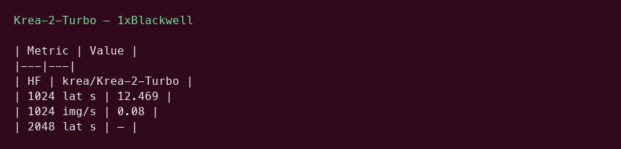
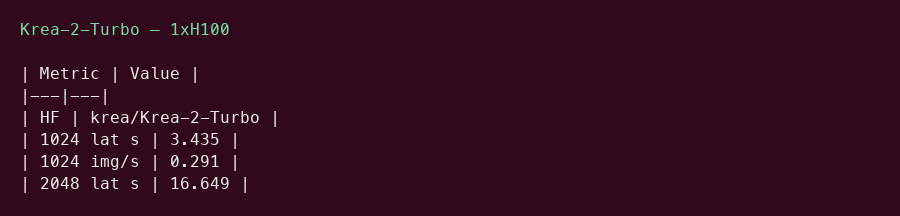

# Krea 2 Turbo GPU Benchmark

### Last Edit Date:
MC - 2026.07.20

## Purpose
Live Massed Compute text-to-image benches for **krea/Krea-2-Turbo** (12B DiT, 8-step distilled).

## Technique
Diffusers / Krea2 pipeline, BF16, guidance_scale=0, **8 steps**. Metrics: latency (s) and images/s at 1024² and 2048².

## Results

| SKU | $/hr | Res | Latency mean (s) | Images/s | VRAM (GB) |
|---|---:|---|---:|---:|---:|
| `gpu_1x_pro_6000_blackwell` | 2.19 | 1024x1024 | 12.469 | 0.08 | 44.83 |
| `gpu_1x_h100` | 2.73 | 1024x1024 | 3.435 | 0.291 | 39.34 |
| `gpu_1x_h100` | 2.73 | 2048x2048 | 16.649 | 0.06 | 52.64 |

### Screenshots

**gpu_1x_pro_6000_blackwell** — $2.19/hr

**gpu_1x_h100** — $2.73/hr

## Conclusion

H100 leads raw images/s at 1024² in this capture; Blackwell remains competitive on $/hr.

## Notes
- Open-weight Krea 2 Turbo (Community License).
- Numbers from live Massed runs 2026-07-20.

---

**[LAUNCH GPU OR CPU INSTANCE](https://massedcompute.com/?utm_source=github.com&utm_campaign=gpu-benchmark)**

> **Pricing note:** Listed `$/hr` rates are point-in-time from the capture date. Confirm live pricing in the marketplace before you launch — rates can change. Pay only for the hours you use; no long-term contracts.
