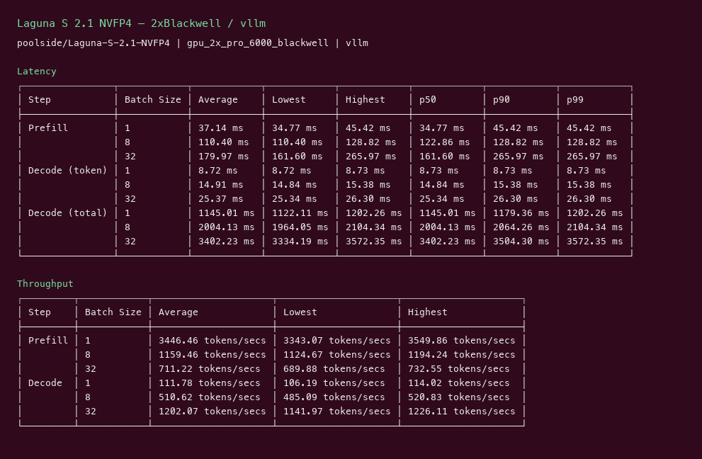

# Laguna S 2.1 NVFP4 GPU Benchmark

### Last Edit Date:
MC - 2026.07.22

## Purpose
Live Massed Compute inference benches for **poolside/Laguna-S-2.1-NVFP4** (118B-A8B MoE, NVFP4).

## Technique
vLLM serving bench: random prompts, input=128, output=128, concurrency 1 / 8 / 32. Headline = **c32 output tok/s**. BF16 weights OOM on 2×96GB; published numbers use the NVFP4 checkpoint.

## Results

| Engine | SKU | $/hr | Output tok/s (c32) | TTFT med (ms) | tok/s per $ |
|---|---|---:|---:|---:|---:|
| vllm | `gpu_2x_pro_6000_blackwell` | 4.38 | 1202.1 | 161.6 | 274.4 |

### Screenshots

Terminal-style vLLM serving-bench captures (input=128, output=128, concurrency 1/8/32), Massed Compute 2026-07-22.

**gpu_2x_pro_6000_blackwell** — 2× RTX PRO 6000 Blackwell 96GB — $4.38/hr

vLLM · `poolside/Laguna-S-2.1-NVFP4` · c32 **1202.1** output tok/s · TTFT med **161.6** ms:

## Conclusion

Peak c32: **1202 tok/s** on `gpu_2x_pro_6000_blackwell` (**274.4 tok/s per $**).

## Notes
- 118B-A8B MoE; NVFP4 is the loadable path on 2×96GB.
- Numbers from live Massed runs 2026-07-22; disposable bench VMs terminated after capture.

---

  

  <strong><a href="https://massedcompute.com/?utm_source=github.com&utm_campaign=gpu-benchmark">LAUNCH GPU OR CPU INSTANCE</a></strong>

> **Pricing note:** Listed `$/hr` rates are point-in-time from the capture date. Confirm live pricing in the marketplace before you launch — rates can change. Pay only for the hours you use.

