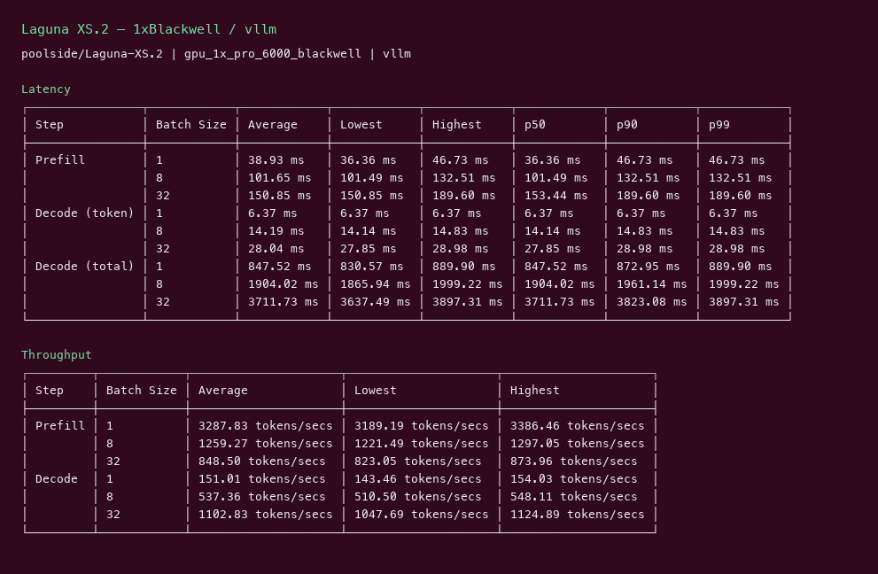
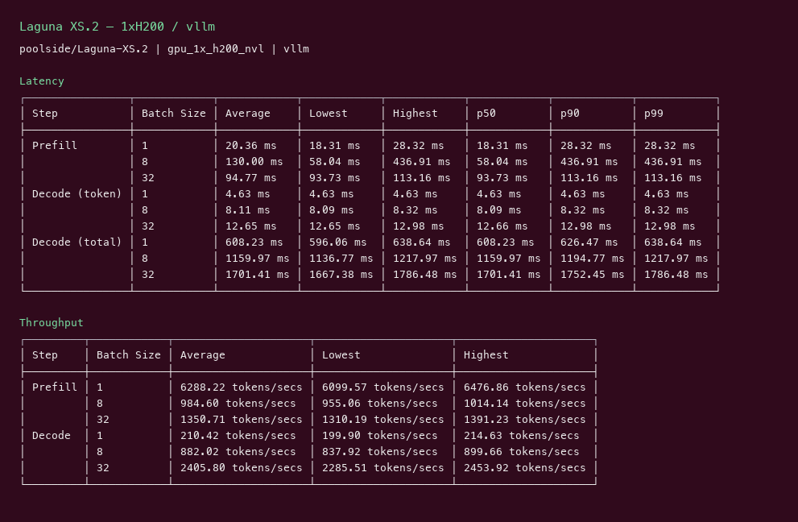

# Laguna XS.2 GPU Benchmark

### Last Edit Date:
MC - 2026.07.22

## Purpose
Live Massed Compute inference benches for **poolside/Laguna-XS.2**.

## Technique
Pinned profile where supported: random prompts, input=128, output=128, concurrency 1/8/32 (headline c32). Alternate engines noted in Results.

## Results

| Engine | SKU | $/hr | Output tok/s | TTFT med (ms) | tok/s per $ |
|---|---|---:|---:|---:|---:|
| vllm | `gpu_1x_pro_6000_blackwell` | 2.19 | 1102.8 | 153.4 | 503.6 |
| vllm | `gpu_1x_h200_nvl` | 3.62 | 2405.8 | 93.7 | 664.6 |

### Screenshots

Terminal-style captures from live Massed runs 2026-07-22.

**gpu_1x_pro_6000_blackwell** — RTX PRO 6000 Blackwell 96GB — $2.19/hr

vLLM · `poolside/Laguna-XS.2` · c32 **1102.8** tok/s · TTFT med **153.4** ms:

**gpu_1x_h200_nvl** — H200 NVL 141GB — $3.62/hr

vLLM · `poolside/Laguna-XS.2` · c32 **2405.8** tok/s · TTFT med **93.7** ms:

## Conclusion

Peak throughput: **2406 tok/s** on `gpu_1x_h200_nvl`.
Best $/tok: **664.6 tok/s per $** on `gpu_1x_h200_nvl`.

## Notes
- 33B-A3B MoE agentic coding contender (Apache-2.0).
- `gpu_1x_h100` unavailable at launch; used `gpu_1x_h200_nvl` ($3.62/hr) as second SKU.
- Numbers from live Massed runs 2026-07-22; disposable bench VMs terminated after capture.

---

**[LAUNCH GPU OR CPU INSTANCE](https://massedcompute.com/?utm_source=github.com&utm_campaign=gpu-benchmark)**

> **Pricing note:** Listed `$/hr` rates are point-in-time from the capture date. Confirm live pricing in the marketplace before you launch — rates can change. Pay only for the hours you use.
