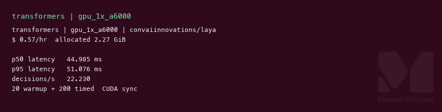
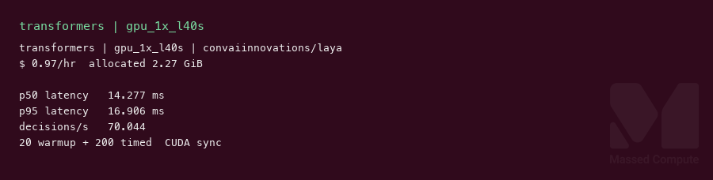
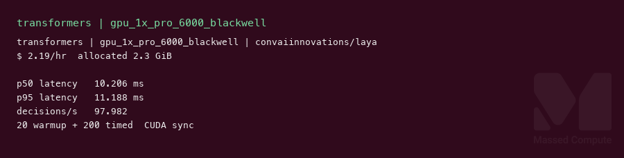

# Laya GPU Benchmark

### Last Edit Date:
MC - 2026.09.21

## Purpose
Live Massed Compute latency benches for **convaiinnovations/laya** (English default `model.safetensors`, ModernBERT-large encoder + RL decision head, Apache-2.0). This is a **non-autoregressive System 1 decision model**, not an LLM. Headlines are **p50 `system_one` latency (ms)** and **decisions/s**, not token throughput.

## Technique
Hugging Face snapshot of `convaiinnovations/laya`, `RLAgent.system_one` from the repo (`rl_agent_api.py`). Single-stream, 20 CUDA-sync warmups + 200 timed calls on a fixed 4-question email ticket (choice / score / noul / noul). Runner: `scripts/laya/remote.sh`.

This is **not** the PyPI `Router(preload=True)` multi-checkpoint path (card quotes ~32.8 ms GPU). Same English checkpoint, one forward per call.

Engine pin: `torch 2.14.0+cu130`, `transformers 5.17.0`.

## Results

| Engine | SKU | $/hr | p50 latency (ms) | p95 latency (ms) | Decisions/s | Decisions per $ | Allocated VRAM (GiB) |
|---|---|---:|---:|---:|---:|---:|---:|
| transformers | `gpu_1x_a6000` | 0.57 | 45.0 | 51.1 | 22.2 | 39.0 | 2.27 |
| transformers | `gpu_1x_l40s` | 0.97 | 14.3 | 16.9 | 70.0 | 72.2 | 2.27 |
| transformers | `gpu_1x_pro_6000_blackwell` | 2.19 | 10.2 | 11.2 | 98.0 | 44.7 | 2.30 |

Allocated VRAM = `torch.cuda.max_memory_allocated` MiB / 1024 after the timed loop.

### Screenshots

**gpu_1x_a6000** — RTX A6000 48GB — $0.57/hr

transformers · `RLAgent.system_one` · p50 **45.0 ms** · **22.2** decisions/s:

**gpu_1x_l40s** — L40S 48GB — $0.97/hr

transformers · same checkpoint · p50 **14.3 ms** · **70.0** decisions/s:

**gpu_1x_pro_6000_blackwell** — RTX PRO 6000 Blackwell 96GB — $2.19/hr

transformers · same checkpoint · p50 **10.2 ms** · **98.0** decisions/s:

## Conclusion

Smallest launched fit is **`gpu_1x_a6000`**. Best value on this harness is **`gpu_1x_l40s`** at **72.2 decisions per $** (14.3 ms p50). Blackwell is the latency card: **10.2 ms** p50 / **98.0** decisions/s, about **4.4×** A6000 throughput and **1.4×** L40S, worst value of the three versus L40S.

L40S listed at **$0.97/hr** (rate moved from $0.88 on 2026-09-08).

## Notes
- Weights: repo-root `model.safetensors` (~843 MB) + `encoder/` config (`answerdotai/ModernBERT-large`). `multilingual/` and `typed-decisions/` checkpoints were not run.
- Untested cheaper live SKUs: `gpu_1x_a6000_low_ram` ($0.55). Out of stock at capture: `gpu_1x_A30` ($0.35), `gpu_1x_a5000` ($0.44).
- Smoke answers on the sample ticket: department=billing, refund requested, churn language present. Not an accuracy eval.
- Raw: `results/raw/laya/<sku>/` (`laya-bench.json`, live `nvidia-smi.txt`, `DONE`).
- Bench VMs terminated after capture.

---

  

  <strong><a href="https://massedcompute.com/?utm_source=github.com&utm_campaign=gpu-benchmark">LAUNCH GPU OR CPU INSTANCE</a></strong>

> **Pricing note:** Listed `$/hr` rates are point-in-time from the capture date. Confirm live pricing in the marketplace before you launch — rates can change. Pay only for the hours you use.
