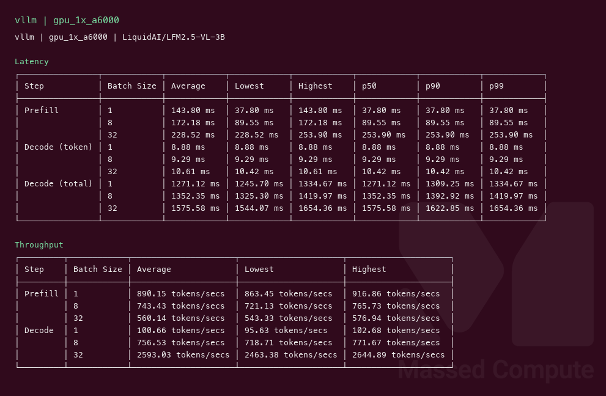
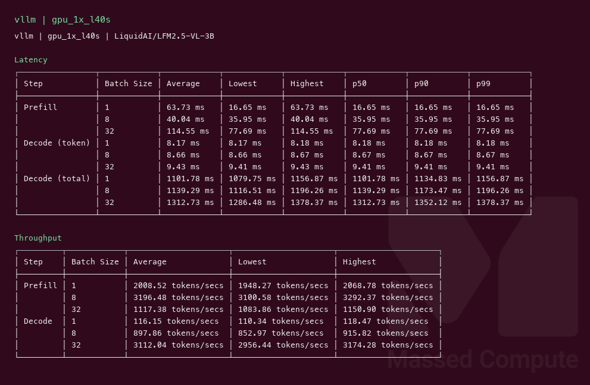
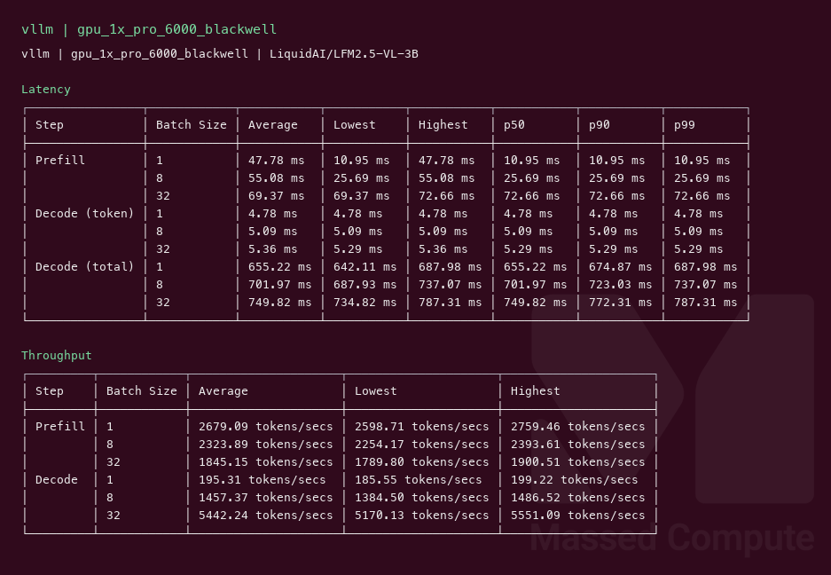

# LFM2.5 VL 3B GPU Benchmark

### Last Edit Date:
MC - 2026.08.25

## Purpose
Live Massed Compute vLLM benches for **LiquidAI/LFM2.5-VL-3B** (3.1B native vision-language, Liquid license). Exact BF16 weights on every SKU. Text-only decode profile (`--limit-mm-per-prompt '{"image":0}'`).

## Technique
Pinned profile: random prompts, input=128, output=128, request-rate=inf, concurrency 1 / 8 / 32. Headlines use **c32**.
Engine: **vLLM** `vllm/vllm-openai:v0.27.1`, `--max-model-len 8192 --gpu-memory-utilization 0.92 --max-num-batched-tokens 16384 --enable-prefix-caching --kv-cache-dtype fp8 --limit-mm-per-prompt '{"image":0}'`.

## Results

| Engine | SKU | Weights | $/hr | Output tok/s (c32) | TTFT med (ms) | tok/s per $ | $/1M out tokens |
|---|---|---|---:|---:|---:|---:|---:|
| vllm | `gpu_1x_a6000` | BF16 | 0.57 | 2593.0 | 253.9 | 4549.2 | 0.061 |
| vllm | `gpu_1x_l40s` | BF16 | 0.88 | 3112.0 | 77.7 | 3536.4 | 0.079 |
| vllm | `gpu_1x_pro_6000_blackwell` | BF16 | 2.19 | 5442.2 | 72.7 | 2485.0 | 0.112 |

### Screenshots

**gpu_1x_a6000** — $0.57/hr — exact BF16

vllm — 2593.0 output tok/s @ c32:

**gpu_1x_l40s** — $0.88/hr — exact BF16

vllm — 3112.0 output tok/s @ c32:

**gpu_1x_pro_6000_blackwell** — $2.19/hr — exact BF16

vllm — 5442.2 output tok/s @ c32:

## Conclusion

Smallest fit is **`gpu_1x_a6000`** at **4549** tok/s per $ (**2593** tok/s at $0.57/hr). L40S is **20%** faster and **54%** more per hour, so A6000 still wins cost. Blackwell is the throughput card: **5442** tok/s, **2.1×** A6000, **1.8×** L40S, worst tok/s per $ of the three. Buy A6000 unless the job is latency-bound (Blackwell TTFT 73 ms vs A6000 254 ms).

## Notes
- 3.1B BF16 (~6 GB weights) fits 32 GB; A6000 at $0.57 is the least expensive live SKU that ran it. Multi-GPU is not warranted.
- Same checkpoint on all three rows. Text-only serving flags; this is not an image-generation bench.
- SGLang was attempted on Blackwell; the serving bench could not write its ShareGPT cache and produced no JSON. vLLM-only this capture.
- Numbers from live Massed runs 2026-08-25; bench VMs terminated after capture.

---

  

  <strong><a href="https://massedcompute.com/?utm_source=github.com&utm_campaign=gpu-benchmark">LAUNCH GPU OR CPU INSTANCE</a></strong>

> **Pricing note:** Listed `$/hr` rates are point-in-time from the capture date. Confirm live pricing in the marketplace before you launch — rates can change. Pay only for the hours you use.
