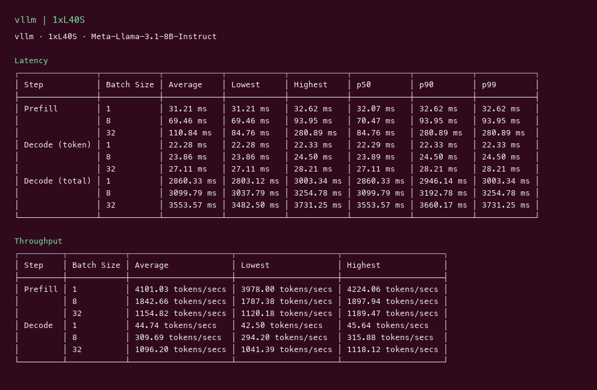
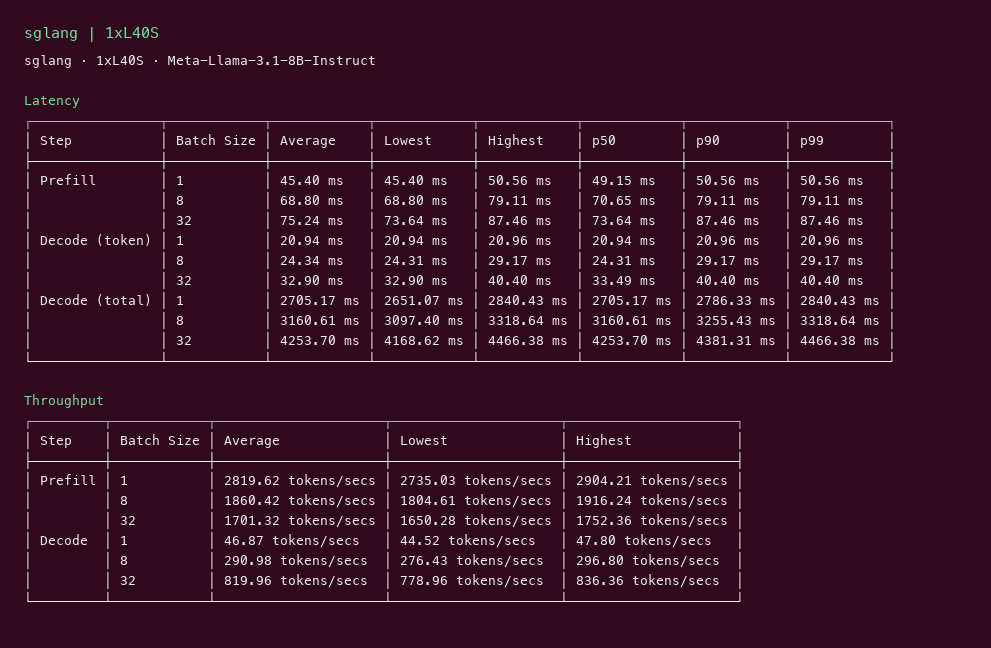

# Llama 3.1 8B GPU Benchmark

### Last Edit Date:
MC - 2026.07.16

## Purpose
Our own live inference benches for **meta-llama/Meta-Llama-3.1-8B-Instruct** (weights via ungated mirror `unsloth/Meta-Llama-3.1-8B-Instruct` — HF account lacks Meta gated access) on Massed Compute, comparing **vLLM** vs **SGLang**.

## Technique
Pinned profile: random prompts, input=128, output=128, request-rate=inf, max concurrency 1 / 8 / 32. Headline tables use concurrency **32**.
Engines: vLLM `v0.8.5` (H100/L40S) and `cu129-nightly` (Blackwell sm_120); SGLang `lmsysorg/sglang:latest`.

## Results

| Engine | SKU | $/hr | Output tok/s (c32) | TTFT p50 | tok/s per $ |
|---|---|---:|---:|---:|---:|
| vllm | `gpu_1x_l40s` | 0.88 | 1096.2 | 84.8 | 1245.7 |
| sglang | `gpu_1x_l40s` | 0.88 | 820.0 | 73.6 | 931.8 |

**L40S**
Instance: **$0.88/hr**

vllm:

sglang:

## Conclusion

At concurrency 32, peak output throughput was **~1096 tok/s** on `gpu_1x_l40s` with **vllm**.

## Notes

- Numbers are from our live Massed runs on 2026-07-16; VMs terminated after capture.
- Official `meta-llama/*` repos are gated; we used Unsloth BF16 redistributions of the same weights.

---

**[LAUNCH GPU OR CPU INSTANCE](https://massedcompute.com/?utm_source=github.com&utm_campaign=gpu-benchmark)**

> **Pricing note:** Listed `$/hr` rates are point-in-time from the capture date. Confirm live pricing in the marketplace before you launch — rates can change. Pay only for the hours you use; no long-term contracts.
