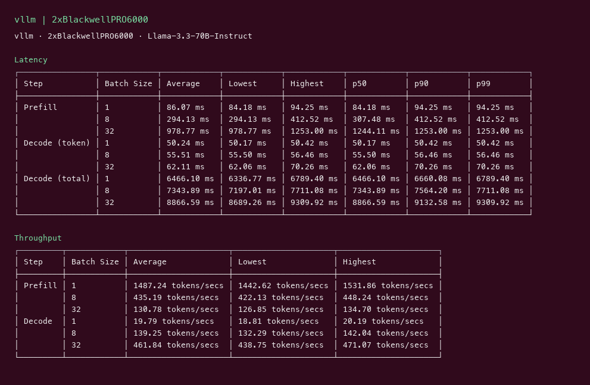
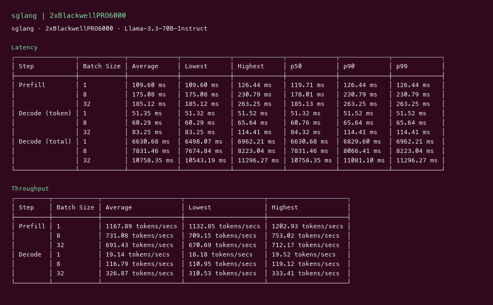
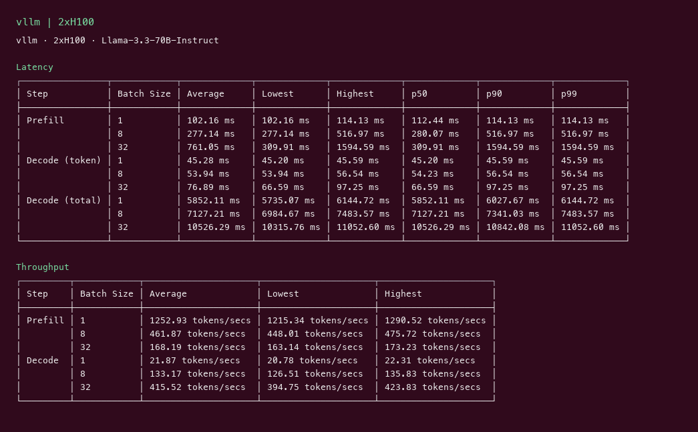
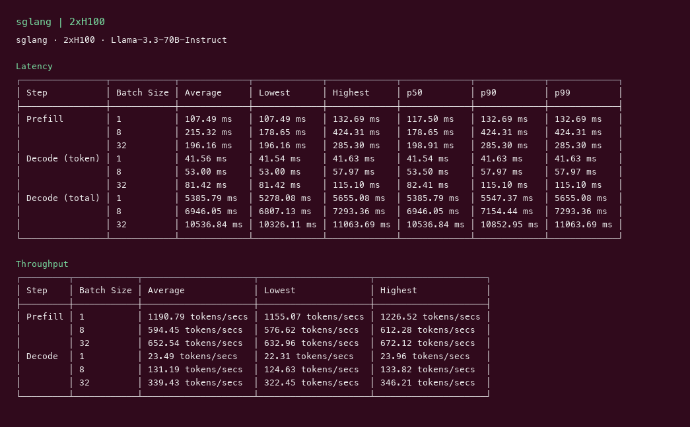

# Llama 3.3 70B GPU Benchmark

### Last Edit Date:
MC - 2026.07.16

## Purpose
Our own live inference benches for **meta-llama/Llama-3.3-70B-Instruct** (weights via ungated mirror `unsloth/Llama-3.3-70B-Instruct`) on Massed Compute — **Blackwell vs H100** headline, vLLM + SGLang.

## Technique
Pinned profile: random prompts, input=128, output=128, request-rate=inf, concurrency 1/8/32. Headline = **c32**.
vLLM: `v0.8.5` on H100, `cu129-nightly` on Blackwell (sm_120). SGLang: `lmsysorg/sglang:latest` (H100 used `--mem-fraction-static 0.88`).

## Results

| Engine | SKU | $/hr | Output tok/s (c32) | TTFT p50 | tok/s per $ |
|---|---|---:|---:|---:|---:|
| vllm | `gpu_2x_pro_6000_blackwell` | 4.38 | 461.8 | 1244.1 | 105.4 |
| sglang | `gpu_2x_pro_6000_blackwell` | 4.38 | 326.9 | 185.1 | 74.6 |
| vllm | `gpu_2x_h100` | 5.46 | 415.5 | 309.9 | 76.1 |
| sglang | `gpu_2x_h100` | 5.46 | 339.4 | 198.9 | 62.2 |

**2× RTX PRO 6000 Blackwell**
Instance: **$4.38/hr**

vllm:

sglang:

**2× H100**
Instance: **$5.46/hr**

vllm:

sglang:

## Conclusion

**Blackwell** wins the vLLM throughput race at c32: **~462 tok/s** ($4.38/hr, **~105 tok/s per $**) vs **2× H100** **~416 tok/s** ($5.46/hr, **~76 tok/s per $**).
SGLang trails vLLM on throughput here but often shows stronger TTFT on Blackwell.

## Notes

- Live Massed runs 2026-07-16; bench VMs terminated after capture.
- Official `meta-llama/*` gated for HF user `dynyman`; Unsloth BF16 redistributions used.
- L40S 8B companion page: [llama-3.1-8b](../llama-3.1-8b/llama-3.1-8b.md).

---

  

  <strong><a href="https://massedcompute.com/?utm_source=github.com&utm_campaign=gpu-benchmark">LAUNCH GPU OR CPU INSTANCE</a></strong>

> **Pricing note:** Listed `$/hr` rates are point-in-time from the capture date. Confirm live pricing in the marketplace before you launch — rates can change. Pay only for the hours you use
