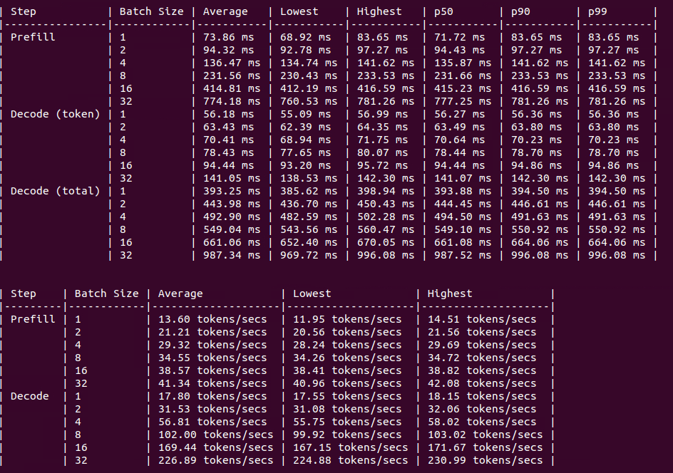
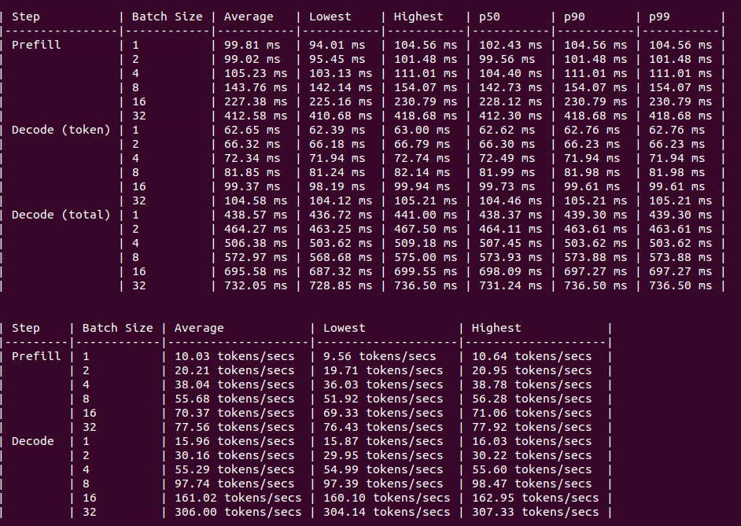
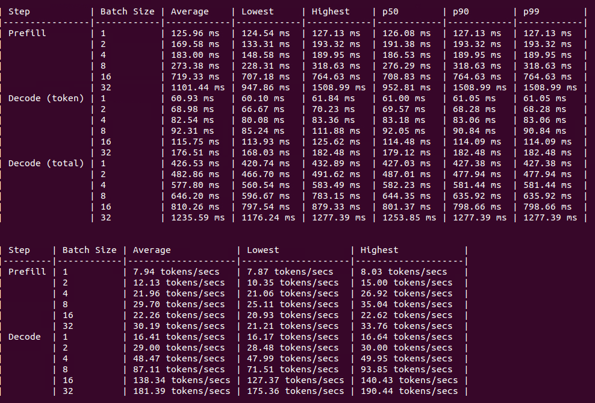
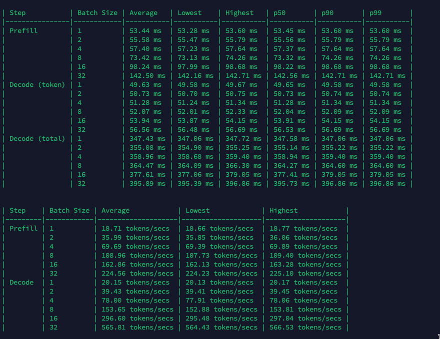
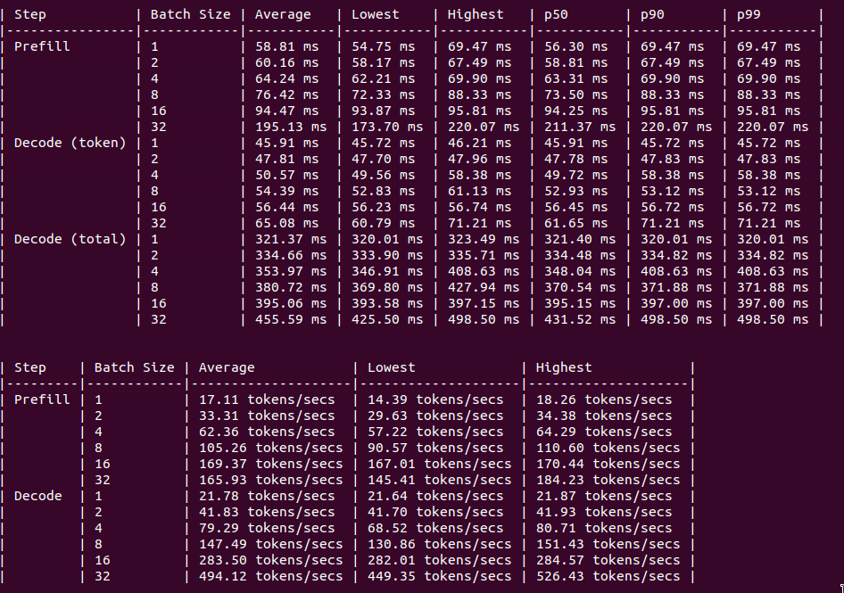

# Llama 3.1 70B GPU Benchmark

### Last Edit Date:
NB - 2024.08.01

[Original Blog Post](https://massedcompute.com/llama-3-1-benchmark-across-various-gpu-types/)

## Purpose
We want to look at how various GPU types perform when hosting LLM inference. In this particular case we look at Llama 3.1 70B inference.

## Technique
We leverage [Hugging Face Text Generation Inference (TGI)](https://github.com/huggingface/text-generation-inference) as the engine for our tests. The primary reason for selecting TGI over other engines is the ease of running benchmarks. Other inference engines have benchmarks built in but the TGI benchmarks provide a comprehensive look at performance.

## Running the test
First we had to request access to the model via Hugging Face. This requires a free Hugging Face account where you can fill out the agreement to access the model.

[LLama 3.1 70B Instruct Agreement](./images/Llama3.1/meta-llama_Meta-Llama-3.1-70B-Instruct_agreement.png)

After getting access to the model we ran a similar startup docker command across all GPUs

```bash
token=TOKEN_FROM_HUGGING_FACE
shard=NUMBER_OF_GPU_IN_INSTANCE

$ docker run --gpus all --shm-size 4g -e \
    HUGGING_FACE_HUB_TOKEN=$token -p 8080:80 \
    -v ~/data \
    ghcr.io/huggingface/text-generation-inference:latest \
    --model-id meta-llama/Meta-Llama-3.1-70B-Instruct \
    --sharded true \
    --num-shard $shard
```

After the docker container downloads the model and the inference endpoint is ready you can access the docker container and run the benchmark

```bash
docker exec -it CONTAINER_NAME bash

text-generation-benchmark --tokenizer-name meta-llama/Meta-Llama-3-70B-Instruct
```

As you run the test a new chart will appear
[Sample TGI Chart](../shared-images/sample_tgi_benchmark.png)

Press `q` to exit the chart when completed. You will then see the metrics and results of the inference benchmark.

### Variables

**$token** The Hugging Face Access token from Hugging Face account

**$shard** The number of GPUs to spread the model across. EX: 4xA6000 Instance: `shard=4`. 8xA30 Instance: `shard=8`

## GPU Quantity per Type
As we tested across various GPU Types we deployed instances that had enough vRAM. We did not take into account any redundancy a development group *should* consider when deploying inference in production. It is highly recommended to load balance your inference workloads across multiple instances.

For Llama 3 70B you need roughly 150GB of vRAM.

## Results

**A30**
8xA30 Intance: **$2.00/hr**


**RTX A6000**
4xA6000 Instance: **$2.50/hr**


**L40**
4xL40 Instance: **$3.96/hr**


**A100 SXM4**
2xA100 SXM4 Instance: **N/A** (We partitioned 2 GPUs for this test but only sell 8 GPU bare metal)


**H100 PCIe**
2xH100 PCI Instnace: **$5.98/hr**


## Conclusion
Looking at performance only, the A100 SXM4 & RTX A6000 really stood out. The A100 SXM4 getting more than 10% increase in output tokens compared to the H100 PCIe was really interesting. Also for cost to performance the RTX A6000 performs exceptionally well.

## Future Additions
As other GPU types become available we would like to come back and add those results.