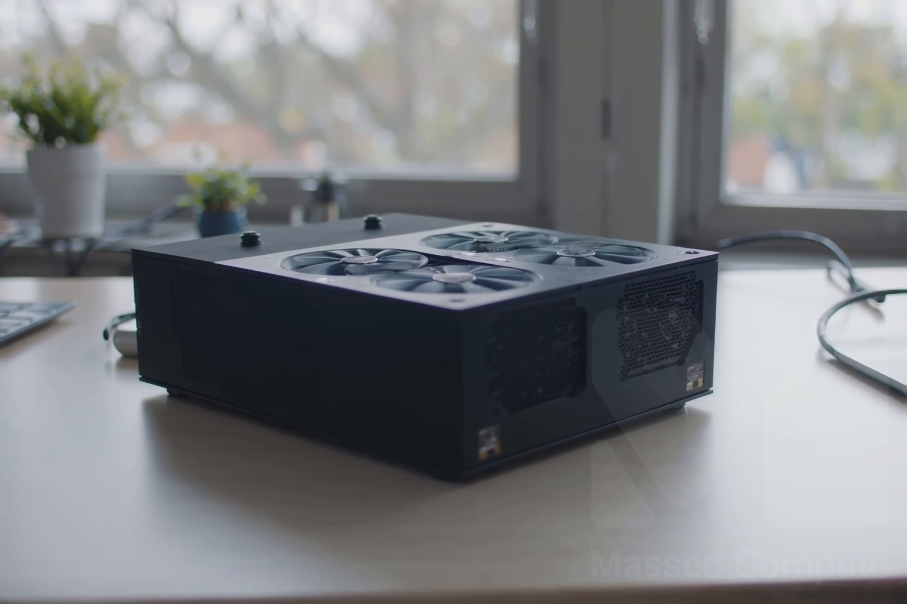
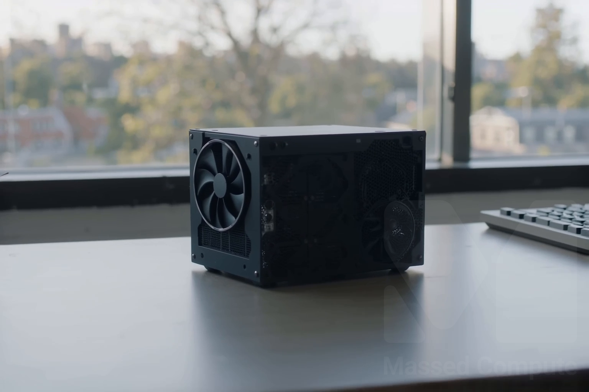
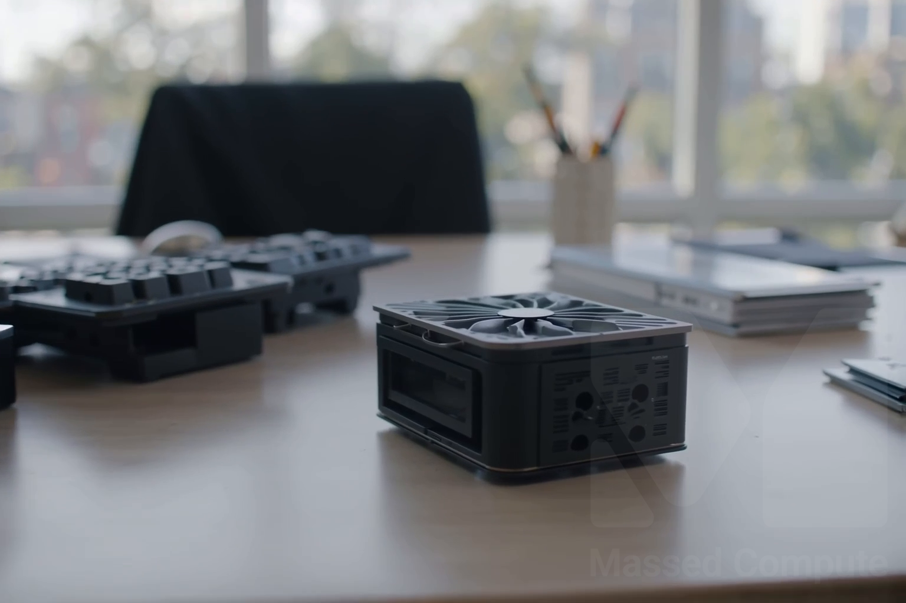

# LTX-2.5 Distilled GPU Benchmark

### Last Edit Date:
MC - 2026.09.02

## Purpose
Live Massed Compute benches for **Lightricks/LTX-2.5 Distilled** two-stage text-to-video (audio+video). Official `ltx-pipelines.distilled` path, exact BF16 split pack. Disposable `mc-bench-ltx-*` VMs only. Protected studio `ltx-25` was not used.

## Technique
Engine: `uv sync --extra natten` from [Lightricks/LTX-2](https://github.com/Lightricks/LTX-2), `python -m ltx_pipelines.distilled`. Checkpoint: `ltx-2.5-22b-distilled-transformer-bf16` + Gemma 4 12B TE + DiffVAE + audio VAE + spatial x2 upscaler (~66 GiB on disk). Native BF16, no `fp8-cast`, no CPU offload flag.

Locked clip (same on every SKU): **1536×1024**, **121 frames**, **24 fps** (**5.041667 s**), seed **42**. Stage 1 is 8 steps at 768×512; stage 2 is 3 steps at 1536×1024. Image 184, driver **580.126.16**.

Headline metric: **warm end-to-end wall** — a second independent process launch of the same clip, including the ~66 GiB pack load. Cold and warm are two `uv run python -m ltx_pipelines.distilled` processes; warm still rebuilds the text encoder, transformer, and VAEs. The delta is filesystem cache, not a skipped load. `$/clip` and `Clips/hr` therefore describe relaunch-per-clip operation, not a persistent worker. Peak VRAM is `nvidia-smi memory.used` sampled at 1 Hz, not the Python allocator.

Locked prompt:
> A compact GPU accelerator module on a clean desk in soft daylight, camera slowly pushes in, quiet fan whir and room tone, no text no logos no watermarks.

## Results

Catalog `$/hr` from live inventory **2026-09-02** (re-checked 2026-09-02 before this page). `$/clip` = warm wall × `$/hr` ÷ 3600.

| SKU | $/hr | Warm e2e (s) | Cold (s) | Peak VRAM | Peak GPU util | $/clip | Clips/hr | Launch → first clip | Status |
|---|---:|---:|---:|---:|---:|---:|---:|---:|---|
| `gpu_1x_l40s` | 0.88 | **93.599** | 111.289 | 43.83 / 45.00 GiB | 100% | **0.0229** | 38.5 | 9.55 min | OK |
| `gpu_1x_DGX_A100` | 1.38 | 91.664 | 103.777 | 47.05 / 80.00 GiB | 100% | 0.0351 | 39.3 | 9.27 min | OK |
| `gpu_1x_pro_6000_blackwell` | 2.19 | **52.925** | 61.026 | 47.27 / 95.59 GiB | 100% | 0.0322 | **68.0** | 7.90 min | OK |

**Who should rent which card.** The job peaks at 44–47 GiB on every card. Hourly sticker is the wrong unit.

- **Waiting on the clip → 1× RTX PRO 6000 Blackwell.** Ten clips: 15.8 min / $0.58 vs L40S 23.6 min / $0.35. Extra $0.23 buys ~8 minutes. Break-even human wage: **$1.80/hr**.
- **Unattended batch → 1× L40S.** Same 5.04 s mux, least dollars per clip among the three SKUs evaluated (**$0.0229**). Lower-priced 48 GB cards (`gpu_1x_a6000` $0.57, `gpu_1x_6000_ada` $0.79, `gpu_1x_l40` $0.86 at capture) were not tested.
- **Do not rent the 80 GB A100 for this distilled 5.04 s job.** It is **2%** faster than L40S on warm (91.7 s vs 93.6 s), **53%** more `$/clip`, and leaves ~33 GB of VRAM empty.

First clip costs **6–9×** a later clip because of the ~66 GiB pull (L40S $0.14 / 9.6 min, A100 $0.21 / 9.3 min, Blackwell $0.29 / 7.9 min). Wait per 1 s of output: L40S 18.6× realtime, A100 18.2×, Blackwell 10.5×. Blackwell is **1.77×** faster than L40S on the warm clip.

| Clips in one sitting | L40S $ | A100 $ | Blackwell $ |
|---:|---:|---:|---:|
| 1 | 0.14 | 0.21 | 0.29 |
| 10 | 0.35 | 0.53 | 0.58 |
| 20 | 0.57 | 0.88 | 0.90 |
| 50 | 1.26 | 1.94 | 1.87 |

All three muxes: H.264 1536×1024, 121 frames, 24 fps, AAC stereo ~5.01 s. These **are** the timed warm runs from 2026-09-02.

### Smoke clips

Preview still is a frame from that clip; the link under it is the full smoke MP4.

**1× L40S** — $0.88/hr — DistilledPipeline — warm **93.6 s** / **$0.0229** per clip.

[1× L40S smoke clip (mp4)](./images/1xL40S-distilled-smoke.mp4)

**1× DGX A100** — $1.38/hr — DistilledPipeline — warm **91.7 s** / **$0.0351** per clip.

[1× A100 smoke clip (mp4)](./images/1xA100-distilled-smoke.mp4)

**1× RTX PRO 6000 Blackwell** — $2.19/hr — DistilledPipeline — warm **52.9 s** / **$0.0322** per clip.

[1× Blackwell smoke clip (mp4)](./images/1xBlackwell-distilled-smoke.mp4)

## Conclusion
If a person is waiting, rent **1× RTX PRO 6000 Blackwell**. If the job can sit unattended, rent **1× L40S** — the least expensive SKU among those evaluated that actually runs this distilled BF16 pack. Skip **1× DGX A100** for this clip: it loses both the wait test and the dollar test.

## Notes
- This is **DistilledPipeline**, not DFR (detailing IC-LoRA) and not the full 22B dev transformer. DFR is slower and hungrier; do not divide these walls into a DFR quote.
- Disk weights are ~66 GiB (DiT 39.1 + Gemma 24.5 + VAEs/upscaler). Peak GPU is ~44–47 GiB because the official pipeline trims the text encoder after encode. That is not FP8/INT8.
- L40S did **not** need `--quantization fp8-cast --offload cpu` for this locked 5 s clip. No OOM on any SKU.
- Torch from `uv sync --extra natten`: **2.13.0+cu132**. Same image-184 driver on all three SKUs.
- Setup friction: ~8–10 min from launch to first clip (weight pull). The uv installer returned non-zero on L40S and A100 (`~/.config/fish` mkdir permission); the binary was already installed and the bench restarted. Clip identity did not change.
- Raw: `results/raw/ltx-2.5/mar-74-2026-09-02/`.
- Lower-priced 48 GB SKUs (`gpu_1x_a6000` $0.57, `gpu_1x_6000_ada` $0.79, `gpu_1x_l40` $0.86 at capture) were not on this ladder.

---

  

  <strong><a href="https://massedcompute.com/?utm_source=github.com&utm_campaign=gpu-benchmark">LAUNCH GPU OR CPU INSTANCE</a></strong>

> **Pricing note:** Listed `$/hr` rates are point-in-time from the capture date. Confirm live pricing in the marketplace before you launch — rates can change. Pay only for the hours you use.
