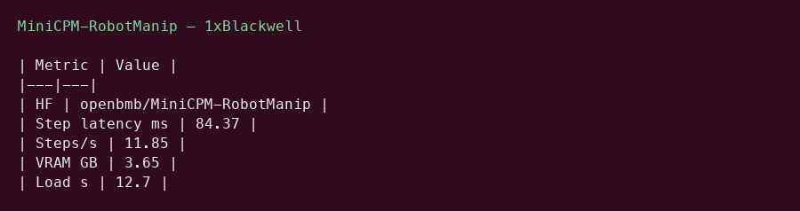
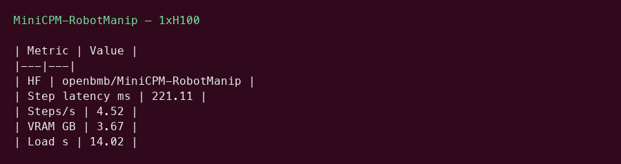

# MiniCPM-RobotManip GPU Benchmark

### Last Edit Date:
MC - 2026.07.20

## Purpose
Live Massed Compute latency benches for **openbmb/MiniCPM-RobotManip** (1.5B VLA for robot manipulation).

## Technique
PyTorch BF16 forward via official `predict_action` path (transformers==5.7.0). Metric: **decision-step latency (ms)** and steps/s, not LLM tok/s.

## Results

| SKU | $/hr | Step latency mean (ms) | Steps/s | VRAM (GB) |
|---|---:|---:|---:|---:|
| `gpu_1x_pro_6000_blackwell` | 2.19 | 84.37 | 11.85 | 3.65 |
| `gpu_1x_h100` | 2.73 | 221.11 | 4.52 | 3.67 |

### Screenshots

**gpu_1x_pro_6000_blackwell** — $2.19/hr

**gpu_1x_h100** — $2.73/hr

## Conclusion

Fastest step latency: **84.37 ms** on `gpu_1x_pro_6000_blackwell`.

## Notes
- Embodied VLA (vision-language-action), not a chat LLM.
- Official card cites ~120 ms/step on H100 BF16 single-frame; our H100 mean was higher under this harness.
- Numbers from live Massed runs 2026-07-20.

---

**[LAUNCH GPU OR CPU INSTANCE](https://massedcompute.com/?utm_source=github.com&utm_campaign=gpu-benchmark)**

> **Pricing note:** Listed `$/hr` rates are point-in-time from the capture date. Confirm live pricing in the marketplace before you launch — rates can change. Pay only for the hours you use; no long-term contracts.
