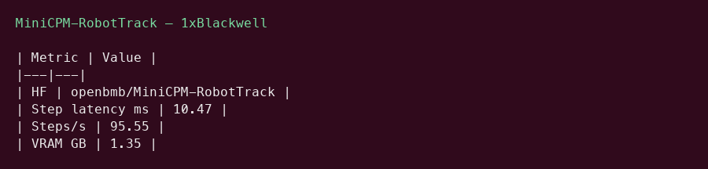
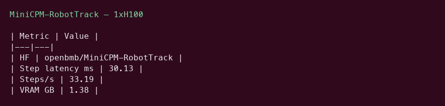

# MiniCPM-RobotTrack GPU Benchmark

### Last Edit Date:
MC - 2026.07.20

## Purpose
Live Massed Compute latency benches for **openbmb/MiniCPM-RobotTrack** (0.9B VLA for target tracking).

## Technique
PyTorch forward with official fused-token API (zeros stand in for DINOv3+SigLIP features). transformers>=4.56,<5. Metric: **step latency (ms)**.

## Results

| SKU | $/hr | Step latency mean (ms) | Steps/s | VRAM (GB) |
|---|---:|---:|---:|---:|
| `gpu_1x_pro_6000_blackwell` | 2.19 | 10.47 | 95.55 | 1.35 |
| `gpu_1x_h100` | 2.73 | 30.13 | 33.19 | 1.38 |

### Screenshots

**gpu_1x_pro_6000_blackwell** — $2.19/hr

**gpu_1x_h100** — $2.73/hr

## Conclusion

Fastest step latency: **10.47 ms** on `gpu_1x_pro_6000_blackwell`.

## Notes
- Forward latency with placeholder visual tokens (README example shapes).
- Numbers from live Massed runs 2026-07-20.

---

  

  <strong><a href="https://massedcompute.com/?utm_source=github.com&utm_campaign=gpu-benchmark">LAUNCH GPU OR CPU INSTANCE</a></strong>

> **Pricing note:** Listed `$/hr` rates are point-in-time from the capture date. Confirm live pricing in the marketplace before you launch — rates can change. Pay only for the hours you use; no long-term contracts.
