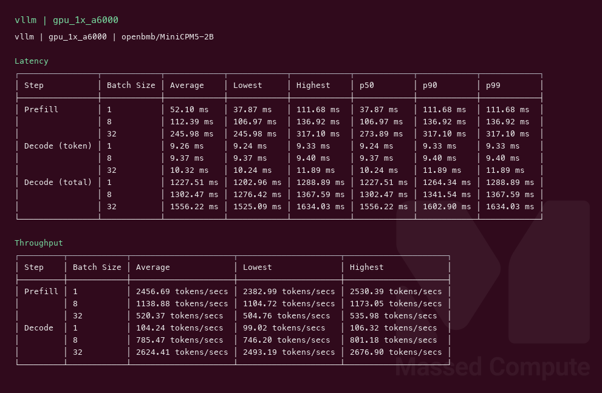
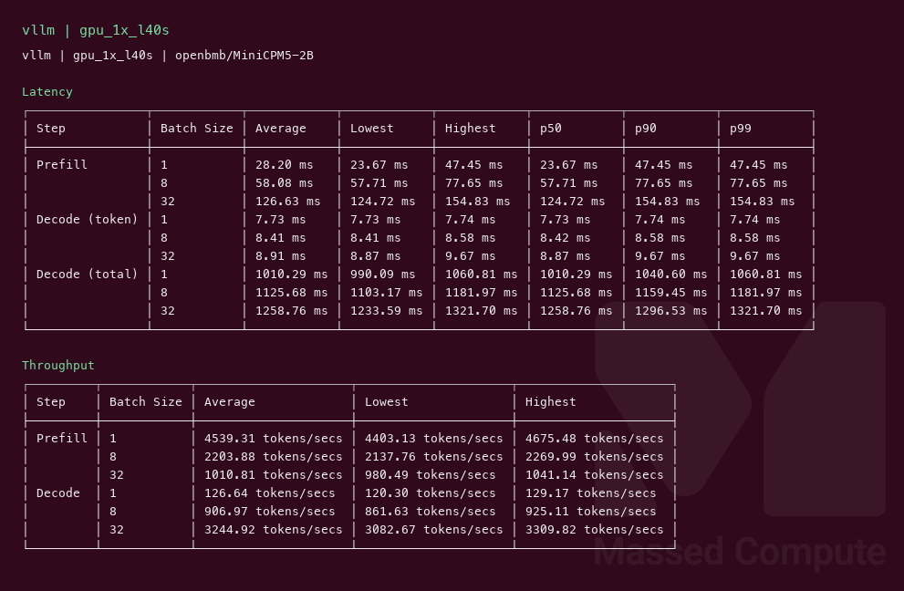
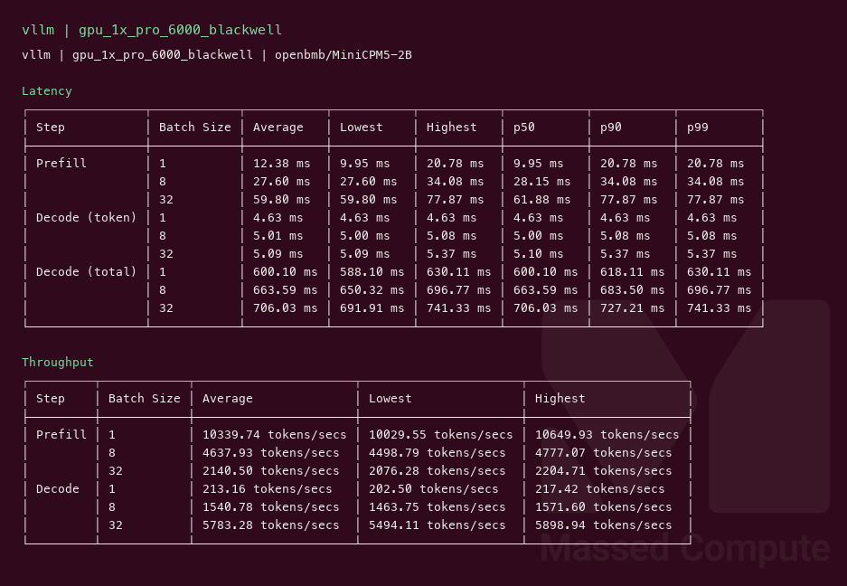

# MiniCPM5 2B GPU Benchmark

### Last Edit Date:
MC - 2026.09.14

## Purpose
Live Massed Compute vLLM benches for **openbmb/MiniCPM5-2B** (2.52B `LlamaForCausalLM`, Apache 2.0). Exact BF16 weights (~5.0 GB safetensors) on every SKU.

## Technique
Pinned profile: random prompts, input=128, output=128, request-rate=inf, concurrency 1 / 8 / 32. Headlines use **c32** **Output token throughput**.
Engine: **vLLM** `vllm/vllm-openai:nightly` digest `sha256:78c73c96fb74cdbee0f6d90d8ba756540a2385668a35f565f73dbab1da461099`, `--max-model-len 8192 --gpu-memory-utilization 0.92 --max-num-batched-tokens 16384 --kv-cache-dtype fp8`. No prefix-caching (c1/c8/c32 share one server).

## Results

| Engine | SKU | Weights | $/hr | Output tok/s (c32) | TTFT med (ms) | tok/s per $ | $/1M out tokens |
|---|---|---|---:|---:|---:|---:|---:|
| vllm | `gpu_1x_a6000` | BF16 | 0.57 | 2624.4 | 273.9 | 4604.2 | 0.060 |
| vllm | `gpu_1x_l40s` | BF16 | 0.97 | 3244.9 | 124.7 | 3345.3 | 0.083 |
| vllm | `gpu_1x_pro_6000_blackwell` | BF16 | 2.19 | 5783.3 | 61.9 | 2640.8 | 0.105 |

### Screenshots

Terminal-style vLLM serving-bench captures (input=128, output=128, concurrency 1/8/32), Massed Compute 2026-09-14.

**gpu_1x_a6000** — RTX A6000 48GB — $0.57/hr

vLLM nightly · `openbmb/MiniCPM5-2B` · c32 **2624.4** output tok/s · TTFT med **273.9** ms:

**gpu_1x_l40s** — L40S 48GB — $0.97/hr

vLLM nightly · `openbmb/MiniCPM5-2B` · c32 **3244.9** output tok/s · TTFT med **124.7** ms:

**gpu_1x_pro_6000_blackwell** — RTX PRO 6000 Blackwell 96GB — $2.19/hr

vLLM nightly · `openbmb/MiniCPM5-2B` · c32 **5783.3** output tok/s · TTFT med **61.9** ms:

## Conclusion

Smallest fit that ran is **`gpu_1x_a6000`** at **4604** tok/s per $ (**2624.4** tok/s at $0.57/hr). L40S is **24%** faster and **70%** more per hour, so A6000 still wins cost. Blackwell is the throughput card: **5783.3** tok/s, **2.2×** A6000, **1.8×** L40S, worst tok/s per $ of the three. Pick A6000 unless TTFT matters (Blackwell **61.9** ms vs A6000 **273.9** ms).

## Notes
- 2.52B BF16 (~5 GB weights) fits 24 GB; `gpu_1x_A30` ($0.35, cap=1) was live and **not launched**. `gpu_1x_a6000_spot` ($0.50) and `gpu_1x_a6000_low_ram` ($0.55) were not launched.
- Same checkpoint on all three rows. Text-decode only; this is not an image-generation bench.
- `nvidia-smi` VRAM while the server was up (MiB/1024): A6000 **43.75 GiB**, L40S **41.12 GiB**, Blackwell **87.77 GiB**. That is vLLM `--gpu-memory-utilization 0.92` filling the card, not the 5 GB weight file.
- L40S list rate on capture date **$0.97/hr** (rate rose from $0.88 on 2026-09-08).
- Numbers from live Massed runs 2026-09-14; disposable bench VMs terminated after capture.

---

  

  <strong><a href="https://massedcompute.com/?utm_source=github.com&utm_campaign=gpu-benchmark">LAUNCH GPU OR CPU INSTANCE</a></strong>

> **Pricing note:** Listed `$/hr` rates are point-in-time from the capture date. Confirm live pricing in the marketplace before you launch — rates can change. Pay only for the hours you use.
