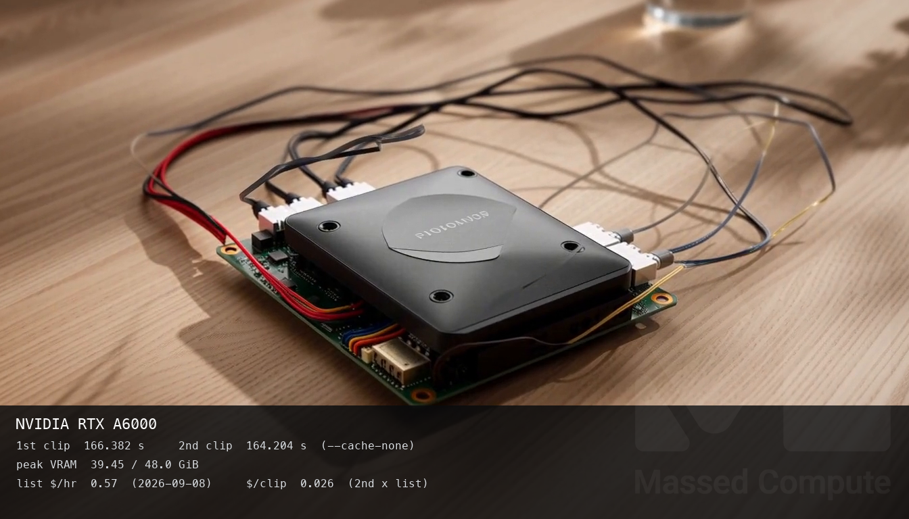
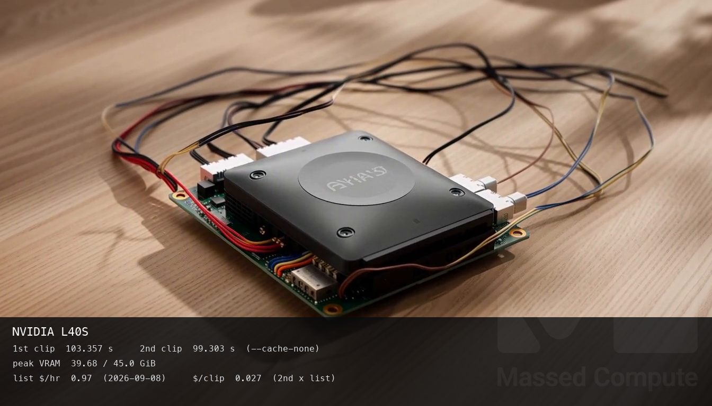
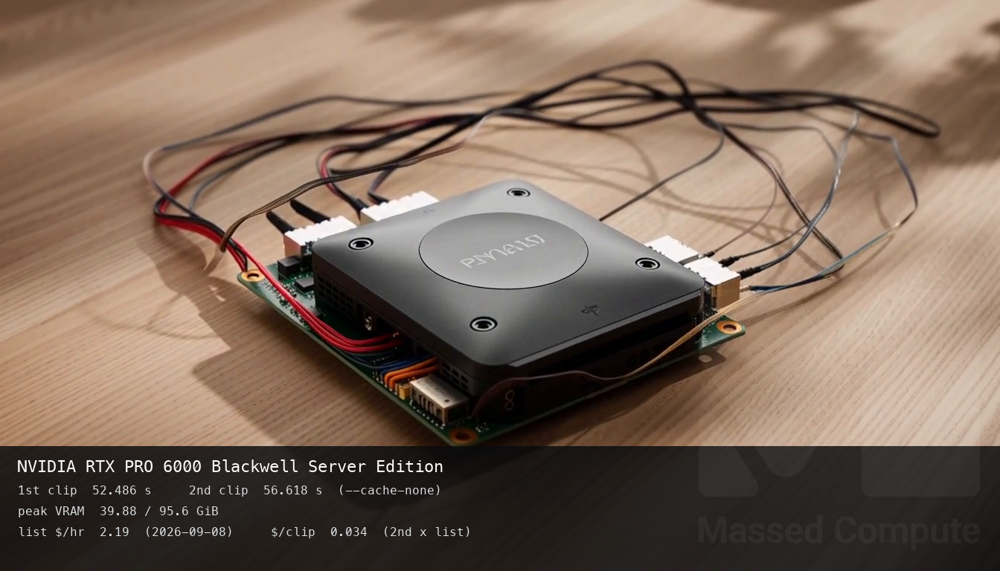

# MiniMax-H3 Turbo GPU Benchmark

### Last Edit Date:
MC - 2026.09.08

## Purpose
Live Massed Compute benches for **[lightx2v/Minimax-h3-Turbo](https://huggingface.co/lightx2v/Minimax-h3-Turbo)** on the Comfy-Org MiniMax-H3 renter path. Headline: **4-step v1.2 768p** LoRA (`minimax_h3_fl2v_turbo_4step_v1.2_768p_comfyui_bf16.safetensors`) on pruned INT8 ConvRot FL2VA.

This is the ticket engine (ComfyUI ≥ 0.31, core MiniMax-H3 nodes). It is **not** native LightX2V `python -m lightx2v.infer`. That earlier capture needed ~125 GiB host RAM and skipped A6000 / L40S; those numbers are not this table.

## Technique
- Engine: ComfyUI `efa6c8f` + `MiniMaxH3ImageToVideo` / `MiniMaxH3SigmaShift` / `LoraLoaderModelOnly`, `torch 2.14.0+cu130`, `--cache-none`
- Base: `Comfy-Org/MiniMax-H3` `minimax_h3_fl2va_pruned_int8_convrot.safetensors`
- Text encoder: `qwen3vl_32b_minimax_h3_nvfp4_awq.safetensors`
- VAEs: `minimax_h3_video_vae_fp16` + `minimax_h3_audio_vae_fp32`
- Lock (every SKU): **1344×768**, **4 steps**, Euler / simple, video shift **6**, audio shift **3**, **124 frames** (~5 s @ 24 fps), seed **42**
- Headline metric: **second `--cache-none` clip** (default Comfy unloads after each prompt, so this is “Comfy is already up,” not a hot-weight shortcut). An identical prompt without `--cache-none` returned in 0.01 s from the execution cache — that is not a clip.

Do not read “warm” as “weights stayed on the GPU.” Peak VRAM drops to <1 GiB between jobs. Blackwell’s second clip (56.6 s) was **slower** than its first (52.5 s).

## Results

**Speed winner:** `gpu_1x_pro_6000_blackwell` — **56.6 s** for one 5 s clip, **2.9×** A6000 / **1.75×** L40S.

**Value winner, unattended:** `gpu_1x_a6000` — **$0.026**/clip. L40S is **$0.027**. Blackwell is **$0.034**.

**Value winner, someone is waiting:** Blackwell. You pay **$0.008** extra vs A6000 to cut **108 s** off the wait. That is the sit-and-watch case. The unattended-queue ranking does not apply.

**Unexpected:** Peak VRAM is ~**40 GiB on every card**. Blackwell leaves ~56 GiB idle. A6000 (48 GiB host RAM) loads. You are buying wall time, not H3 memory. L40S is the mushy middle: not the wait card, not the batch card.

One 5 s clip, default Comfy reload (live list $/hr 2026-09-08). Second-clip `$/clip` = `warm_s / 3600 × list`:

| SKU | $/hr | 1st clip (s) | 2nd clip (s) | Peak / total VRAM | Host RAM | $/clip | Status |
|---|---:|---:|---:|---:|---:|---:|---|
| `gpu_1x_a6000` | 0.57 | 166.382 | **164.204** | 39.45 / 48.0 GiB | 48 GiB | **0.026** | OK |
| `gpu_1x_l40s` | 0.97 | 103.357 | **99.303** | 39.68 / 45.0 GiB | 72 GiB | 0.027 | OK |
| `gpu_1x_pro_6000_blackwell` | 2.19 | **52.486** | 56.618 | 39.88 / 95.6 GiB | 144 GiB | 0.034 | OK |

Attended one-shot vs unattended 100-clip queue (same 2nd-clip seconds):

| SKU | Wait for 1 clip | 100-clip wall | 100-clip $ |
|---|---:|---:|---:|
| `gpu_1x_a6000` | 2 min 44 s | 4.56 h | **$2.60** |
| `gpu_1x_l40s` | 1 min 39 s | 2.76 h | $2.68 |
| `gpu_1x_pro_6000_blackwell` | **57 s** | **1.57 h** | $3.44 |

### Screenshots

Caption numbers are copied from `bench.json` (1st/2nd clip seconds, peak VRAM). `$/clip` is 2nd clip × list rate. No synthesized min/max.

**gpu_1x_a6000** — $0.57/hr — ComfyUI 4-step Turbo 768p

2nd clip 164.204 s, 39.45 / 48.0 GiB, $0.026/clip:

**gpu_1x_l40s** — $0.97/hr — ComfyUI 4-step Turbo 768p

2nd clip 99.303 s, 39.68 / 45.0 GiB, $0.027/clip:

**gpu_1x_pro_6000_blackwell** — $2.19/hr — ComfyUI 4-step Turbo 768p

2nd clip 56.618 s, 39.88 / 95.6 GiB, $0.034/clip:

## Conclusion
If the GPU runs while you do something else, buy **`gpu_1x_a6000`**. 100 clips cost **$2.60** vs Blackwell **$3.44**.

If a person is staring at the progress bar, buy Blackwell. The extra **$0.008**/clip buys **108 s** back. Do not quote the unattended `$/clip` ranking as that decision.

Do not buy L40S for this graph. It is **$0.001**/clip above A6000 and still **1.75×** slower than Blackwell.

## Notes
- Setup: image 184, ~15 min launch-to-first-OK clip (weights ~45 GB). Runner: `scripts/h3turbo/remote_comfy_4step.sh`.
- Native LightX2V (2026-09-04) peaked at ~17 GiB VRAM but needed ~125 GiB host RAM. A6000/L40S failed that engine. Those stills remain at `images/1xA100-lightx2v-showcase.png` and `images/1xBlackwell-lightx2v-showcase.png` and are **not** this ladder.
- Capture 2026-09-08. Disposable bench VMs from this ladder were terminated after numbers were saved.
- L40S list rate rose from $0.88 to $0.97 on 2026-09-08. Older pages still show $0.88 as of their capture date.
- Raw: `results/raw/minimax-h3-turbo/comfyui/`.

---

  

  <strong><a href="https://massedcompute.com/?utm_source=github.com&utm_campaign=gpu-benchmark">LAUNCH GPU OR CPU INSTANCE</a></strong>

> **Pricing note:** Listed `$/hr` rates are point-in-time from the capture date. Confirm live pricing in the marketplace before you launch — rates can change. Pay only for the hours you use.
