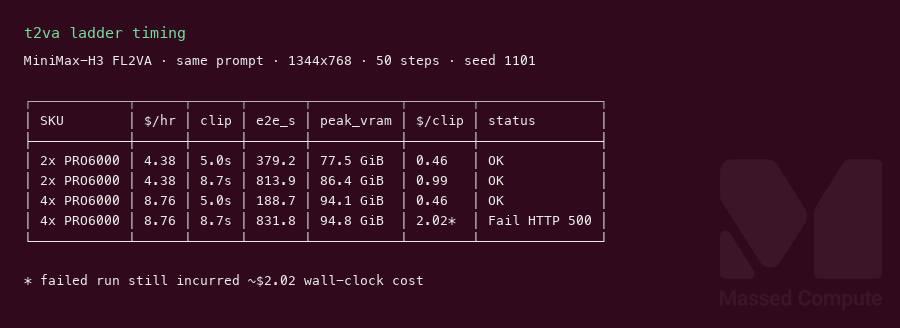
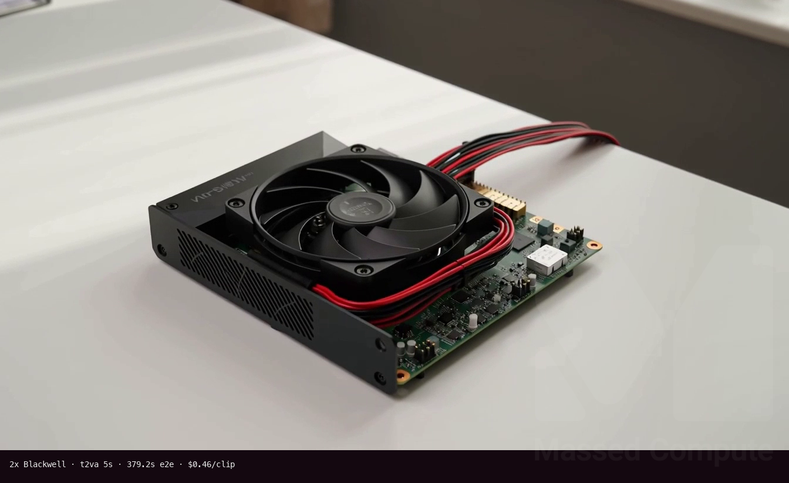
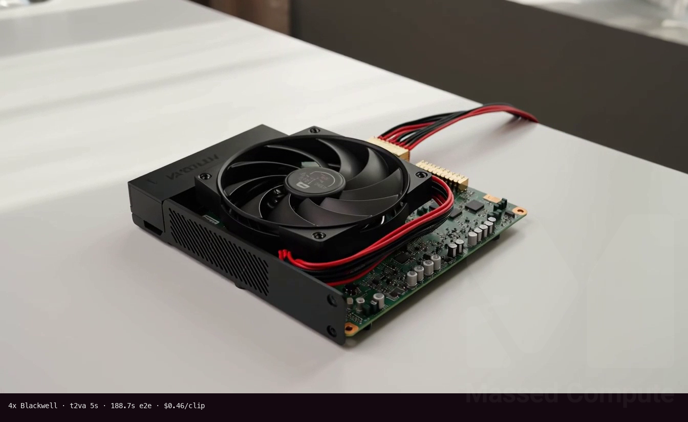

# MiniMax H3 GPU Benchmark

### Last Edit Date:
MC - 2026.08.06

## Purpose
Live Massed Compute benches for **MiniMaxAI/MiniMax-H3** (H3-Base **FL2VA** partition) — joint text-to-video+audio (t2va) clip generation. Fresh disposable `mc-bench-*` VMs only (did not reuse existing MiniMax hosts).

## Technique
Pinned profile across the ladder:
- Engine: `vllm/vllm-omni:minimax-h3` serving **FL2VA**
- Same prompt, seed **1101**, **1344×768** 16:9, **24 FPS**, **50** steps, `flow_shift=12`, `audio_flow_shift=3.0`
- Durations: **5.0 s** (headline) and **8.7 s** (recipe reference shape)
- Metrics: warm end-to-end seconds, peak VRAM, $/clip, ffprobe mux check

Locked prompt:
> A compact GPU accelerator module on a clean desk in soft daylight, camera slowly pushes in, subtle ambient room tone, no text no logos no watermarks.

## Results

| SKU | $/hr | Clip | Warm e2e (s) | Peak VRAM | $/clip | Status |
|---|---:|---:|---:|---:|---:|---|
| `gpu_1x_pro_6000_blackwell` | 2.19 | 5.0 s | — | — | — | Fail (see Notes) |
| `gpu_2x_pro_6000_blackwell` | 4.38 | 5.0 s | **379.2** | 77.5 GiB | **0.46** | OK |
| `gpu_2x_pro_6000_blackwell` | 4.38 | 8.7 s | 813.9 | 86.4 GiB | 0.99 | OK |
| `gpu_4x_pro_6000_blackwell` | 8.76 | 5.0 s | **188.7** | 94.1 GiB | **0.46** | OK |
| `gpu_4x_pro_6000_blackwell` | 8.76 | 8.7 s | 831.8 | 94.8 GiB | 2.02† | Fail HTTP 500 |

### Screenshots

**Ladder timing board**

**gpu_2x_pro_6000_blackwell** — $4.38/hr — 5 s t2va still

**gpu_4x_pro_6000_blackwell** — $8.76/hr — 5 s t2va still

## Conclusion
On the locked 5 s clip, **4× Blackwell finished ~2.0× faster than 2×** (188.7 s vs 379.2 s) while **$/clip stayed almost identical (~$0.46)**. Smallest working Massed fit in this capture was **2× PRO 6000 Blackwell**; 1× did not complete a valid MP4 on the BF16 CPU-offload path.

## Notes
- A 15 s clip attempt on 2× left only a 114-byte stub and was dropped (not in `plan.json` durations).
- Open weights used: H3-Base **FL2VA** only (~135 GiB). H3-Context-IR and H3-Regenerate-2K remain hosted API pieces — local output is **768p-class**, not the full 2K product path.
- **1×**: `FLASH_ATTN` hit an FA4 layout error; `TRTLLM_ATTN` failed orchestrator init on the **144 GiB** host (recipe prefers ≥200 GiB for offload).
- **2×**: TP2 + VAE tile, no DLO (2×96 GB fits BF16). Warm 5 s and 8.7 s both returned H.264 + 32 kHz stereo AAC.
- **4×**: USP4 no-offload profile. 5 s OK; 8.7 s returned HTTP 500 near full HBM (~94.8 GiB/GPU) — treat longer clips as needing more headroom / offload tuning.
- Extra checks on OK runs: ffprobe streams, duration ≈ requested, audio channels=2 @ 32 kHz.
- Live Massed runs 2026-08-06; bench VMs terminated after capture.

---

  

  <strong><a href="https://massedcompute.com/?utm_source=github.com&utm_campaign=gpu-benchmark">LAUNCH GPU OR CPU INSTANCE</a></strong>

> **Pricing note:** Listed `$/hr` rates are point-in-time from the capture date. Confirm live pricing in the marketplace before you launch — rates can change. Pay only for the hours you use.
