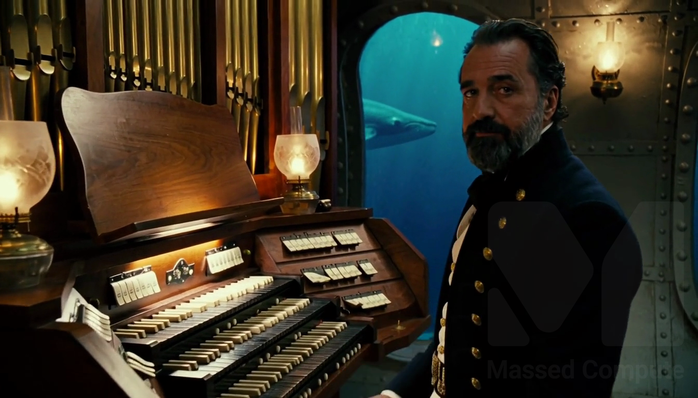
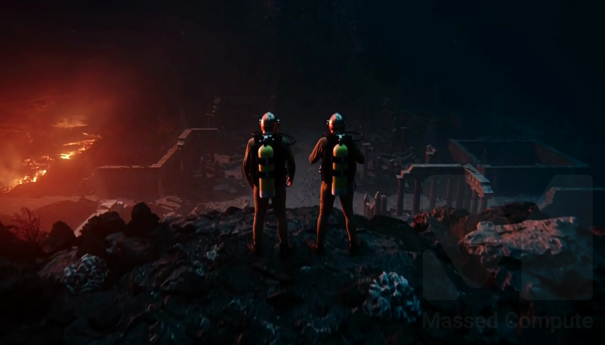

# MiniMax H3 GPU Benchmark

### Last Edit Date:
MC - 2026.08.13

## Purpose
Live Massed Compute benches for **MiniMaxAI/MiniMax-H3**. Three series, **not one table**:

1. **FL2VA / vLLM-Omni** — disposable `mc-bench-*` VMs, 1×/2×/4× RTX PRO 6000 Blackwell, locked 5.0 s / 8.7 s clips.
2. **Ref2VA / ComfyUI production OP** — 1344×768, 192 frames (8 s @ 24 fps), 20 steps, pruned-INT8, on 4× Pro 6000 / 8× L40S / 8× Pro 4500. **H200 not timed.**
3. **Atlántida reel** — 12-shot Verne film + checkpoint A/B on host `64.247.196.28` (comparison L40S box; page copy says 4× RTX 6000 Ada). Proof that the stack finishes a real cut, not a synthetic clip.

Do not divide wall times across series. Each series has its own control.

## Technique

**Series 1 — vLLM-Omni FL2VA** (`results/raw/minimax-h3/plan.json`)
- Engine: `vllm/vllm-omni:minimax-h3` serving **FL2VA**
- Same prompt, seed **1101**, **1344×768** 16:9, **24 FPS**, **50** steps, `flow_shift=12`, `audio_flow_shift=3.0`
- Durations: **5.0 s** (headline) and **8.7 s**
- Metrics: warm e2e seconds, peak VRAM (MiB/1024), $/clip, ffprobe mux

Locked prompt:
> A compact GPU accelerator module on a clean desk in soft daylight, camera slowly pushes in, subtle ambient room tone, no text no logos no watermarks.

**Series 2 — ComfyUI Ref2VA** (`results/raw/minimax-h3/comfyui-ref2va-comparison.json`)
- 4 reference images + 1 audio window, pruned-INT8 Ref2VA, 20 sampler steps
- Same-day Pro 6000 control on the Pro 4500 series (489 s / 24.5 s per step) — do not reuse the 414 s figure against that series
- Catalog `$/hr` from live inventory 2026-08-13 applied to measured wall (derived `$/clip`, not a marketplace capture)

**Series 3 — Atlántida** (`results/raw/minimax-h3/atlantida-reel.json`)
- 1344×768, **25** steps, res_multistep + simple, sigma 12/3, **SageAttention**
- MP4 metadata: `minimax_h3_fl2va_pruned_int8_convrot.safetensors`
- Sage is a **+20.2%** L40S speedup that Series 2 **rejected** (SSIM **0.858** vs production default). Treat reel walls as a different quality path.

## Results

### Series 1 — FL2VA vLLM-Omni (Blackwell ladder)

| SKU | $/hr | Clip | Warm e2e (s) | Peak VRAM | $/clip | Status |
|---|---:|---:|---:|---:|---:|---|
| `gpu_1x_pro_6000_blackwell` | 2.19 | 5.0 s | — | — | — | Fail (see Notes) |
| `gpu_2x_pro_6000_blackwell` | 4.38 | 5.0 s | **379.2** | 77.5 GiB | **0.46** | OK |
| `gpu_2x_pro_6000_blackwell` | 4.38 | 8.7 s | 813.9 | 86.4 GiB | 0.99 | OK |
| `gpu_4x_pro_6000_blackwell` | 8.76 | 5.0 s | **188.7** | 94.1 GiB | **0.46** | OK |
| `gpu_4x_pro_6000_blackwell` | 8.76 | 8.7 s | 831.8 | 94.8 GiB | 2.02† | Fail HTTP 500 |

† Failed run still incurred ~$2.02 wall-clock cost.

On the locked 5 s clip, **4× finished ~2.0× faster than 2×** while **$/clip stayed ~$0.46**. Smallest working Massed fit in this capture: **2× PRO 6000 Blackwell**.

### Series 2 — ComfyUI Ref2VA production OP (8 s / 20 steps)

Peak `nvidia-smi` is the allocator filling the card, not the job size. Staged warm weights: **24.9 GiB** (DiT 20.0 + video VAE 5.0 + audio VAE 0.6). Text encoder 15.0 GiB first clip only, then CPU.

| Box | Catalog SKU | Catalog $/hr | Warm wall / clip | s/step | Best ckpt | Full-box clips/hr | Derived $/clip |
|---|---|---:|---:|---:|---|---:|---:|
| 4× Pro 6000 | `gpu_4x_pro_6000_blackwell` | 8.76 | **414 s** | 19.9 | INT8 | **34.8** | **1.01** |
| 8× L40S | `gpu_8x_l40s` | 7.04 | **902 s** | 45.1 | INT8 | **31.9** | 1.76 |
| 8× Pro 4500 | `gpu_8x_pro_4500_blackwell` | 6.08 | **1285 s** B | 64.3 B | **NVFP4** | 21.3 | 2.17 |
| 8× H200 | `gpu_8x_h200_nvl` | 28.96 | **not measured** | — | INT8 (predicted) | — | — |

B Pro 4500 series used a same-day Pro 6000 control of **489 s / 24.5 s per step**, not 414 s. Normalized step cost: Pro 6000 **1.00**, L40S **2.27**, Pro 4500 **2.62**. A naive 64.3÷45.1 overstates the 4500 vs L40S gap by ~23%.

Eight L40S land within **8%** of four Pro 6000 on clips/hour (31.9 vs 34.8) while 2.2× worse per clip. Scaling is flat: 8-way L40S was slightly *faster* per step than solo.

**Checkpoint ranking inverts by card** (same geometry):

| Checkpoint | Pro 6000 | L40S (Ada) | Pro 4500 (Blackwell) |
|---|---:|---:|---:|
| pruned INT8 convrot | **414 s** (chosen) | **902 s** (chosen) | 1384 s |
| pruned FP8 | 432 s | 941 s | — |
| pruned NVFP4 | 405 s (2% faster, rejected) | **1055 s — slowest** | **1285 s — fastest** |

Ada emulates NVFP4 (no FP4 tensor cores). On Pro 4500 the same 12 GB file vs 20 GB INT8 is the difference between fitting and swapping; on Pro 6000 2% is not worth a second fleet checkpoint.

**SeedVR2 upscale (1104 short edge) is the real floor**, not sampling:

| Card | 1104 master | Peak | 4K (2208) |
|---|---|---|---|
| Pro 6000 96 GB | 166 s | 48 GiB | yes, 901 s tiled, 61 GiB |
| L40S 45 GiB | 304 s, 4 allocator retries | 100% of card | never |
| Pro 4500 32 GB | **VAE tiling only**, 379 s | 22991 MiB | no |

Tiling costs ~15% Laplacian sharpness (309.98 → 262.62 on Pro 6000 tiled-vs-untiled). Softness is the tile, not the small card.

### Series 3 — Atlántida reel (4× 48 GB Ada, 25 steps, Sage)

Film: 12 shots, 1:44 assembled, mean **1094 s**/shot, reported peaks 43.4–47.4 GB. Four dramatic shots mean **1599 s**. Trailer 58 s / teaser 38 s are editorial, not extra generates.

Checkpoint A/B on that host (5.17 s INT8 clip probed at 1344×768 / 24 fps / AAC 32 kHz):

| Config | Wall | Reported VRAM | Weights |
|---|---:|---:|---:|
| BF16 full | 791 s | 46.9 GB | 61.7 GB |
| pruned BF16 | 320 s | 47.2 GB | 37.5 GB |
| GGUF Q8_0 | 356 s | 46.3 GB | 33.6 GB |
| FP8 native Ada | 616 s | 46.3 GB | 19.5 GB |
| **INT8 pruned** | **486 s** | 46.4 GB | 19.5 GB |
| GGUF Q3_K_M | 361 s | 35.2 GB | 14.5 GB |
| Turbo LoRA 8 steps | 212 s | 46.5 GB | — |
| Turbo LoRA 4 steps | 166 s | 46.3 GB | audio degraded |
| BF16 209f / 8.71 s | 1528 s | 46.8 GB | 4 GPUs as VRAM pool |
| Multishot 10.8 s / 3 cuts in one generate | 1542 s | 43.9 GB | — |

INT8 is the fastest non-turbo arm on this board. Turbo 4-step is the speed floor and the audio floor.

### Screenshots

**Series 1 — ladder timing board** (vLLM-Omni FL2VA, 2×/4× Blackwell)

**gpu_2x_pro_6000_blackwell** — $4.38/hr — 5 s t2va still, seed 1101, 50 steps

**gpu_4x_pro_6000_blackwell** — $8.76/hr — 5 s t2va still, seed 1101, 50 steps

**Series 3 — INT8 Comfy default** (host `64.247.196.28`, 5.17 s FL2VA INT8 convrot, 486 s wall on the A/B board)

**Series 3 — Atlántida shot 6** (“La revelación de la ciudad”, 8.71 s, 1152 s wall, 43.4 GB reported)

## Conclusion

- **Buy 2× Blackwell** if you need the Massed vLLM-Omni FL2VA path today: 5 s clip in **379.2 s** at **$0.46**. 4× halves latency, not cost.
- **Buy 8× L40S** if the job is batch Ref2VA: **31.9 clips/hr** vs **34.8** on 4× Pro 6000, at a lower box rate. Per-clip latency is the wrong metric for a song/film queue.
- **Buy one 96 GB card for the tail.** Every tier runs H3 sampling. SeedVR2 4K never runs on L40S or Pro 4500; 1104 on Pro 4500 needs tiling.
- **Pick the quant per card.** INT8 on Ada and on 96 GB Blackwell. NVFP4 on 32 GB Blackwell. Not an architecture-level answer.
- **H200:** onboarded once (143771 MiB). No clip timed. Do not interpolate.
- **Atlántida** is the quality/continuity proof: 12 shots + trailer on the L40S-tier host, FL2VA INT8, Sage on. Do not quote 1094 s/shot as the 20-step production OP.

## Notes
- Series 1: 15 s attempt on 2× left a 114-byte stub (dropped; not in `plan.json`). Open weights = H3-Base **FL2VA** only (~135 GiB). H3-Context-IR and H3-Regenerate-2K stay hosted API — local output is **768p-class**.
- Series 1 **1×**: `FLASH_ATTN` FA4 layout error; `TRTLLM_ATTN` failed orchestrator init on the **144 GiB** host (recipe prefers ≥200 GiB for offload).
- Series 1 **2×**: TP2 + VAE tile, no DLO. Warm 5 s and 8.7 s returned H.264 + 32 kHz stereo AAC.
- Series 1 **4×**: USP4 no-offload. 5 s OK; 8.7 s HTTP 500 near full HBM (~94.8 GiB/GPU).
- Series 2: `--disable-dynamic-vram` held L40S to 29.46 GiB then **OOM’d the second clip** on Pro 4500. DynamicVRAM expansion is what makes 32 GB viable. `--use-sage-attention` +20.2% / SSIM 0.858 — not shipped.
- Same seed, INT8, two Blackwell hosts: SSIM **0.857** across Pro 4500 vs Pro 6000 (ComfyUI checkouts 8 days apart). Do not split one song across card types.
- Pro 4500-only (not a comparison): Z-Image-Turbo 1280×720 8 steps = 6.5 s / 19.1 GB; Qwen3-TTS-12Hz-1.7B RTF **0.235**, 9.4 GiB, 1.75% WER.
- Series 1 live Massed runs 2026-08-06; bench VMs terminated. Series 2/3 from rented production hosts; stills watermarked 2026-08-13.

---

**[LAUNCH GPU OR CPU INSTANCE](https://massedcompute.com/?utm_source=github.com&utm_campaign=gpu-benchmark)**

> **Pricing note:** Listed `$/hr` rates are point-in-time from the capture date. Confirm live pricing in the marketplace before you launch — rates can change. Pay only for the hours you use.
