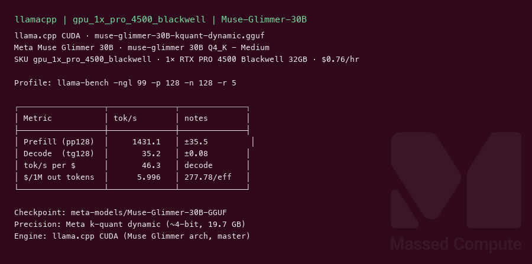
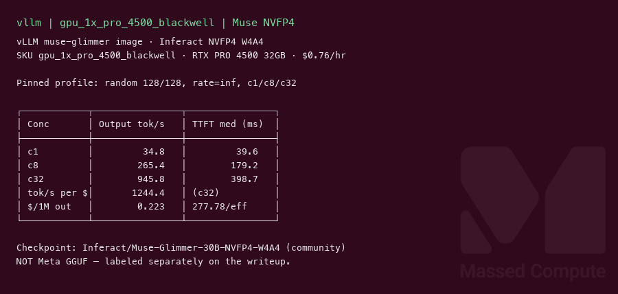
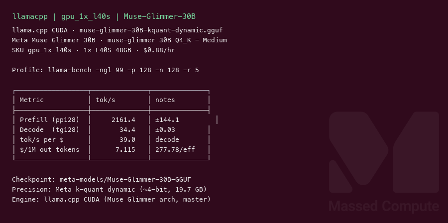
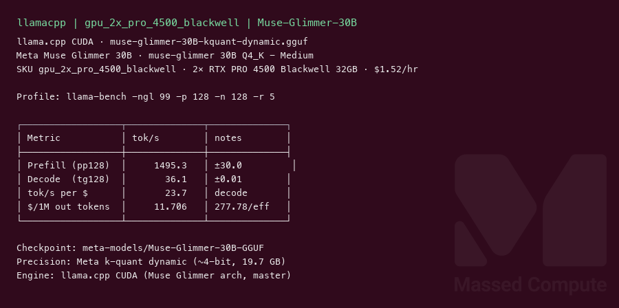
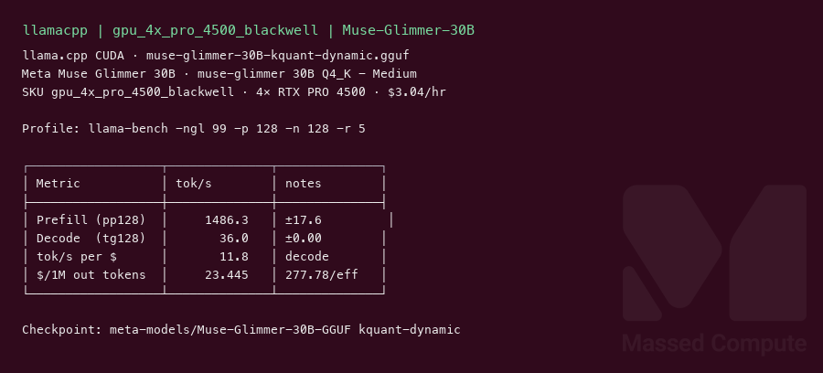
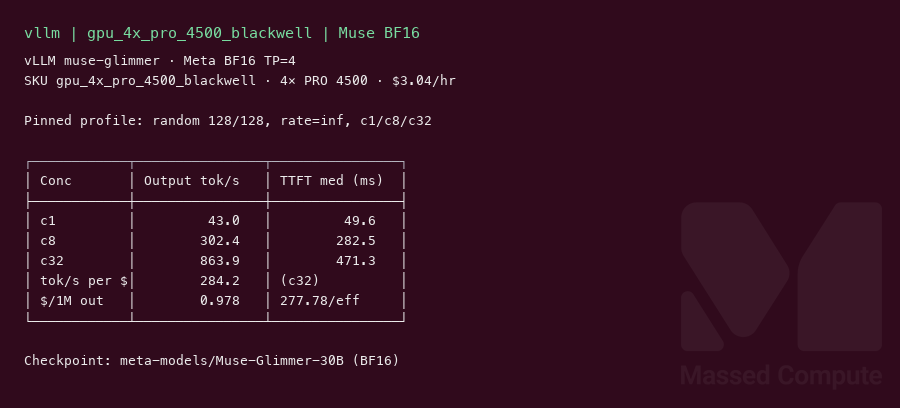

# Muse Glimmer 30B GPU Benchmark

### Last Edit Date:
MC - 2026.08.11

## Purpose
Live Massed Compute benches for **Meta Muse Glimmer 30B** on the new **RTX PRO 4500 Blackwell (32 GB)** ladder, with a **1× L40S** comparison row for the launch campaign. First published GPU serving numbers for this model.

## Technique

### Checkpoint A — Meta 4-bit (primary)
`meta-models/Muse-Glimmer-30B-GGUF` → `muse-glimmer-30B-kquant-dynamic.gguf` (~19.7 GB, Q4_K Medium).  
Meta’s official 32 GB consumer build. Engine: **llama.cpp** CUDA (arch merged 2026-08-10, `#26841`).  
Profile: `llama-bench -ngl 99 -p 128 -n 128 -r 5`. Headline decode = **tg128**.

### Checkpoint B — community NVFP4 (vLLM serving)
`Inferact/Muse-Glimmer-30B-NVFP4-W4A4` (~24 GB, ModelOpt W4A4).  
**Not** a Meta or NVIDIA-published checkpoint — labeled separately. Used only because Meta’s 4-bit is GGUF and the pinned vLLM profile needs a safetensors quant that fits 32 GB.  
Engine: **vLLM** `vllm/vllm-openai:muse-glimmer` with pinned flags + Muse parsers.  
Profile: random prompts, input=128, output=128, request-rate=inf, concurrency 1 / 8 / 32. Headline = **c32**.

### vLLM support (gate check)
**Confirmed.** Image resolves `MuseGlimmerForConditionalGeneration` with `--tool-call-parser muse_glimmer` / `--reasoning-parser muse_glimmer`.  
BF16 (`meta-models/Muse-Glimmer-30B`, ~60 GB) **OOM on 2× PRO 4500** during KV init. Needs 4× / larger VRAM for BF16 serve.

`$ per 1M output tokens = 277.78 / (tok/s per $)`.

## Results — Meta GGUF (llama.cpp)

| Engine | SKU | $/hr | Prefill tok/s (pp128) | Decode tok/s (tg128) | tok/s per $ | $/1M out tokens |
|---|---|---:|---:|---:|---:|---:|
| llama.cpp | `gpu_1x_pro_4500_blackwell` | 0.76 | 1431.1 | 35.2 | 46.3 | 6.00 |
| llama.cpp | `gpu_1x_l40s` | 0.88 | 2161.4 | 34.4 | 39.0 | 7.12 |
| llama.cpp | `gpu_2x_pro_4500_blackwell` | 1.52 | 1495.3 | 36.1 | 23.7 | 11.71 |
| llama.cpp | `gpu_4x_pro_4500_blackwell` | 3.04 | 1486.3 | 36.0 | 11.8 | 23.45 |

## Results — Inferact NVFP4 (vLLM)

| Engine | SKU | $/hr | Output tok/s (c32) | TTFT med (ms) | tok/s per $ | $/1M out tokens |
|---|---|---:|---:|---:|---:|---:|
| vllm | `gpu_1x_pro_4500_blackwell` | 0.76 | 945.8 | 398.7 | 1244.4 | 0.223 |

## Results — Meta BF16 (vLLM)

| Engine | SKU | $/hr | Output tok/s (c32) | TTFT med (ms) | tok/s per $ | $/1M out tokens |
|---|---|---:|---:|---:|---:|---:|
| vllm | `gpu_4x_pro_4500_blackwell` | 3.04 | 863.9 | 471.3 | 284.2 | 0.977 |

Do **not** mix NVFP4 / GGUF / BF16 rows as the same test. Different engine or precision.

### Screenshots

Ghost watermark per MAR-12 recipe. Captured 2026-08-11 on Massed Compute.

**gpu_1x_pro_4500_blackwell** — RTX PRO 4500 Blackwell 32GB — $0.76/hr

llama.cpp · Meta `kquant-dynamic` · decode **35.2 tok/s**:

vLLM · Inferact NVFP4 · **945.8** output tok/s @ c32:

**gpu_1x_l40s** — L40S 48GB — $0.88/hr

llama.cpp · same Meta GGUF · decode **34.4 tok/s**:

**gpu_2x_pro_4500_blackwell** — 2× RTX PRO 4500 — $1.52/hr

llama.cpp · same Meta GGUF · decode **36.1 tok/s** (single-stream does not need a second card once the model fits):

**gpu_4x_pro_4500_blackwell** — 4× RTX PRO 4500 — $3.04/hr

llama.cpp · same Meta GGUF · decode **36.0 tok/s**:

vLLM · Meta BF16 TP=4 · **863.9** output tok/s @ c32:

## Conclusion

**Meta GGUF apples-to-apples:** **1× RTX PRO 4500** beats **1× L40S** on decode cost — **46.3 vs 39.0 tok/s per $** (**~$6.00 vs ~$7.12 per 1M output tokens**). Decode tok/s is nearly tied (35.2 vs 34.4); L40S wins prefill.

**vLLM serving:** On one 4500, Inferact NVFP4 hits **945.8 tok/s @ c32** (**~1244 tok/s per $**, **~$0.22 per 1M**). Meta BF16 needs **4×** and lands **863.9 tok/s @ c32** (**~284 tok/s per $**). For this card, quantized 1× serving wins on both throughput and dollars — keep precisions labeled.

## Notes

- Apache 2.0. Dense ~29.6B multimodal agentic; 131K context; text-only path (no mmproj) for these runs.
- No NVIDIA-published NVFP4 for Muse at capture time; Meta’s official 4-bit is GGUF.
- Multi-GPU GGUF single-stream decode stays ~36 tok/s — the model already fits on 1×; extra cards are for concurrency / BF16.
- Bench VMs terminated after capture.

---

**[LAUNCH GPU OR CPU INSTANCE](https://massedcompute.com/?utm_source=github.com&utm_campaign=gpu-benchmark)**

> **Pricing note:** Listed `$/hr` rates are point-in-time from the capture date. Confirm live pricing in the marketplace before you launch — rates can change. Pay only for the hours you use.
