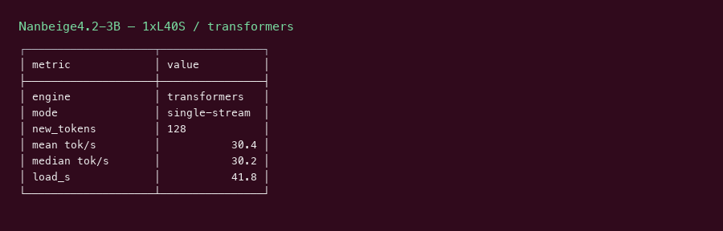
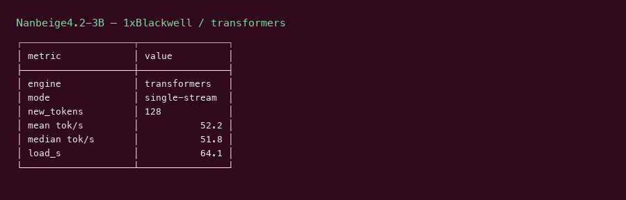

# Nanbeige4.2 3B GPU Benchmark

### Last Edit Date:
MC - 2026.07.22

## Purpose
Live Massed Compute benches for **Nanbeige/Nanbeige4.2-3B**.

## Technique
Transformers `generate` single-stream (128 new tokens, 5 repeats after warmup). Config uses `rope_scaling=None` so rotary init matches the published null scaling. Architecture is not in vLLM.

## Results

| Engine | SKU | $/hr | Decode tok/s | tok/s per $ |
|---|---|---:|---:|---:|
| transformers | `gpu_1x_l40s` | 0.88 | 30.4 | 34.5 |
| transformers | `gpu_1x_pro_6000_blackwell` | 2.19 | 52.2 | 23.8 |

### Screenshots

Terminal-style captures from live Massed runs 2026-07-22 (transformers single-stream decode — not T2I).

**gpu_1x_l40s** — L40S 48GB — $0.88/hr

transformers · single-stream **30.4** tok/s:

**gpu_1x_pro_6000_blackwell** — RTX PRO 6000 Blackwell 96GB — $2.19/hr

transformers · single-stream **52.2** tok/s:

## Conclusion

Peak decode: **52.2 tok/s** on `gpu_1x_pro_6000_blackwell`.
Best $/tok: **34.5 tok/s per $** on `gpu_1x_l40s`.

## Notes
- Transformers path only (c8/c32 N/A without vLLM arch support). TTFT not measured.
- Entry L40S + Blackwell step-up.
- Raw `nvidia-smi.txt` on these SKUs was captured after teardown in the first pass (0 MiB) — do not treat as peak VRAM.
- Numbers from live Massed runs 2026-07-22; disposable bench VMs terminated after capture.

---

  

  <strong><a href="https://massedcompute.com/?utm_source=github.com&utm_campaign=gpu-benchmark">LAUNCH GPU OR CPU INSTANCE</a></strong>

> **Pricing note:** Listed `$/hr` rates are point-in-time from the capture date. Confirm live pricing in the marketplace before you launch — rates can change. Pay only for the hours you use.

