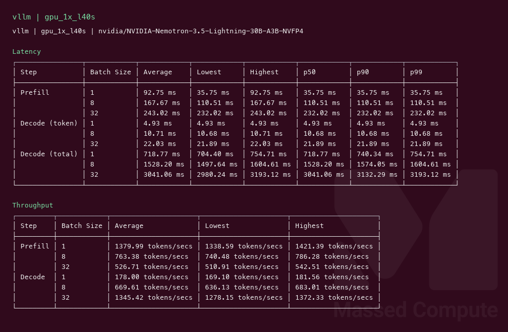
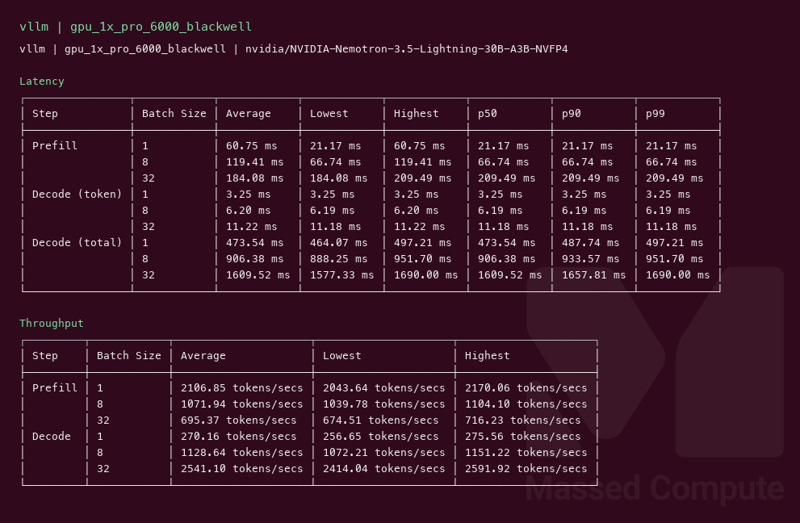
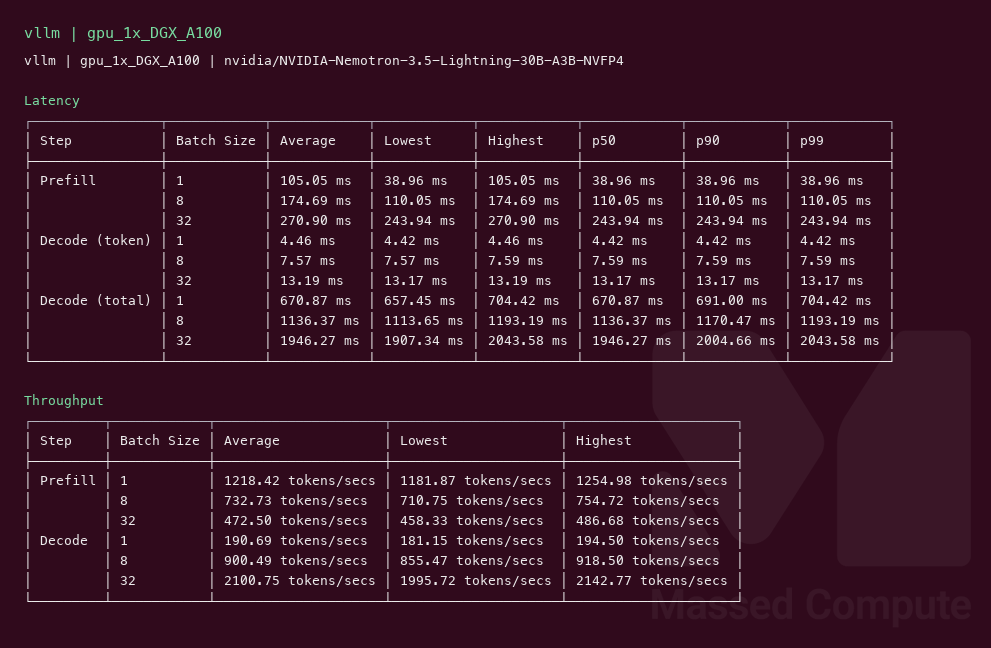

# NVIDIA Nemotron 3.5 Lightning 30B A3B NVFP4 GPU Benchmark

### Last Edit Date:
MC - 2026.08.18

## Purpose
Live Massed Compute vLLM benches for **NVIDIA Nemotron 3.5 Lightning** (`nvidia/NVIDIA-Nemotron-3.5-Lightning-30B-A3B-NVFP4`). Official NVFP4 checkpoint (~16 GB), 30B total / 3B active.

## Technique
Pinned profile: random prompts, input=128, output=128, request-rate=inf, concurrency 1 / 8 / 32. Headlines use **c32**.
Engine: **vLLM** `vllm/vllm-openai:v0.27.1`, `--max-model-len 8192`. No DSpark (NVIDIA: spec-decode loses batch tput).
- L40S / A100: W4A16 `humming` + `--quantization modelopt_fp4` + `--mamba-ssu-algorithm simple`
- Blackwell 96 GB: native FP4 path + FP8 KV

## Results

| Engine | SKU | $/hr | Output tok/s (c32) | TTFT med (ms) | tok/s per $ | $/1M out tokens |
|---|---|---:|---:|---:|---:|---:|
| vllm | `gpu_1x_l40s` | 0.88 | 1345.4 | 232.0 | 1528.9 | 0.182 |
| vllm | `gpu_1x_pro_6000_blackwell` | 2.19 | 2541.1 | 209.5 | 1160.3 | 0.239 |
| vllm | `gpu_1x_DGX_A100` | 1.38 | 2100.8 | 243.9 | 1522.3 | 0.182 |

### Screenshots

**gpu_1x_l40s** — $0.88/hr

vllm — 1345.4 output tok/s @ c32:

**gpu_1x_pro_6000_blackwell** — $2.19/hr

vllm — 2541.1 output tok/s @ c32:

**gpu_1x_DGX_A100** — $1.38/hr

vllm — 2100.8 output tok/s @ c32:

## Conclusion

Peak c32 output throughput: **2541 tok/s** on `gpu_1x_pro_6000_blackwell` with **vllm**.
Best $/tok: **1528.9 tok/s per $** on `gpu_1x_l40s` / **vllm** (A100 is 1522.3, nearly tied).

## Notes
- Exact weights: official NVFP4. BF16 is the 80 GB research dump; not served here.
- Smallest live coupon fit was **1× L40S** (48 GB). `gpu_1x_pro_4500_blackwell` and `gpu_1x_h100` launches failed (4500 not on coupon list; H100 no capacity).
- Numbers from live Massed runs 2026-08-18; bench VMs terminated after capture.

---

  

  <strong><a href="https://massedcompute.com/?utm_source=github.com&utm_campaign=gpu-benchmark">LAUNCH GPU OR CPU INSTANCE</a></strong>

> **Pricing note:** Listed `$/hr` rates are point-in-time from the capture date. Confirm live pricing in the marketplace before you launch — rates can change. Pay only for the hours you use.
