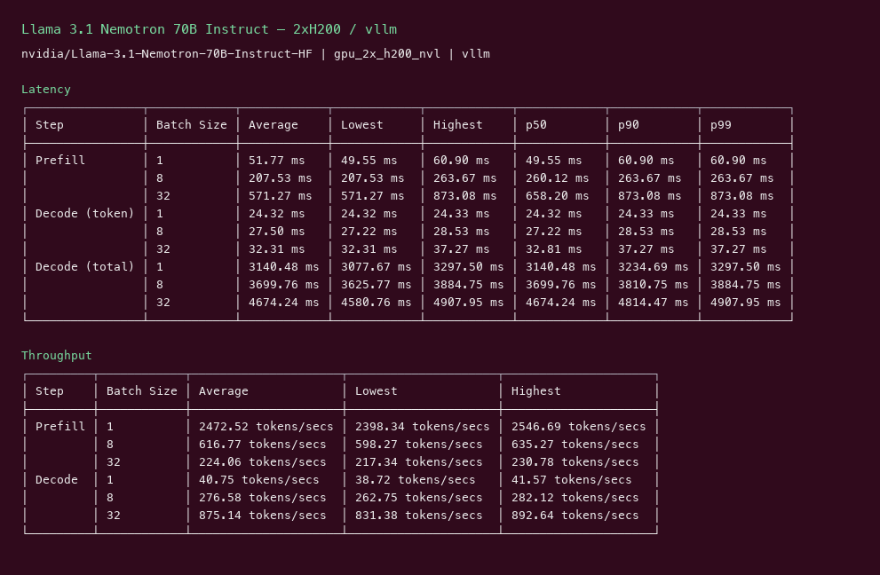
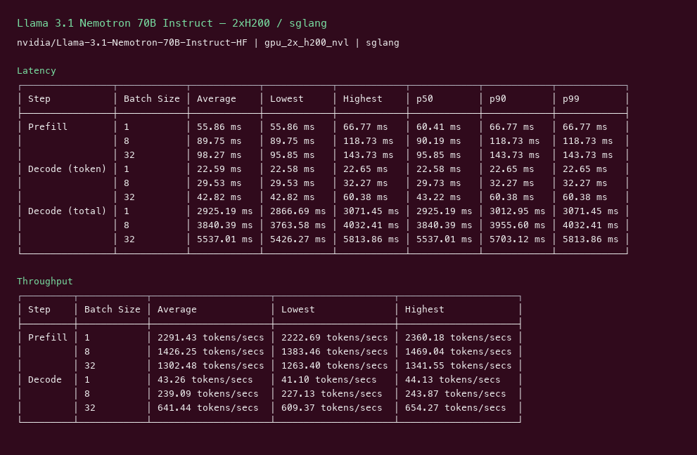
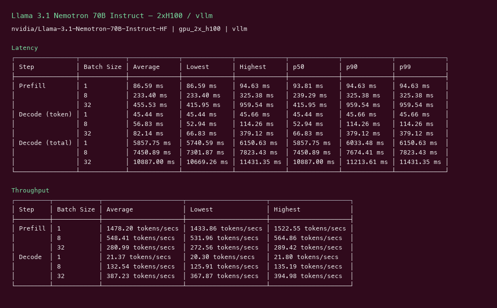
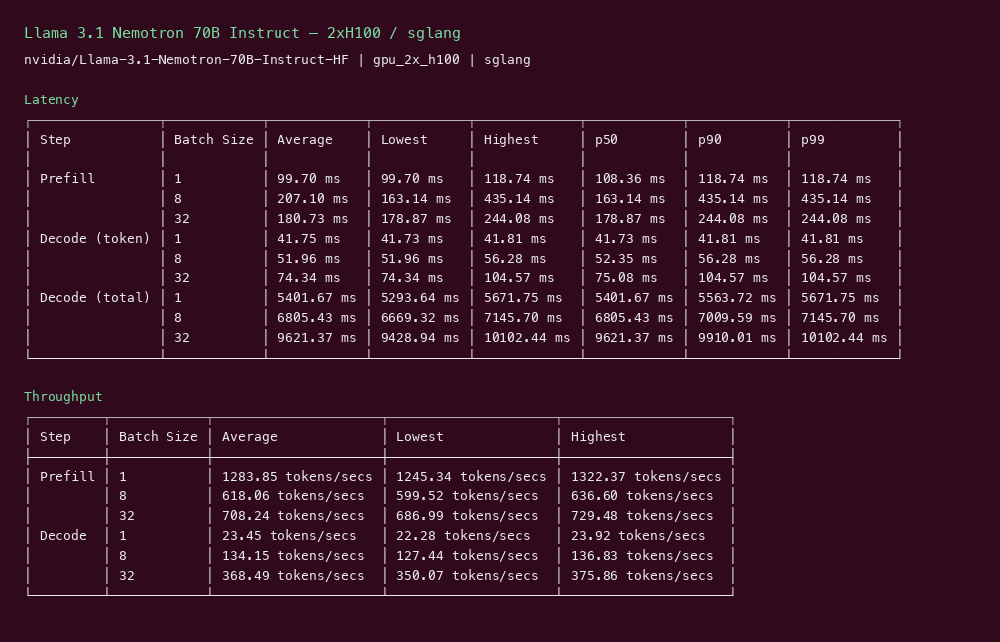

# Llama 3.1 Nemotron 70B Instruct GPU Benchmark

### Last Edit Date:
MC - 2026.07.16

## Purpose
Live Massed Compute inference benches for **nvidia/Llama-3.1-Nemotron-70B-Instruct-HF**, comparing **vLLM** vs **SGLang**.

## Technique
Pinned profile: random prompts, input=128, output=128, request-rate=inf, concurrency 1 / 8 / 32. Headlines use **c32**.
Engines: vLLM (`v0.8.5` and/or `cu129-nightly`) + SGLang `lmsysorg/sglang:latest`.

## Results

| Engine | SKU | $/hr | Output tok/s (c32) | TTFT mean/med (ms) | tok/s per $ |
|---|---|---:|---:|---:|---:|
| vllm | `gpu_2x_h200_nvl` | 7.24 | 875.1 | 658.2 | 120.9 |
| sglang | `gpu_2x_h200_nvl` | 7.24 | 641.4 | 95.8 | 88.6 |
| vllm | `gpu_2x_h100` | 5.46 | 387.2 | 416.0 | 70.9 |
| sglang | `gpu_2x_h100` | 5.46 | 368.5 | 178.9 | 67.5 |

### Screenshots

**gpu_2x_h200_nvl** — $7.24/hr

vllm:

sglang:

**gpu_2x_h100** — $5.46/hr

vllm:

sglang:

## Conclusion

Peak c32 output throughput: **875 tok/s** on `gpu_2x_h200_nvl` with **vllm**.
Best $/tok: **120.9 tok/s per $** on `gpu_2x_h200_nvl` / **vllm**.

## Notes

- 2× Blackwell was out of capacity; compared 2× H200 NVL vs 2× H100 instead.
- H200 roughly doubles vLLM c32 throughput vs H100 and wins $/tok.
- Numbers from live Massed runs 2026-07-16; bench VMs terminated after capture.

---

  

  <strong><a href="https://massedcompute.com/?utm_source=github.com&utm_campaign=gpu-benchmark">LAUNCH GPU OR CPU INSTANCE</a></strong>

> **Pricing note:** Listed `$/hr` rates are point-in-time from the capture date. Confirm live pricing in the marketplace before you launch — rates can change. Pay only for the hours you use
