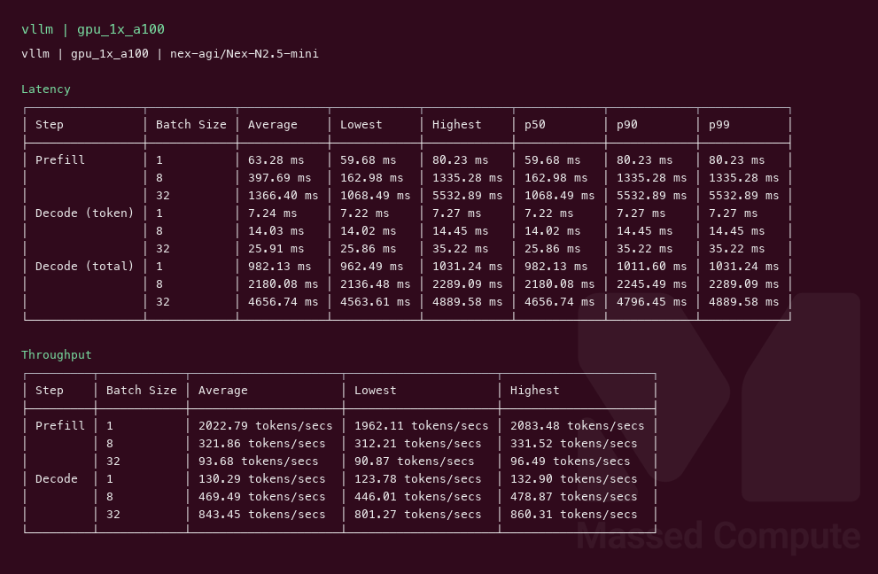
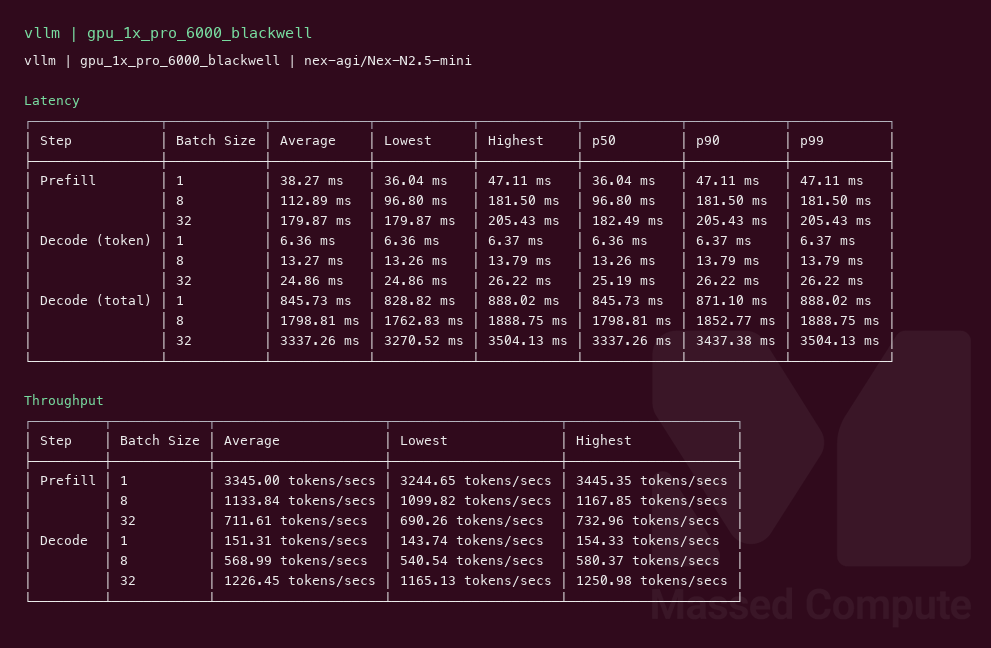

# Nex-N2.5-mini GPU Benchmark

### Last Edit Date:
MC - 2026.09.14

## Purpose
Live Massed Compute vLLM benches for **nex-agi/Nex-N2.5-mini** (Qwen3.5 MoE, Apache 2.0). Exact BF16 weights on both SKUs. Text-only decode (`--limit-mm-per-prompt '{"image":0}'`).

## Technique
Pinned profile: random prompts, input=128, output=128, request-rate=inf, concurrency 1 / 8 / 32. Headlines use **c32** **Output token throughput**.
Engine: **vLLM** `vllm/vllm-openai:nightly` digest `sha256:78c73c96fb74cdbee0f6d90d8ba756540a2385668a35f565f73dbab1da461099`, `--gpu-memory-utilization 0.92 --max-num-batched-tokens 16384 --kv-cache-dtype fp8 --trust-remote-code`. No prefix-caching.
SKU-specific serve flags (not a controlled A/B for latency):
- `gpu_1x_a100`: `--max-model-len 4096 --max-num-seqs 64` (80 GB headroom; 128 seqs failed CUDA-graph / Mamba cache-block check)
- `gpu_1x_pro_6000_blackwell`: `--max-model-len 8192 --max-num-seqs 128`

## Results

| Engine | SKU | Weights | $/hr | Output tok/s (c32) | TTFT med (ms) | tok/s per $ | $/1M out tokens |
|---|---|---|---:|---:|---:|---:|---:|
| vllm | `gpu_1x_a100` | BF16 | 1.35 | 843.4 | 1068.5 | 624.8 | 0.445 |
| vllm | `gpu_1x_pro_6000_blackwell` | BF16 | 2.19 | 1226.4 | 182.5 | 560.0 | 0.496 |

### Screenshots

Terminal-style vLLM serving-bench captures (input=128, output=128, concurrency 1/8/32), Massed Compute 2026-09-14.

**gpu_1x_a100** — A100 80GB PCIe — $1.35/hr

vLLM nightly · `nex-agi/Nex-N2.5-mini` · c32 **843.4** output tok/s · TTFT med **1068.5** ms:

**gpu_1x_pro_6000_blackwell** — RTX PRO 6000 Blackwell 96GB — $2.19/hr

vLLM nightly · `nex-agi/Nex-N2.5-mini` · c32 **1226.4** output tok/s · TTFT med **182.5** ms:

## Conclusion

Smallest fit that ran is **`gpu_1x_a100`** at **624.8** tok/s per $ (**843.4** tok/s at $1.35/hr). Blackwell is the speed card: **1226.4** tok/s (**1.45×** A100) and **182.5** ms TTFT vs A100’s **1068.5** ms at c32. Buy A100 for tok/s per $; buy Blackwell if you want the higher c32 rate and lower TTFT.

## Notes
- Weights loaded at **65.53 GiB**. `gpu_1x_l40s` (48 GB) cannot hold that checkpoint; not launched. `gpu_1x_h100` ($2.73) not launched.
- Same HF id on both rows. Text-decode only; this is not an image-generation bench.
- A100 c32 TTFT median **1068.5** ms (mean **1366.4** ms) vs c8 **163.0** ms — packed 80 GB card at c32, not a Blackwell A/B.
- `nvidia-smi` VRAM while the server was up (MiB/1024): A100 **74.03 GiB**, Blackwell **88.55 GiB**.
- Numbers from live Massed runs 2026-09-14; disposable bench VMs terminated after capture.

---

  

  <strong><a href="https://massedcompute.com/?utm_source=github.com&utm_campaign=gpu-benchmark">LAUNCH GPU OR CPU INSTANCE</a></strong>

> **Pricing note:** Listed `$/hr` rates are point-in-time from the capture date. Confirm live pricing in the marketplace before you launch — rates can change. Pay only for the hours you use.
