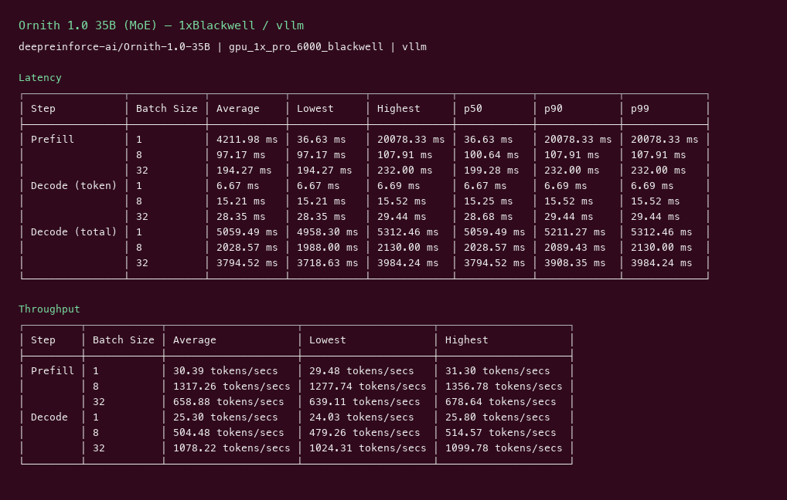
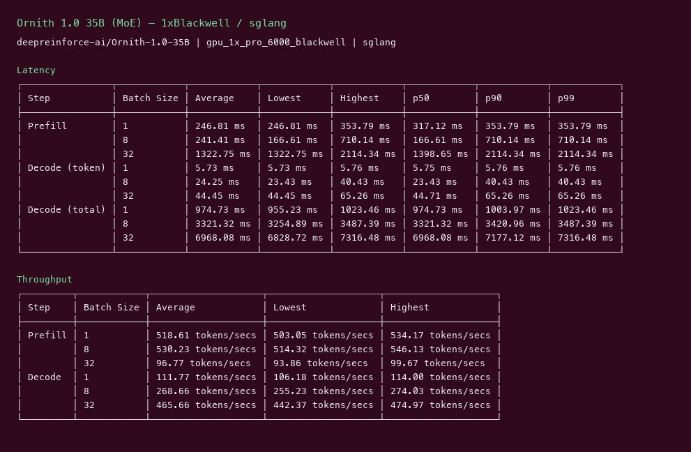
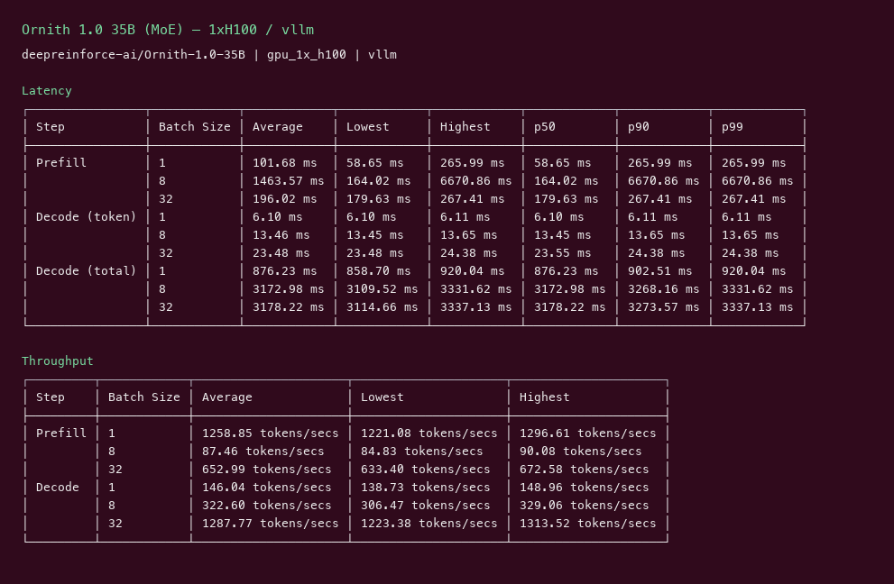
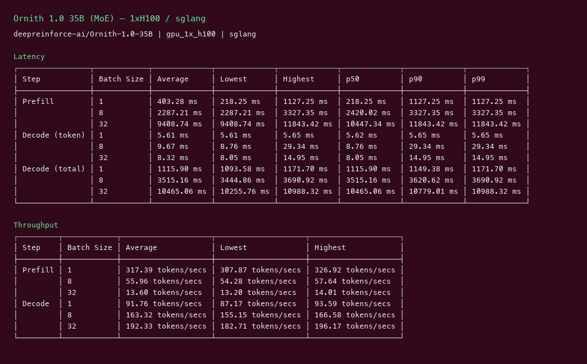

# Ornith 1.0 35B (MoE) GPU Benchmark

### Last Edit Date:
MC - 2026.07.20

## Purpose
Live Massed Compute inference benches for **deepreinforce-ai/Ornith-1.0-35B**, comparing **vLLM** vs **SGLang**.

## Technique
Pinned profile: random prompts, input=128, output=128, request-rate=inf, concurrency 1 / 8 / 32. Headlines use **c32**.
Engines: vLLM (`cu129-nightly`) + SGLang `lmsysorg/sglang:latest`.

## Results

| Engine | SKU | $/hr | Output tok/s (c32) | TTFT med (ms) | tok/s per $ |
|---|---|---:|---:|---:|---:|
| vllm | `gpu_1x_pro_6000_blackwell` | 2.19 | 1078.2 | 199.3 | 492.3 |
| sglang | `gpu_1x_pro_6000_blackwell` | 2.19 | 465.7 | 1398.7 | 212.6 |
| vllm | `gpu_1x_h100` | 2.73 | 1287.8 | 179.6 | 471.7 |
| sglang | `gpu_1x_h100` | 2.73 | 192.3 | 10447.3 | 70.4 |

### Screenshots

**gpu_1x_pro_6000_blackwell** — $2.19/hr

vllm:

sglang:

**gpu_1x_h100** — $2.73/hr

vllm:

sglang:

## Conclusion

Peak c32 output throughput: **1288 tok/s** on `gpu_1x_h100` with **vllm**.
Best $/tok: **492.3 tok/s per $** on `gpu_1x_pro_6000_blackwell` / **vllm**.

## Notes

- Ornith MoE coding agent (~35B).
- H100 vLLM used `--max-num-seqs 128` (Mamba cache limit).
- Numbers from live Massed runs 2026-07-20; bench VMs terminated after capture.

---

  

  <strong><a href="https://massedcompute.com/?utm_source=github.com&utm_campaign=gpu-benchmark">LAUNCH GPU OR CPU INSTANCE</a></strong>

> **Pricing note:** Listed `$/hr` rates are point-in-time from the capture date. Confirm live pricing in the marketplace before you launch — rates can change. Pay only for the hours you use; no long-term contracts.
