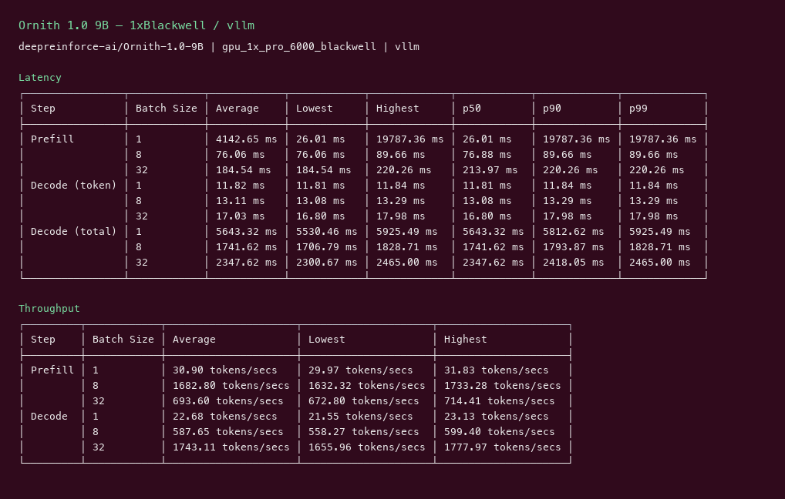
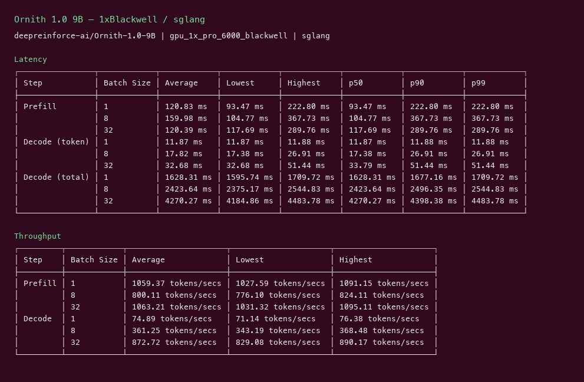
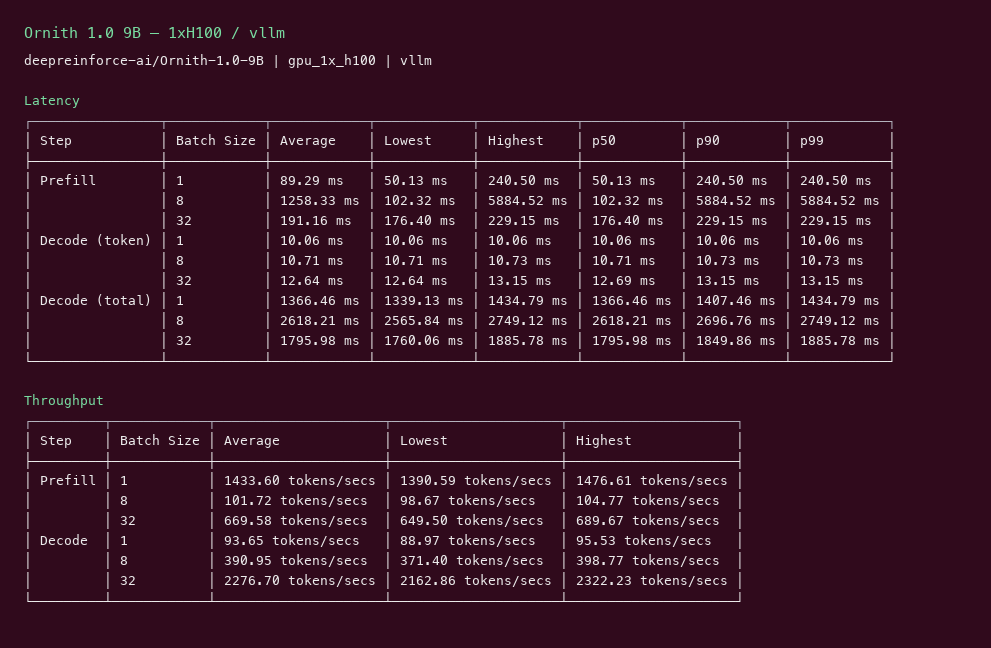
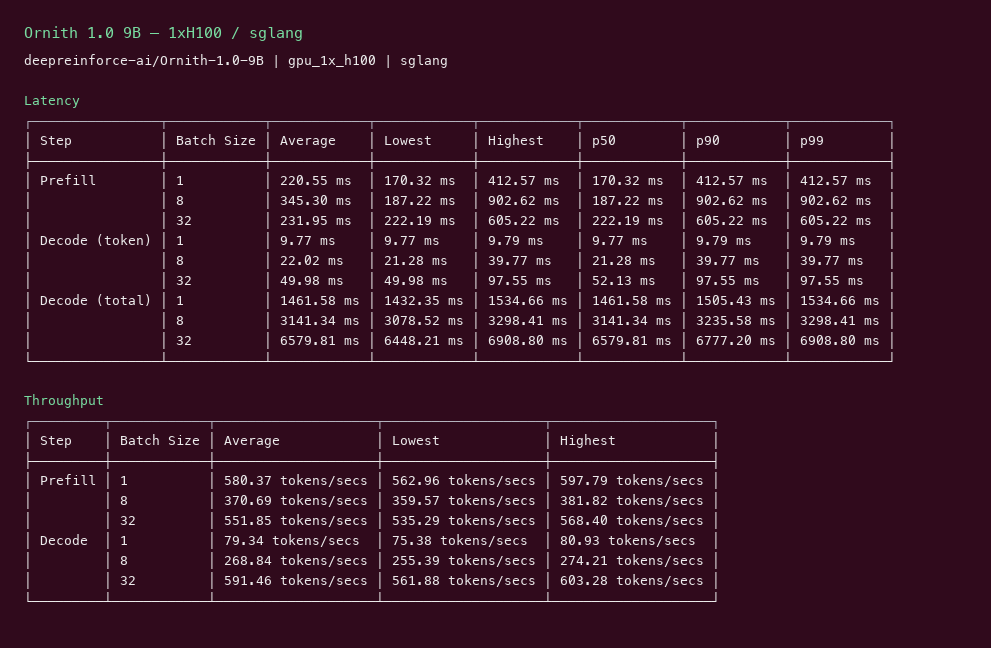

# Ornith 1.0 9B GPU Benchmark

### Last Edit Date:
MC - 2026.07.20

## Purpose
Live Massed Compute inference benches for **deepreinforce-ai/Ornith-1.0-9B**, comparing **vLLM** vs **SGLang**.

## Technique
Pinned profile: random prompts, input=128, output=128, request-rate=inf, concurrency 1 / 8 / 32. Headlines use **c32**.
Engines: vLLM (`cu129-nightly`) + SGLang `lmsysorg/sglang:latest`.

## Results

| Engine | SKU | $/hr | Output tok/s (c32) | TTFT med (ms) | tok/s per $ |
|---|---|---:|---:|---:|---:|
| vllm | `gpu_1x_pro_6000_blackwell` | 2.19 | 1743.1 | 214.0 | 795.9 |
| sglang | `gpu_1x_pro_6000_blackwell` | 2.19 | 872.7 | 117.7 | 398.5 |
| vllm | `gpu_1x_h100` | 2.73 | 2276.7 | 176.4 | 834.0 |
| sglang | `gpu_1x_h100` | 2.73 | 591.5 | 222.2 | 216.7 |

### Screenshots

**gpu_1x_pro_6000_blackwell** — $2.19/hr

vllm:

sglang:

**gpu_1x_h100** — $2.73/hr

vllm:

sglang:

## Conclusion

Peak c32 output throughput: **2277 tok/s** on `gpu_1x_h100` with **vllm**.
Best $/tok: **834.0 tok/s per $** on `gpu_1x_h100` / **vllm**.

## Notes

- Self-improving agentic coding model (dense 9B); MIT.
- Blackwell + H100 both ran vLLM cu129-nightly.
- Numbers from live Massed runs 2026-07-20; bench VMs terminated after capture.
