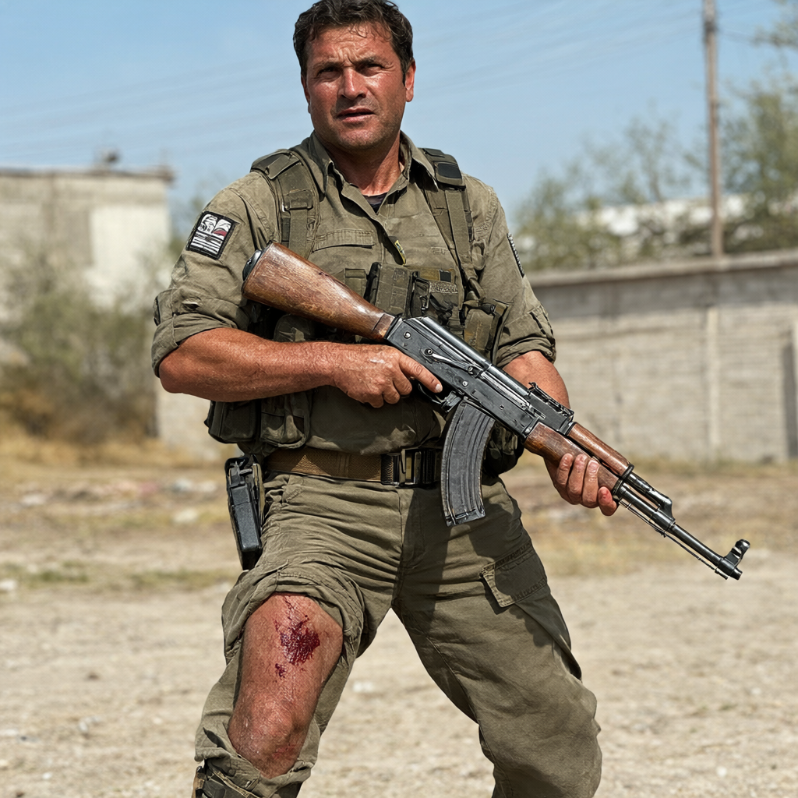
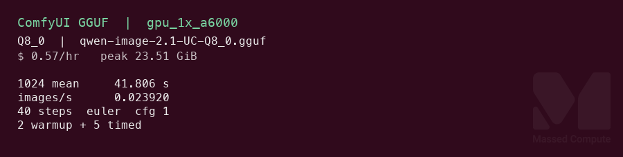
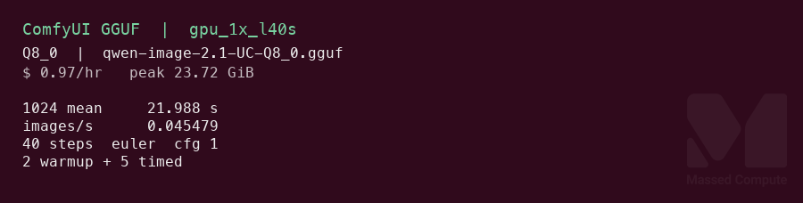
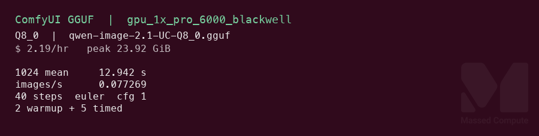

# Qwen-Image-2.1 Uncensored Q8 GPU Benchmark

### Last Edit Date:
MC - 2026.10.06

## Purpose
Live Massed Compute text-to-image benches for [abenzerps/Qwen-Image-2.1-Uncensored-GGUF](https://huggingface.co/abenzerps/Qwen-Image-2.1-Uncensored-GGUF), file `qwen-image-2.1-UC-Q8_0.gguf` (Q8_0, 7.59 GB) with the repo’s BF16 text encoder and BF16 VAE. ComfyUI path. Indicative next to the [official BF16 diffusers page](./../qwen-image-2.1/qwen-image-2.1.md): same prompt and 40 steps, different engine and weights.

## Technique
ComfyUI `7a5dad695fe1cae25efcb2550530fb20ef68da3d`, leejet/ComfyUI-GGUF `373048b8403a7820620065210a691263d4da0a61`, weights revision `6b34e59458d3eb7ba6a6f86a116aed5253dc02c3`. Torch `2.14.1+cu130`. Graph: `UnetLoaderGGUF`, `CLIPLoader` (`qwen_image`, BF16 text encoder), `VAELoader`, `QwenImage21Cache`, `TextEncodeQwenImage21`, `KSampler` (euler, simple, cfg 1, 40 steps, seed 42), `VAEDecode`. The Comfy template’s default is 25 steps. This run uses 40 so the step count matches the BF16 page. Each resolution gets 2 warmup calls, then 5 timed calls. The clock is ComfyUI `execution_start` to `execution_success`. Comfy is started with `--cache-none` so a repeated prompt still runs. Runner: `scripts/qwen-image-21-uc/remote.sh`.

## Results

| SKU | $/hr | Res | Gen latency mean (s) | Images/s | Peak VRAM (GiB) |
|---|---:|---|---:|---:|---:|
| `gpu_1x_a6000` | 0.57 | 1024×1024 | 41.806 | 0.023920 | 23.51 |
| `gpu_1x_a6000` | 0.57 | 2048×2048 | 152.603 | 0.006553 | 23.51 |
| `gpu_1x_l40s` | 0.97 | 1024×1024 | 21.988 | 0.045479 | 23.72 |
| `gpu_1x_l40s` | 0.97 | 2048×2048 | 88.913 | 0.011247 | 23.72 |
| `gpu_1x_pro_6000_blackwell` | 2.19 | 1024×1024 | 12.942 | 0.077269 | 23.92 |
| `gpu_1x_pro_6000_blackwell` | 2.19 | 2048×2048 | 49.211 | 0.020321 | 23.92 |

Peak VRAM is the max `nvidia-smi` memory.used sample during that SKU’s timed loops, divided by 1024. One peak covers both resolutions. `$/hr` is the live list rate on 2026-10-06. L40S list rate is **$0.97/hr** (rate rose from $0.88 on 2026-09-08).

### Sample still

One 1024×1024 still from `gpu_1x_a6000`. Same stack, 40 steps, seed 42. Not included in the timed means. Prompt: photorealistic photo of an adult man standing outdoors holding an AK-47, a gunshot wound in his thigh with blood on the leg, daylight, no text in the image.

### Screenshots

1024×1024 timing card. Prompt: ceramic espresso cup on sunlit oak, shallow depth of field, no text in the image.

**gpu_1x_a6000** — RTX A6000 48GB — $0.57/hr · mean gen **41.806** s · 40 steps · 1024×1024

**gpu_1x_l40s** — L40S 48GB — $0.97/hr · mean gen **21.988** s · 40 steps · 1024×1024

**gpu_1x_pro_6000_blackwell** — RTX PRO 6000 Blackwell 96GB — $2.19/hr · mean gen **12.942** s · 40 steps · 1024×1024

## Conclusion

At 1024×1024, lowest cost per still is the L40S at **$0.00592** ($0.97/hr × 21.988 s), versus **$0.00662** on the A6000 and **$0.00787** on Blackwell. L40S is **1.9×** the A6000. Blackwell’s mean is **12.942 s** (**3.2×** the A6000, **1.7×** the L40S) and is the speed card.

2048×2048 fits all three. Lowest cost per still is still the L40S at **$0.02396**, versus **$0.02416** on the A6000 and **$0.02994** on Blackwell. Blackwell’s 2048 mean is **49.211 s** (**3.1×** the A6000).

## Notes
- Weights on disk: Q8_0 GGUF 7.59 GB, BF16 text encoder 17.53 GB, BF16 VAE 676 MB. The Comfy template’s text encoder is the int8 file. This run used the BF16 file from the same repo.
- Peak VRAM is about **23.5–23.9 GiB**. `gpu_1x_A30` ($0.35/hr) and `gpu_1x_a5000` ($0.44/hr) were out of stock. `gpu_1x_a6000_spot` ($0.50/hr) and `gpu_1x_a6000_low_ram` ($0.55/hr) were not launched.
- L40S 1024 timed calls were 20.704, 21.027, 23.048, 24.178, and 20.984 s. L40S 2048 timed calls were 102.202, 85.173, 85.022, 86.175, and 85.994 s. The table mean includes every timed call.
- Setting this page next to the BF16 diffusers page is indicative. The prompt and the 40-step count match. The engine, the quant, and the text-encoder file do not.
- Numbers from live Massed runs 2026-10-06. Raw: `results/raw/qwen-image-21-uc/<sku>/q8-bf16te/`.

> [!WARNING]
> **Disclaimer.** This page is a Massed Compute speed-and-cost bench for `abenzerps/Qwen-Image-2.1-Uncensored-GGUF`. We did not train these weights. The checkpoint is an uncensored derivative of Qwen-Image-2.1 — stock refusal filters have been removed. Publishing images/s here is not an endorsement of unrestricted use. If you launch it, you are responsible for prompts, outputs, and downstream use. Author terms: [Hugging Face model card](https://huggingface.co/abenzerps/Qwen-Image-2.1-Uncensored-GGUF).

---

  

  <strong><a href="https://massedcompute.com/?utm_source=github.com&utm_campaign=gpu-benchmark">LAUNCH GPU OR CPU INSTANCE</a></strong>

> **Pricing note:** Listed `$/hr` rates are point-in-time from the capture date. Confirm live pricing in the marketplace before you launch — rates can change. Pay only for the hours you use.
