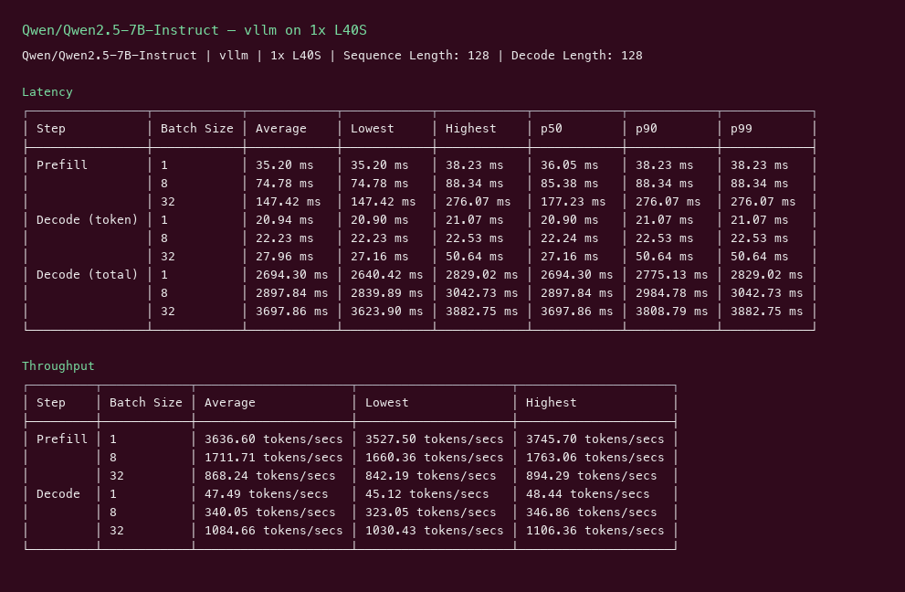
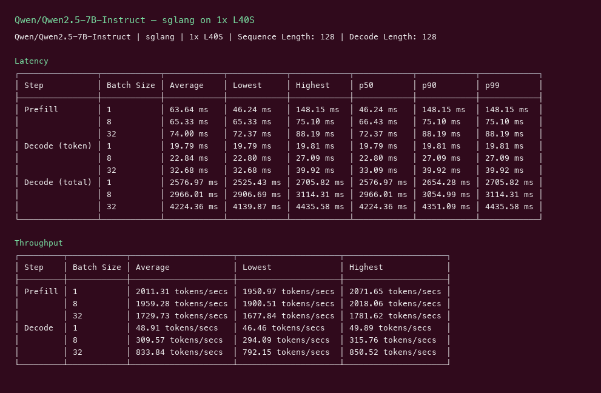

# Qwen2.5 7B Instruct GPU Benchmark

### Last Edit Date:
MC - 2026.07.16

## Purpose
Traffic-facing inference benchmarks for **Qwen/Qwen2.5-7B-Instruct** on Massed Compute GPUs, comparing modern serving engines so buyers can pick the right card.

## Technique
We run the same online serving workload on **[vLLM](https://github.com/vllm-project/vllm)** and **[SGLang](https://github.com/sgl-project/sglang)**.

Pinned profile: random prompts, input=128, output=128, request-rate=inf, max concurrency 1 / 8 / 32. Headline tables use concurrency **32**.

## Running the test

```bash
# vLLM
docker run --gpus all --shm-size 16g -p 8000:8000 \
  vllm/vllm-openai:v0.8.5 --model Qwen/Qwen2.5-7B-Instruct --tensor-parallel-size $TP

vllm bench serve --backend openai --base-url http://127.0.0.1:8000 \
  --model Qwen/Qwen2.5-7B-Instruct --dataset-name random --input-len 128 --output-len 128 \
  --num-prompts 160 --max-concurrency 32 --request-rate inf
```

```bash
# SGLang
docker run --gpus all --shm-size 16g -p 30000:30000 lmsysorg/sglang:latest \
  python3 -m sglang.launch_server --model-path Qwen/Qwen2.5-7B-Instruct --tp-size $TP --port 30000

python3 -m sglang.bench_serving --backend sglang --host 127.0.0.1 --port 30000 \
  --model Qwen/Qwen2.5-7B-Instruct --dataset-name random --random-input-len 128 --random-output-len 128 \
  --num-prompts 160 --max-concurrency 32 --request-rate inf
```

## GPU Quantity per Type
Small models use a single GPU. Large (~70B) models use 2–3 instances max (Blackwell vs H100, optional 4× L40S).

### How L40S fits
**NVIDIA L40S** is a 48GB Ada inference card. On Massed, `gpu_1x_l40s` (~$0.88/hr) is the default single-GPU SKU for ≤32B models: enough VRAM for FP16 7B–14B (and many 32B quantized), strong throughput, and usually the best capacity on the marketplace. For 70B-class models use **4× L40S** (`gpu_4x_l40s`) so tensor parallel has ~192GB aggregate — still often the value play vs dual H100/Blackwell.

## Results

| Engine | SKU | $/hr | Output tok/s (c32) | TTFT p50 | tok/s per $ |
|---|---|---:|---:|---:|---:|
| vllm | `gpu_1x_l40s` | 0.88 | 1084.66 | 177.23 | 1232.6 |
| sglang | `gpu_1x_l40s` | 0.88 | 1018.0 | 72.37 | 1156.8 |

**L40S**
1x L40S Instance: **$0.88/hr**

vLLM:


SGLang:


## Conclusion

On **1× L40S**, **vLLM** hit **~1085 output tok/s** at concurrency 32 (**~1233 tok/s per $**). **SGLang** was close on throughput (**~1018 tok/s**) with **better TTFT** (p50 ~72ms vs ~177ms).

Takeaway for traffic: L40S is a strong default for popular 7B–14B instruct models — cheap, fast, and easy to replicate with vLLM or SGLang.

## Future Additions
More models as they release — `mc-bench run --model <hf_id>` launches, benches, writes this page, and terminates the VMs.


---

<p align="center">
  <a href="https://massedcompute.com/?utm_source=github.com&utm_campaign=gpu-benchmark">
    
  </a>
</p>

<p align="center">
  <strong><a href="https://massedcompute.com/?utm_source=github.com&utm_campaign=gpu-benchmark">LAUNCH GPU OR CPU INSTANCE</a></strong>
</p>

> **Pricing note:** Listed `$/hr` rates are point-in-time from the capture date. Confirm live pricing in the marketplace before you launch — rates can change. Pay only for the hours you use.
