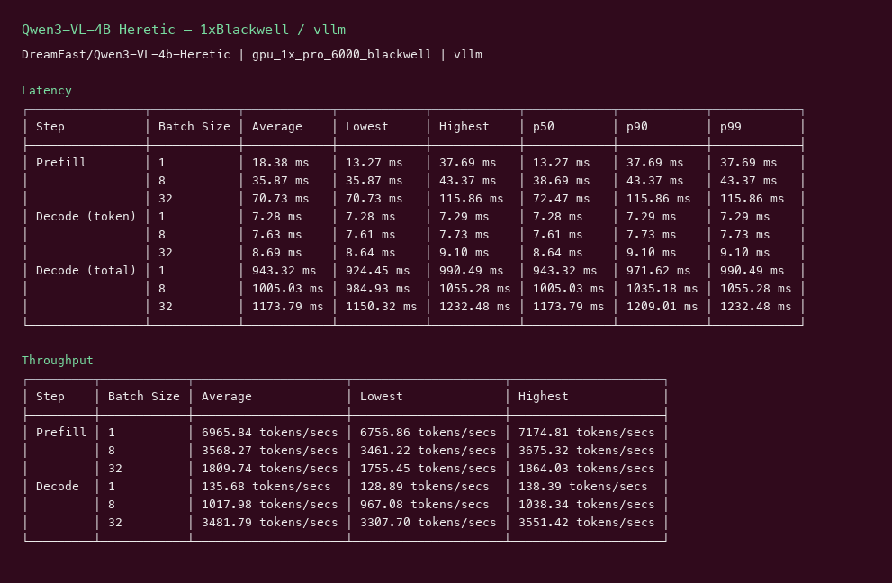
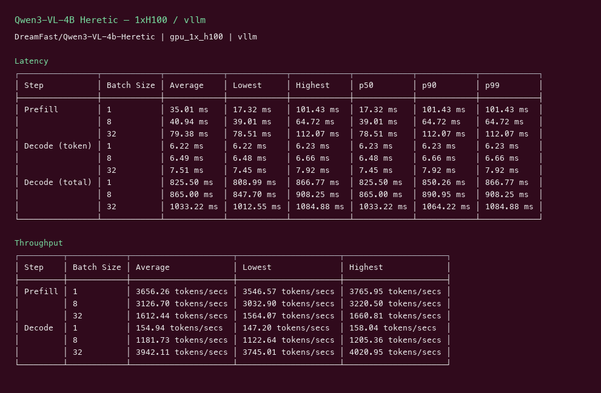

# Qwen3-VL-4B Heretic GPU Benchmark

### Last Edit Date:
MC - 2026.07.21

## Purpose
Live Massed Compute vLLM benches for **DreamFast/Qwen3-VL-4b-Heretic** (Qwen3-VL 4B vision-language, transformers weights — not ComfyUI-only).

## Technique
Pinned profile: random prompts, input=128, output=128, request-rate=inf, concurrency 1 / 8 / 32. Headlines use **c32**.
Engine: **vLLM** (`nightly`) with `--trust-remote-code --max-model-len 4096`. Text-decode throughput bench (MM image limit 0).
Script: `scripts/wave4/remote_heretic.sh`.

## Results

| Engine | SKU | $/hr | Output tok/s (c32) | TTFT med (ms) | tok/s per $ |
|---|---|---:|---:|---:|---:|
| vllm | `gpu_1x_pro_6000_blackwell` | 2.19 | 3481.8 | 72.5 | 1589.9 |
| vllm | `gpu_1x_h100` | 2.73 | 3942.1 | 78.5 | 1444.0 |

### Screenshots

Terminal-style vLLM serving-bench captures (input=128, output=128, concurrency 1/8/32), Massed Compute 2026-07-21. Text-decode only (no vision stills) — Latency + Throughput tables across batch sizes.

**gpu_1x_pro_6000_blackwell** — RTX PRO 6000 Blackwell 96GB — $2.19/hr

vLLM nightly · `DreamFast/Qwen3-VL-4b-Heretic` · c32 **3481.8** output tok/s · TTFT med **72.5** ms:

**gpu_1x_h100** — H100 80GB PCIe — $2.73/hr

vLLM nightly · same weights · c32 **3942.1** output tok/s · TTFT med **78.5** ms:

## Conclusion

Peak c32 output throughput: **3942 tok/s** on `gpu_1x_h100` with **vllm**.
Best $/tok: **1589.9 tok/s per $** on `gpu_1x_pro_6000_blackwell` / **vllm**.

## Notes
- VL weights served via vLLM; bench is text-only random prompts for comparable decode throughput.
- Numbers from live Massed runs 2026-07-21; wave4 bench VMs terminated after capture.

---

**[LAUNCH GPU OR CPU INSTANCE](https://massedcompute.com/?utm_source=github.com&utm_campaign=gpu-benchmark)**

> **Pricing note:** Listed `$/hr` rates are point-in-time from the capture date. Confirm live pricing in the marketplace before you launch — rates can change. Pay only for the hours you use; no long-term contracts.
