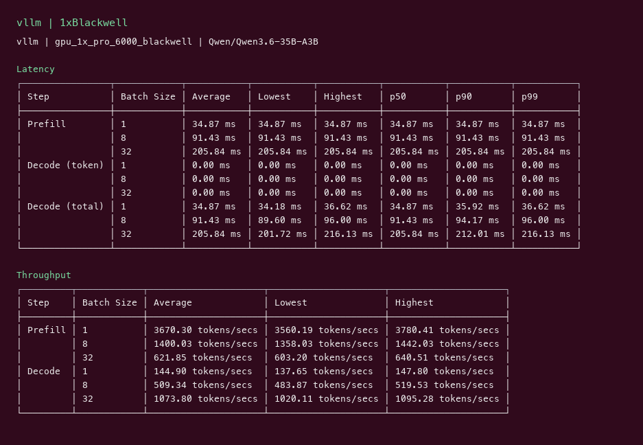
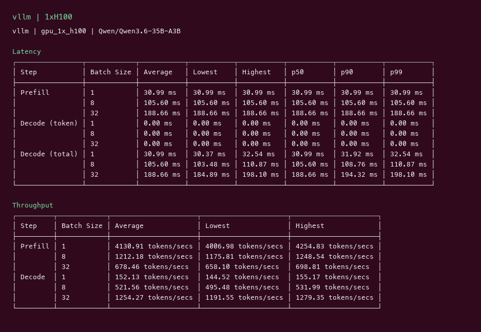

# Qwen3.6 35B-A3B GPU Benchmark

### Last Edit Date:
MC - 2026.07.28

## Purpose
Live Massed Compute vLLM benches for **Qwen/Qwen3.6-35B-A3B** (Qwen3.6 MoE, ~35B total / ~3B active, native multimodal). Exact BF16 weights. Text-decode throughput profile (MM image limit 0).

## Technique
Pinned profile: random prompts, input=128, output=128, request-rate=inf, concurrency 1 / 8 / 32. Headlines use **c32**.
Engine: **vLLM** (`nightly`) with `--trust-remote-code --max-num-seqs 128 --kv-cache-dtype fp8 --limit-mm-per-prompt '{"image":0}'`. Blackwell used `--max-model-len 8192`; H100 used `--max-model-len 4096` (80 GB headroom).

## Results

| Engine | SKU | $/hr | Output tok/s (c32) | TTFT med (ms) | tok/s per $ |
|---|---|---:|---:|---:|---:|
| vllm | `gpu_1x_pro_6000_blackwell` | 2.19 | 1073.8 | 205.8 | 490.3 |
| vllm | `gpu_1x_h100` | 2.73 | 1254.3 | 188.7 | 459.4 |

### Screenshots

Terminal-style vLLM serving-bench captures (input=128, output=128, concurrency 1/8/32), Massed Compute 2026-07-28. Text-decode only.

**gpu_1x_pro_6000_blackwell** — RTX PRO 6000 Blackwell 96GB — $2.19/hr

vLLM nightly · `Qwen/Qwen3.6-35B-A3B` · c32 **1073.8** output tok/s · TTFT med **205.8** ms:

**gpu_1x_h100** — H100 80GB PCIe — $2.73/hr

vLLM nightly · `Qwen/Qwen3.6-35B-A3B` · c32 **1254.3** output tok/s · TTFT med **188.7** ms:

## Conclusion

Peak c32 output throughput: **1254 tok/s** on `gpu_1x_h100` with **vllm**.
Best $/tok: **490.3 tok/s per $** on `gpu_1x_pro_6000_blackwell` / **vllm**.

## Notes
- Exact BF16 HF id `Qwen/Qwen3.6-35B-A3B` (~72 GB). 1× L40S (48 GB) cannot load it; smallest single-GPU fit in inventory was **H100 80 GB**.
- Required `--max-num-seqs 128` (cache-block limit on this arch).
- Numbers from live Massed runs 2026-07-28; bench VMs terminated after capture.

---

**[LAUNCH GPU OR CPU INSTANCE](https://massedcompute.com/?utm_source=github.com&utm_campaign=gpu-benchmark)**

> **Pricing note:** Listed `$/hr` rates are point-in-time from the capture date. Confirm live pricing in the marketplace before you launch — rates can change. Pay only for the hours you use.

