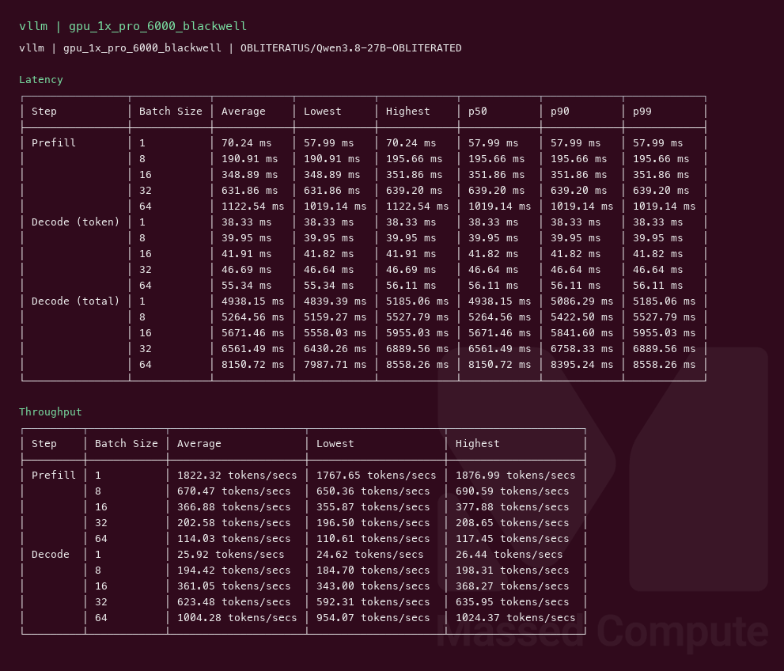
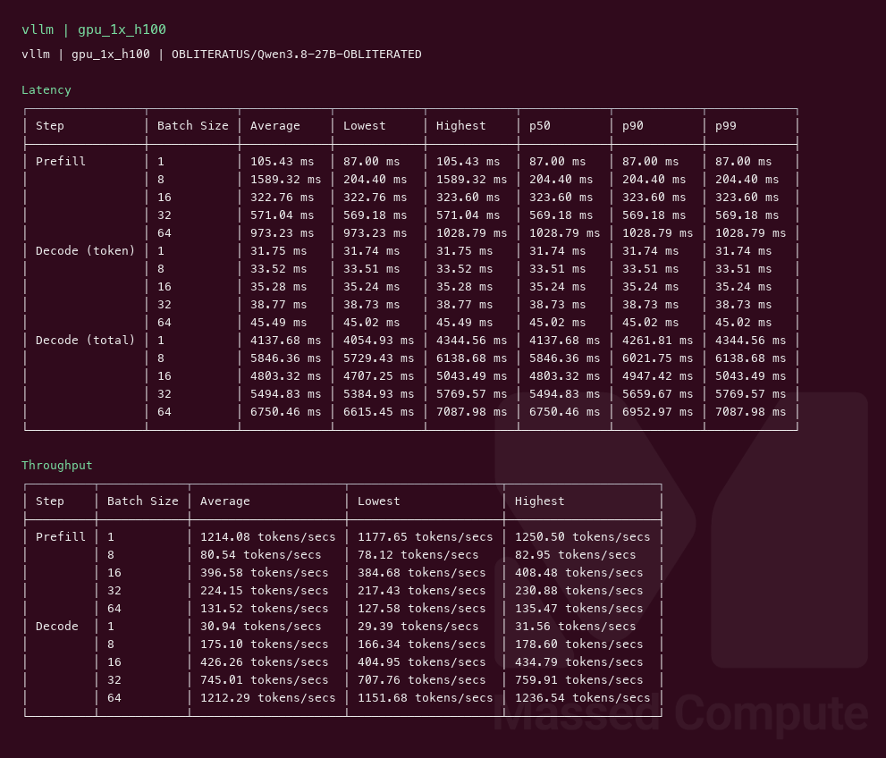
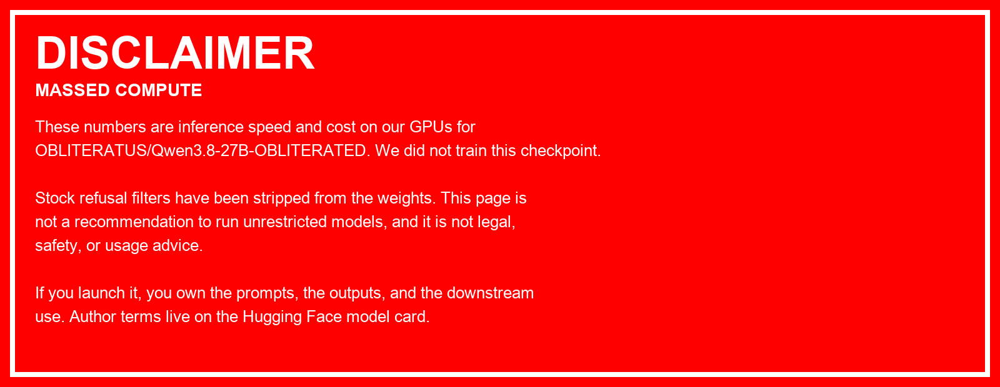

# Qwen3.8 27B OBLITERATED GPU Benchmark

### Last Edit Date:
MC - 2026.08.31

## Purpose
Live Massed Compute inference benches for **OBLITERATUS/Qwen3.8-27B-OBLITERATED** (exact BF16, ~27B, native VL). Official weights, text-decode throughput profile (MM image limit 0).

## Technique
Pinned profile: random prompts, input=128, output=128, request-rate=inf, concurrency 1 / 8 / 16 / 32 / 64. Headlines use **c32**.

Engine: **vLLM** `vllm/vllm-openai:v0.27.1`, `--max-model-len 8192 --kv-cache-dtype fp8 --reasoning-parser qwen3 --limit-mm-per-prompt '{"image":0}'`.

- **1× DGX A100** (`gpu_1x_DGX_A100`, $1.38/hr): default `--max-num-seqs`.
- **1× RTX PRO 6000 Blackwell** (`gpu_1x_pro_6000_blackwell`, $2.19/hr): `--max-num-seqs 256 --gpu-memory-utilization 0.95` (Mamba cache block cap).
- **1× H100** (`gpu_1x_h100`, $2.73/hr): same `--max-num-seqs 256` cap.

Exact BF16 does not fit 48 GB. No official FP8 checkpoint, so L40S was not a same-weights row. SGLang not captured this wave.

## Results

| Engine | SKU | $/hr | Output tok/s (c32) | TTFT med (ms) | tok/s per $ | $/1M out tokens |
|---|---|---:|---:|---:|---:|---:|
| vllm | `gpu_1x_DGX_A100` | 1.38 | 616.2 | 954.9 | 446.5 | 0.622 |
| vllm | `gpu_1x_pro_6000_blackwell` | 2.19 | 623.5 | 639.2 | 284.7 | 0.976 |
| vllm | `gpu_1x_h100` | 2.73 | 745.0 | 569.2 | 272.9 | 1.018 |

### Screenshots

**gpu_1x_DGX_A100** — $1.38/hr

vllm — 616.2 output tok/s @ c32:

**gpu_1x_pro_6000_blackwell** — $2.19/hr

vllm — 623.5 output tok/s @ c32:

**gpu_1x_h100** — $2.73/hr

vllm — 745.0 output tok/s @ c32:

## Conclusion

Peak c32 output throughput: **745 tok/s** on `gpu_1x_h100` with **vllm**.
Best tok/s per $: **446.5** on `gpu_1x_DGX_A100` / **vllm**.

A100 and Blackwell are within **1%** on c32 throughput (616 vs 624). Blackwell costs more per hour; H100 buys **+21%** tok/s vs A100 and the lowest TTFT (569 ms).

## Notes
- Exact published BF16 (~54 GB). 1× L40S skipped — not a same-checkpoint row.
- Hopper/Blackwell default `max_num_seqs=1024` died on Mamba cache (H100 333 blocks, Blackwell 594). Cap 256.
- A100 c32 (616) matches stock Qwen3.8-27B BF16 on the same SKU (614) within noise.
- Numbers from live Massed runs 2026-08-31; bench VMs terminated after capture.

---

**[LAUNCH GPU OR CPU INSTANCE](https://massedcompute.com/?utm_source=github.com&utm_campaign=gpu-benchmark)**

> **Pricing note:** Listed `$/hr` rates are point-in-time from the capture date. Confirm live pricing in the marketplace before you launch — rates can change. Pay only for the hours you use.

[Author terms on Hugging Face](https://huggingface.co/OBLITERATUS/Qwen3.8-27B-OBLITERATED)
