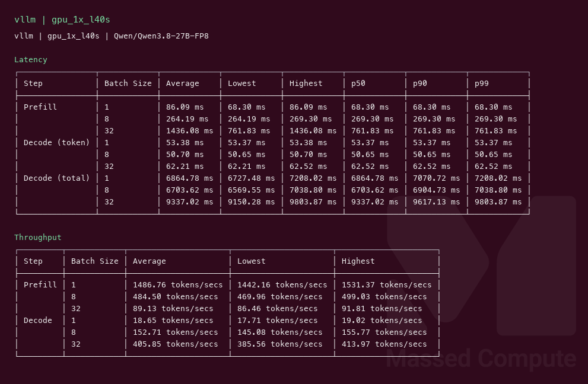
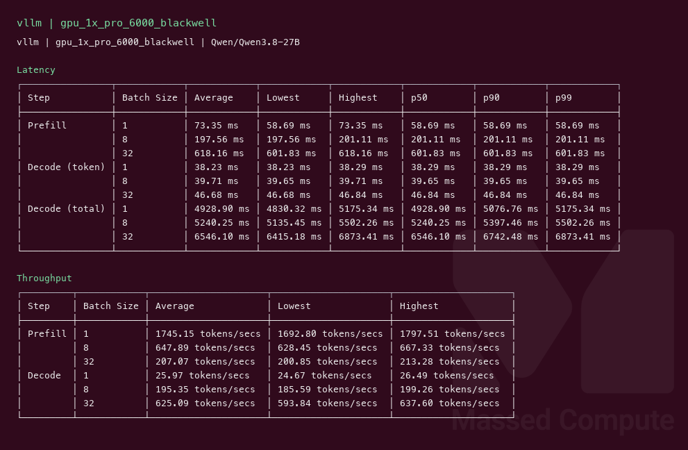
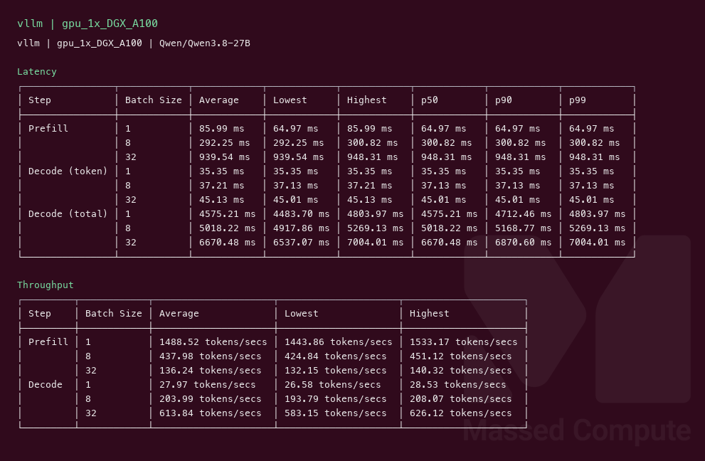

# Qwen3.8 27B GPU Benchmark

### Last Edit Date:
MC - 2026.08.18

## Purpose
Live Massed Compute vLLM benches for **Qwen3.8-27B** (Apache 2.0, native VL). L40S served official **FP8** (`Qwen/Qwen3.8-27B-FP8`). Blackwell and A100 served exact **BF16** (`Qwen/Qwen3.8-27B`).

## Technique
Pinned profile: random prompts, input=128, output=128, request-rate=inf, concurrency 1 / 8 / 32. Headlines use **c32**.
Engine: **vLLM** `vllm/vllm-openai:v0.27.1`, `--max-model-len 8192`, `--reasoning-parser qwen3`, `--limit-mm-per-prompt '{"image":0}'`.
L40S needed `--max-num-seqs 64` (Mamba cache block cap).

## Results

| Engine | SKU | Weights | $/hr | Output tok/s (c32) | TTFT med (ms) | tok/s per $ | $/1M out tokens |
|---|---|---|---:|---:|---:|---:|---:|
| vllm | `gpu_1x_l40s` | FP8 | 0.88 | 405.9 | 761.8 | 461.2 | 0.602 |
| vllm | `gpu_1x_pro_6000_blackwell` | BF16 | 2.19 | 625.1 | 601.8 | 285.4 | 0.973 |
| vllm | `gpu_1x_DGX_A100` | BF16 | 1.38 | 613.8 | 948.3 | 444.8 | 0.624 |

### Screenshots

**gpu_1x_l40s** — $0.88/hr — official FP8

vllm — 405.9 output tok/s @ c32:

**gpu_1x_pro_6000_blackwell** — $2.19/hr — exact BF16

vllm — 625.1 output tok/s @ c32:

**gpu_1x_DGX_A100** — $1.38/hr — exact BF16

vllm — 613.8 output tok/s @ c32:

## Conclusion

On exact BF16, Blackwell (**625.1** tok/s) and A100 (**613.8**) are within **2%** on a single run; Blackwell costs **59%** more per hour ($2.19 vs $1.38). Buy **`gpu_1x_DGX_A100`** for the 80 GB BF16 job. L40S is a different checkpoint (official FP8) and wins tok/s per $ at **461.2**.

## Notes
- Exact BF16 does not fit 48 GB. Smallest coupon fit is official FP8 on 1× L40S — not the same weights as the other two rows.
- `gpu_1x_h100` launch failed (no capacity). 80 GB row launched as **`gpu_1x_DGX_A100`** ($1.38, 16 vCPU / 120 GiB / 1 TB, us-east-1). `nvidia-smi` reported `A100-SXM4-80GB`, the same GPU string as **`gpu_1x_A100_SXM4`** (also $1.38; 14 vCPU / 100 GiB / 625 GB, us-central-3). Rerun this capture on `gpu_1x_DGX_A100`. Do not treat the SXM4 listing as proven equivalent — host RAM, CPU, disk, and region differ.
- Numbers from live Massed runs 2026-08-18; bench VMs terminated after capture.

---

  

  <strong><a href="https://massedcompute.com/?utm_source=github.com&utm_campaign=gpu-benchmark">LAUNCH GPU OR CPU INSTANCE</a></strong>

> **Pricing note:** Listed `$/hr` rates are point-in-time from the capture date. Confirm live pricing in the marketplace before you launch — rates can change. Pay only for the hours you use.
